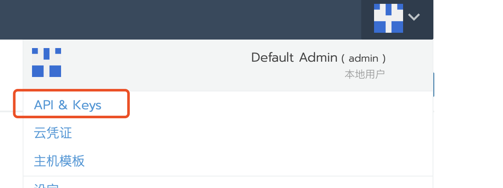
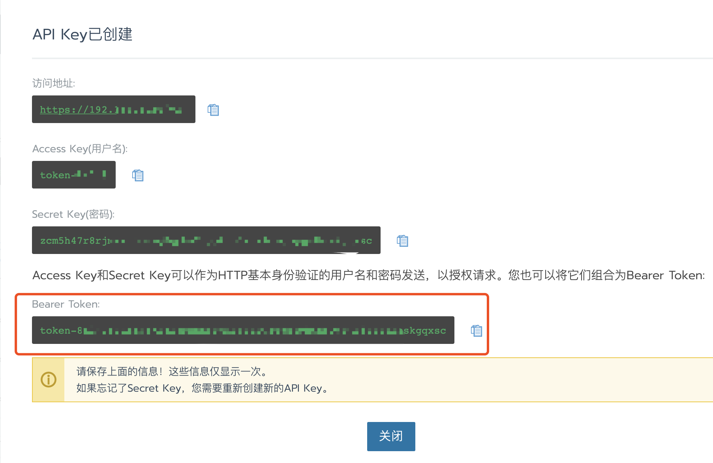

## 一、创建API & Keys

1. 通过管理员登录Rancher UI，点击右上角用户头像，选择API & Keys

    

1. 点击右上角添加Key，然后设置描述并选择有效期，作用集群范围默认不选

    

1. 复制`Bearer Token`备用

    

## 二、创建自定义集群

复制并保存以下内容为脚本文件，修改前三行`api_url`、`token`、`cluster_name`，然后执行脚本。

```bash
#!/bin/bash

api_url='https://xxx.domain.com'
api_token='token-5zgl2:tcj5nvfq67rf55r7xxxxxxxxxxx429xrwd4zx'
cluster_name=''

kubernetes_Version='v1.13.5-rancher1-2'
network_plugin='canal'
quota_backend_bytes=${quota_backend_bytes:-6442450944}
auto_compaction_retention=${auto_compaction_retention:-240}
ingress_provider=${ingress_provider:-nginx}
ignoreDocker_Version=${ignoreDocker_Version:-true}
monitoring_provider=${monitoring_provider:-metrics-server}
service_NodePort_Range=${service_NodePort_Range:-'30000-32767'}

create_Cluster=true
add_Node=true

create_cluster_data()
{
  cat <<EOF
{
    "amazonElasticContainerServiceConfig": null,
    "azureKubernetesServiceConfig": null,
    "dockerRootDir": "/var/lib/docker",
    "enableClusterAlerting": false,
    "enableClusterMonitoring": false,
    "googleKubernetesEngineConfig": null,
    "localClusterAuthEndpoint": {
        "enabled": true,
        "type": "/v3/schemas/localClusterAuthEndpoint"
    },
    "name": "$cluster_name",
    "rancherKubernetesEngineConfig": {
        "addonJobTimeout": 30,
        "addonsInclude":[ "https://raw.githubusercontent.com/rook/rook/master/cluster/examples/kubernetes/ceph/operator.yaml"
        ],
        "authentication": {
            "strategy": "x509|webhook",
            "type": "/v3/schemas/authnConfig"
        },
        "authorization": {
            "type": "/v3/schemas/authzConfig"
        },
        "bastionHost": {
            "sshAgentAuth": false,
            "type": "/v3/schemas/bastionHost"
        },
        "cloudProvider": {
            "type": "/v3/schemas/cloudProvider"
        },
        "ignoreDockerVersion": "$ignoreDocker_Version",
        "ingress": {
            "provider": "$ingress_provider",
            "type": "/v3/schemas/ingressConfig"
        },
        "kubernetesVersion": "$kubernetes_Version",
        "monitoring": {
            "provider": "$monitoring_provider",
            "type": "/v3/schemas/monitoringConfig"
        },
        "network": {
            "options": {
                "flannel_backend_type": "vxlan"
            },
            "plugin": "$network_plugin",
            "type": "/v3/schemas/networkConfig"
        },
        "restore": {
            "restore": false,
            "type": "/v3/schemas/restoreConfig"
        },
        "services": {
            "etcd": {
                "backupConfig": {
                    "enabled": true,
                    "intervalHours": 12,
                    "retention": 6,
                    "s3BackupConfig": null,
                    "type": "/v3/schemas/backupConfig"
                },
                "creation": "12h",
                "extraArgs": {
                    "auto-compaction-retention": "$auto_compaction_retention",
                    "election-timeout": "5000",
                    "heartbeat-interval": "500",
                    "quota-backend-bytes": "$quota_backend_bytes"
                },
                "retention": "72h",
                "snapshot": false,
                "type": "/v3/schemas/etcdService"
            },
            "kubeApi": {
                "alwaysPullImages": false,
                "podSecurityPolicy": false,
                "serviceNodePortRange": "$service_NodePort_Range",
                "type": "/v3/schemas/kubeAPIService"
            },
            "kubeController": {
                "extraArgs": {
                    "node-monitor-grace-period": "20s",
                    "node-monitor-period": "5s",
                    "node-startup-grace-period": "30s",
                    "pod-eviction-timeout": "1m"
                },
                "type": "/v3/schemas/kubeControllerService"
            },
            "kubelet": {
             "extraArgs": {
                    "eviction-hard": "memory.available<300Mi,nodefs.available<10%,imagefs.available<15%,nodefs.inodesFree<5%",
                    "kube-api-burst": "30",
                    "kube-api-qps": "15",
                    "kube-reserved": "memory=250Mi",
                    "max-open-files": "2000000",
                    "max-pods": "250",
                    "network-plugin-mtu": "1500",
                    "pod-infra-container-image": "rancher/pause:3.1",
                    "registry-burst": "10",
                    "registry-qps": "0",
                    "serialize-image-pulls": "false",
                    "sync-frequency": "3s",
                    "system-reserved": "memory=250Mi"
                },
                "failSwapOn": false,
                "type": "/v3/schemas/kubeletService"
            },
            "kubeproxy": {
                "type": "/v3/schemas/kubeproxyService"
            },
            "scheduler": {
                "type": "/v3/schemas/schedulerService"
            },
            "type": "/v3/schemas/rkeConfigServices"
        },
        "sshAgentAuth": false,
        "type": "/v3/schemas/rancherKubernetesEngineConfig"
    }
}
EOF
}

curl -k -X POST \
    -H "Authorization: Bearer ${api_token}" \
    -H "Content-Type: application/json" \
    -d "$(create_cluster_data)" $api_url/v3/clusters

```

## 三、生成注册命令

复制并保存以下内容为脚本文件，修改前三行`api_url`、`token`、`cluster_name`，然后执行脚本。

```bash
#!/bin/bash

api_url='https://xxx.domain.com'
api_token='token-5zgl2:tcj5nvfq67rf55r7xxxxxxxxxxx429xrwd4zx'
cluster_name=''

# 获取集群ID
cluster_ID=$( curl -s -k -H "Authorization: Bearer ${api_token}" $api_url/v3/clusters | jq -r ".data[] | select(.name == \"$cluster_name\") | .id" )

# 生成注册命令
create_token_data()
{
cat <<EOF
{
"clusterId": "$cluster_ID"
}
EOF
}

curl -k -X POST \
    -H "Authorization: Bearer ${api_token}" \
    -H 'Accept: application/json' \
    -H 'Content-Type: application/json' \
    -d "$(create_token_data)" $api_url/v3/clusterregistrationtokens

```

### 四、获取主机注册命令

复制并保存以下内容为脚本文件，修改前三行`api_url`、`token`、`cluster_name`，然后执行脚本。

```bash
#!/bin/bash

api_url='https://xxx.domain.com'
api_token='token-5zgl2:tcj5nvfq67rf55r7xxxxxxxxxxx429xrwd4zx'
cluster_name=''

cluster_ID=$( curl -s -k -H "Authorization: Bearer ${api_token}" $api_url/v3/clusters | jq -r ".data[] | select(.name == \"$cluster_name\") | .id" )

# nodeCommand
curl -s -k -H "Authorization: Bearer ${api_token}" $api_url/v3/clusters/${cluster_ID}/clusterregistrationtokens | jq -r .data[].nodeCommand

# command
curl -s -k -H "Authorization: Bearer ${api_token}" $api_url/v3/clusters/${cluster_ID}/clusterregistrationtokens | jq -r .data[].command

```
