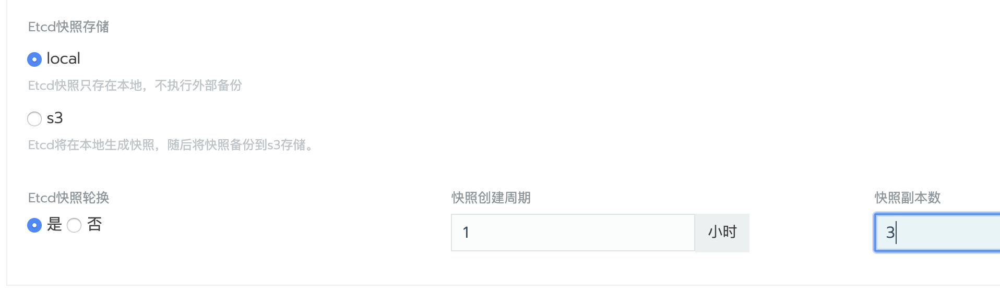

根据etcd集群的容错机制，可以从`机器重启`这样的临时故障中自动恢复。对于永久性故障（比如由于硬件故障导致成员节点无法再连接到集群），它支持最多`(N-1)/2`个成员节点永久断开连接。 如果超过`(N-1)/2`个成员节点断开连接，则`etcd`集群因为无法进行仲裁而无法继续运行。

## 一: 通过UI恢复集群

_功能支持：rancher v2.2.0+_

> **注意：**如果有在Rancherv2.2.0之前创建的Kubernetes集群，在升级Rancher之后，您必须`编辑更新集群`，以便启用更新的快照功能。即使在v2.2.0之前创建了快照，也必须执行此步骤，因为旧的快照无法用于通过UI恢复etcd。

### 1、先决条件

1. 要使用`自定义集群`恢复功能，需要在创建集群时开启自动备份功能。如果集群变动比较频繁，可以把备份间隔缩短一些，根据磁盘大小设置保留的副本数。

    

1. 系统会定时在`/opt/rke/etcd-snapshots`目录生成备份文件，并且在`集群\工具\快照`视图下可以查看到历史备份快照。

    

### 2、恢复集群

1. 在`全局\集群`视图中，定位到需要`数据恢复`的集群；

1. 点击集群右侧的`省略号`菜单，点击`从备份恢复`;

1. 选择要恢复的`备份`，点击`保存`；

    

## 二：在未备份情况下恢复ETCD集群

_适用于rancher v2.2.0以前版本创建的自定义集群_

1. 通过UI删除其他etcd节点，只保留一个etcd节点；

1. 在剩下的etcd节点上，运行以下命令：

    ```bash
    docker run --rm -v /var/run/docker.sock:/var/run/docker.sock \
         registry.cn-shanghai.aliyuncs.com/rancher/run-config etcd
    ```

    > 运行此命令输出etcd的running命令，保存命令以便后面使用。

1. 停止节点中运行的etcd容器并将其重命名为`etcd-old`

    ```bash
    docker stop etcd
    docker rename etcd etcd-old
    ```

1. 将`步骤2`中生成的命令进行以下修改：

    1. 如果原来ETCD集群拥有多个etcd节点，则需要更改`--initial-cluster`使其包含剩余的节点；
    1. 添加`--force-new-cluster`到命令的末尾；

1. 运行修改后的命令；

1. 单个节点启动并正常运行后，建议在集群中添加其他etcd节点。如果要重用旧节点，则需要先[清理节点](/rancher/v2.x/cn/install-prepare/remove-node/)，然后再将它们添加回集群。