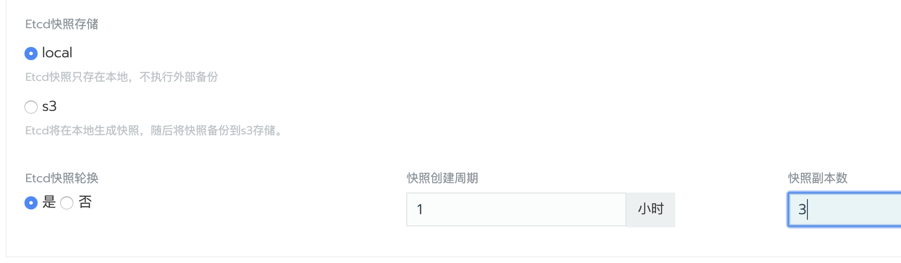

根据etcd集群的容错机制，可以从`机器重启`这样的临时故障中自动恢复。对于永久性故障（比如由于硬件故障导致成员节点无法再连接到集群），它支持最多`(N-1)/2`个成员节点永久断开连接。 如果超过`(N-1)/2`个成员节点断开连接，则`etcd`集群因为无法进行仲裁而无法继续运行。

## 一: 通过UI恢复集群

_功能支持：rancher v2.2.0+_

> **注意：**如果有在Rancherv2.2.0之前创建的Kubernetes集群，在升级Rancher之后，您必须`编辑更新集群`，以便启用更新的快照功能。即使在v2.2.0之前创建了快照，也必须执行此步骤，因为旧的快照无法用于通过UI恢复etcd。

### 1、先决条件

1. 要使用`自定义集群`恢复功能，需要在创建集群时开启自动备份功能。如果集群变动比较频繁，可以把备份间隔缩短一些，根据磁盘大小设置保留的副本数。

    

1. 系统会定时在`/opt/rke/etcd-snapshots`目录生成备份文件，并且在`集群\工具\快照`视图下可以查看到历史备份快照。

    

### 2、恢复集群

1. 在`全局\集群`视图中，定位到需要`数据恢复`的集群；

1. 点击集群右侧的`省略号`菜单，点击`从备份恢复`;

1. 选择要恢复的`备份`，点击`保存`；

    

## 二：在未备份情况下恢复ETCD集群

> 适用于rancher v2.2.0以前版本创建的自定义集群。

如果集群原有两个ETCD节点而坏掉一个，或者原有三个ETCD节点而坏掉两个。这个时候ETCD集群将自动降级，所有键值对变成只读状态。

1. 停止异常的ETCD节点或者在异常ETCD节点上执行`docker rm -f etcd`删除ETCD容器，保证环境中只有一个ETCD实例运行；

1. 在剩下的最后一个etcd节点上，运行以下命令：

    ```bash
    docker run --rm -v /var/run/docker.sock:/var/run/docker.sock \
         registry.cn-shanghai.aliyuncs.com/rancher/run-config etcd
    ```

    运行此命令将输出etcd的running命令，例如：

    ```bash
    docker run --name=etcd --hostname=ubuntu2 \
    --env="ETCDCTL_API=3" \
    --env="ETCDCTL_CACERT=/etc/kubernetes/ssl/kube-ca.pem" \
    --env="ETCDCTL_CERT=/etc/kubernetes/ssl/kube-etcd-1-1-1-133.pem" \
    --env="ETCDCTL_KEY=/etc/kubernetes/ssl/kube-etcd-1-1-1-133-key.pem" \
    --env="ETCDCTL_ENDPOINT=https://0.0.0.0:2379" \
    --env="ETCD_UNSUPPORTED_ARCH=x86_64" \
    --env="PATH=/usr/local/sbin:/usr/local/bin:/usr/sbin:/usr/bin:/sbin:/bin" \
    --volume="/var/lib/etcd:/var/lib/rancher/etcd/:z" \
    --volume="/etc/kubernetes:/etc/kubernetes:z" \
    --network=host \
    --restart=always \
    --label io.rancher.rke.container.name="etcd" \
    --detach=true rancher/coreos-etcd:v3.2.24-rancher1 /usr/local/bin/etcd \
    --peer-client-cert-auth \
    --client-cert-auth \
    --peer-cert-file=/etc/kubernetes/ssl/kube-etcd-1-1-1-133.pem \
    --initial-cluster-token=etcd-cluster-1 \
    --initial-cluster=etcd-1.1.1.128=https://1.1.1.128:2380,etcd-1.1.1.133=https://1.1.1.133:2380 \
    --peer-trusted-ca-file=/etc/kubernetes/ssl/kube-ca.pem \
    --key-file=/etc/kubernetes/ssl/kube-etcd-1-1-1-133-key.pem \
    --data-dir=/var/lib/rancher/etcd/ \
    --advertise-client-urls=https://1.1.1.133:2379,https://1.1.1.133:4001 \
    --listen-client-urls=https://0.0.0.0:2379 \
    --trusted-ca-file=/etc/kubernetes/ssl/kube-ca.pem \
    --peer-key-file=/etc/kubernetes/ssl/kube-etcd-1-1-1-133-key.pem \
    --heartbeat-interval=500 \
    --initial-advertise-peer-urls=https://1.1.1.133:2380 \
    --listen-peer-urls=https://0.0.0.0:2380 \
    --cert-file=/etc/kubernetes/ssl/kube-etcd-1-1-1-133.pem \
    --election-timeout=5000 \
    --name=etcd-1.1.1.133 \
    --initial-cluster-state=new  
    ```

1. 在剩下的最后一个ETCD节点中，停止运行的ETCD容器并将其重命名为`etcd-old`

    ```bash
    docker stop etcd
    docker rename etcd etcd-old
    ```

1. 在剩下的最后一个ETCD节点中，执行以下命令进行ETCD集群初始化：

    ```bash
    # 定义节点IP
    ## 注意，如果是多IP主机，需要根据第二步中显示的IP来判断其他节点中默认使用的是什么接口的IP，因为在`/etc/kubernetes/ssl/`会以IP为格式命名生成ETCD SSL证书文件。

    NODE_IP=1.1.1.128
    ETCD_IMAGES=rancher/coreos-etcd:v3.2.24-rancher1

    docker run --name=etcd --hostname=`hostname` \
    --env="ETCDCTL_API=3" \
    --env="ETCDCTL_CACERT=/etc/kubernetes/ssl/kube-ca.pem" \
    --env="ETCDCTL_CERT=/etc/kubernetes/ssl/kube-etcd-`echo $NODE_IP|sed 's/\./-/g'`.pem" \
    --env="ETCDCTL_KEY=/etc/kubernetes/ssl/kube-etcd-`echo $NODE_IP|sed 's/\./-/g'`-key.pem" \
    --env="ETCDCTL_ENDPOINT=https://0.0.0.0:2379" \
    --env="ETCD_UNSUPPORTED_ARCH=x86_64" \
    --env="PATH=/usr/local/sbin:/usr/local/bin:/usr/sbin:/usr/bin:/sbin:/bin" \
    --volume="/var/lib/etcd:/var/lib/rancher/etcd/:z" \
    --volume="/etc/kubernetes:/etc/kubernetes:z" \
    --network=host \
    --restart=always \
    --label io.rancher.rke.container.name="etcd" \
    --detach=true \
    $ETCD_IMAGES \
    /usr/local/bin/etcd \
    --peer-client-cert-auth \
    --client-cert-auth \
    --peer-cert-file=/etc/kubernetes/ssl/kube-etcd-`echo $NODE_IP|sed 's/\./-/g'`.pem \
    --peer-key-file=/etc/kubernetes/ssl/kube-etcd-`echo $NODE_IP|sed 's/\./-/g'`-key.pem \
    --cert-file=/etc/kubernetes/ssl/kube-etcd-`echo $NODE_IP|sed 's/\./-/g'`.pem \
    --trusted-ca-file=/etc/kubernetes/ssl/kube-ca.pem \
    --initial-cluster-token=etcd-cluster-1 \
    --peer-trusted-ca-file=/etc/kubernetes/ssl/kube-ca.pem \
    --key-file=/etc/kubernetes/ssl/kube-etcd-`echo $NODE_IP|sed 's/\./-/g'`-key.pem \
    --data-dir=/var/lib/rancher/etcd/ \
    --advertise-client-urls=https://$NODE_IP:2379,https://$NODE_IP:4001 \
    --listen-client-urls=https://0.0.0.0:2379 \
    --listen-peer-urls=https://0.0.0.0:2380 \
    --initial-advertise-peer-urls=https://$NODE_IP:2380 \
    --election-timeout=5000 \
    --heartbeat-interval=500 \
    --name=etcd-`echo $NODE_IP|sed 's/\./-/g'` \
    --initial-cluster=etcd-`echo $NODE_IP|sed 's/\./-/g'`=https://$NODE_IP:2380 \
    --initial-cluster-state=new  \
    --force-new-cluster
    ```

1. 在剩下的最后一个ETCD节点中，执行以下命令添加第一个ETCD MEMBER节点

    ```bash
    MEMBER_IP=1.1.1.133
    docker exec -ti etcd etcdctl member add etcd-`echo $MEMBER_IP | sed 's/\./-/g'` --peer-urls=https://$MEMBER_IP:2380
    ```

    > 执行以上命令后将输出以下信息，请保存这些信息，在运行member节点时将要使用。

    ```bash
    root@ubuntu1:~# docker exec -ti etcd etcdctl member add etcd-`echo $NODE2_IP | sed 's/\./-/g'` --peer-urls=https://$NODE2_IP:2380
    Member 5ca934ee06d672a8 added to cluster e51c3a946e907f98

    ETCD_NAME="etcd-1-1-1-133"
    ETCD_INITIAL_CLUSTER="etcd-1-1-1-133=https://1.1.1.133:2380,etcd-1-1-1-128=https://1.1.1.128:2380"
    ETCD_INITIAL_CLUSTER_STATE="existing"
    root@ubuntu1:~#
    ```

    执行以下命令查看成员状态，正常情况新加的成员会处于未开始状态，因为新的ETCD实例未运行。

    ```bash
    docker exec -ti etcd etcdctl member list
    ```

    ```bash
    root@ubuntu1:~# docker exec -ti etcd etcdctl member list
    5ca934ee06d672a8, unstarted, , https://1.1.1.133:2380,
    a57e863dc32700cb, started, etcd-1-1-1-128, https://1.1.1.128:2380, https://1.1.1.128:2379, https://1.1.1.128:4001
    root@ubuntu1:~#
    ```

1. 在第一个**member节点**上执行以下命令添加第一个member节点。

    ```bash
    # 定义节点IP
    ## 注意，如果是多IP主机，需要根据第二步中显示的IP来判断其他节点中默认使用的是什么接口的IP，因为在`/etc/kubernetes/ssl/`会以IP为格式命名生成ETCD SSL证书文件。
    # 备份原有ETCD数据
    mv /var/lib/etcd /var/lib/etcd-bak-$(date +"%Y%m%d%H%M")

    NODE_IP=1.1.1.133
    ETCD_IMAGES=rancher/coreos-etcd:v3.2.24-rancher1

    # 以下三个配置为添加成员时返回

    ETCD_NAME="etcd-1-1-1-133"
    ETCD_INITIAL_CLUSTER="etcd-1-1-1-133=https://1.1.1.133:2380,etcd-1-1-1-128=https://1.1.1.128:2380"
    ETCD_INITIAL_CLUSTER_STATE="existing"

    docker run --name=etcd --hostname=`hostname` \
    --env="ETCDCTL_API=3" \
    --env="ETCDCTL_CACERT=/etc/kubernetes/ssl/kube-ca.pem" \
    --env="ETCDCTL_CERT=/etc/kubernetes/ssl/kube-etcd-`echo $NODE_IP|sed 's/\./-/g'`.pem" \
    --env="ETCDCTL_KEY=/etc/kubernetes/ssl/kube-etcd-`echo $NODE_IP|sed 's/\./-/g'`-key.pem" \
    --env="ETCDCTL_ENDPOINT=https://0.0.0.0:2379" \
    --env="ETCD_UNSUPPORTED_ARCH=x86_64" \
    --env="PATH=/usr/local/sbin:/usr/local/bin:/usr/sbin:/usr/bin:/sbin:/bin" \
    --volume="/var/lib/etcd:/var/lib/rancher/etcd/:z" \
    --volume="/etc/kubernetes:/etc/kubernetes:z" \
    --network=host \
    --restart=always \
    --label io.rancher.rke.container.name="etcd" \
    --detach=true \
    $ETCD_IMAGES \
    /usr/local/bin/etcd \
    --peer-client-cert-auth \
    --client-cert-auth \
    --peer-cert-file=/etc/kubernetes/ssl/kube-etcd-`echo $NODE_IP|sed 's/\./-/g'`.pem \
    --peer-key-file=/etc/kubernetes/ssl/kube-etcd-`echo $NODE_IP|sed 's/\./-/g'`-key.pem \
    --cert-file=/etc/kubernetes/ssl/kube-etcd-`echo $NODE_IP|sed 's/\./-/g'`.pem \
    --trusted-ca-file=/etc/kubernetes/ssl/kube-ca.pem \
    --initial-cluster-token=etcd-cluster-1 \
    --peer-trusted-ca-file=/etc/kubernetes/ssl/kube-ca.pem \
    --key-file=/etc/kubernetes/ssl/kube-etcd-`echo $NODE_IP|sed 's/\./-/g'`-key.pem \
    --data-dir=/var/lib/rancher/etcd/ \
    --advertise-client-urls=https://$NODE_IP:2379,https://$NODE_IP:4001 \
    --listen-client-urls=https://0.0.0.0:2379 \
    --listen-peer-urls=https://0.0.0.0:2380 \
    --initial-advertise-peer-urls=https://$NODE_IP:2380 \
    --election-timeout=5000 \
    --heartbeat-interval=500 \
    --name=$ETCD_NAME \
    --initial-cluster=$ETCD_INITIAL_CLUSTER \
    --initial-cluster-state=$ETCD_INITIAL_CLUSTER_STATE
    ```

    再次查看集群成员列表

    ```bash
    root@ubuntu1:~# docker exec -ti etcd etcdctl member list
    ba3bb38009530a59, started, etcd-1-1-1-128, https://1.1.1.128:2380, https://1.1.1.128:2379,https://1.1.1.128:4001
    fa12c62d5695c420, started, etcd-1-1-1-133, https://1.1.1.133:2380, https://1.1.1.133:2379,https://1.1.1.133:4001
    root@ubuntu1:~#

    ```

1. 重复上一步骤添加更多member节点
