`Rancher v2.0.3`版本支持

如果你在Azure中启用了Active Directory(AD)服务，则可以配置Rancher以允许你的用户使用Azure AD帐户登录。

## 一、在Azure中注册Rancher

在Rancher中启用Azure AD之前，必须向Azure注册Rancher。

Azure分Global区和中国区：

- 中国区Portal地址：`https://portal.azure.cn`
- Global区Portal地址：`https://portal.azure.com`

## `本文配置以中国区为例，Global区方法类似`

1、步骤中的配置需要管理访问权限，所以需要以管理用户身份登录[Microsoft Azure portal](https://portal.azure.cn/)。

2、搜索`应用注册`并打开

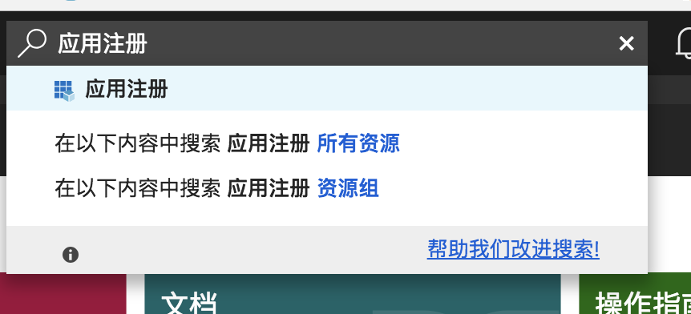

3、点击`新应用程序注册`，并完成表单填写,最后点击右下角的创建。

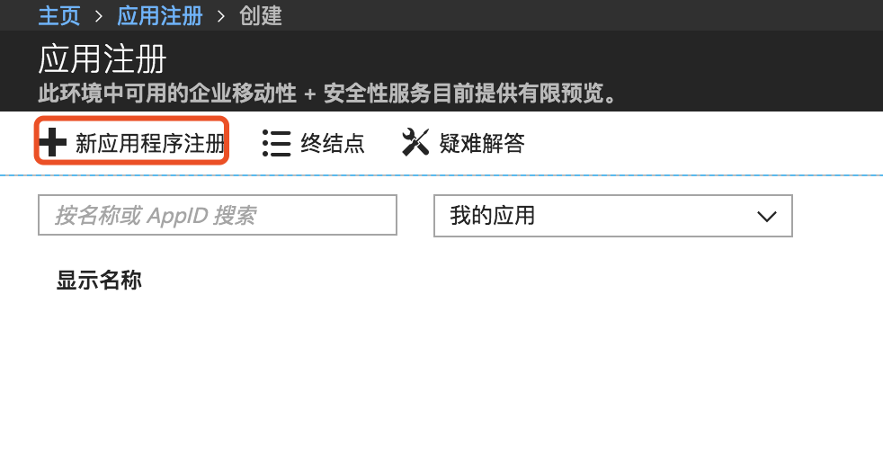
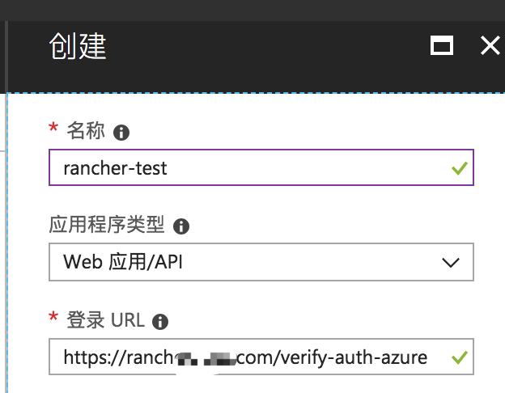

> **注意** 登录URL需要填写为Rancher设置中配置的`server_url`，但是中国区需要在`rancher_server_url`地址后面添加`verify-auth-azure`后缀，例如：`https://demo.rancher.com/verify-auth-azure`，Azure为Global区不用添加。

## 二、创建Azure API密钥

从Azure门户中创建API密钥，Rancher将使用此密钥对Azure AD进行身份验证。

1、搜索`应用注册`服务，然后打开上一个过程中创建的`rancher-test`。可能会提示`你不是此目录中任何应用程序的所有者`,直接点击查看所有应用程序。

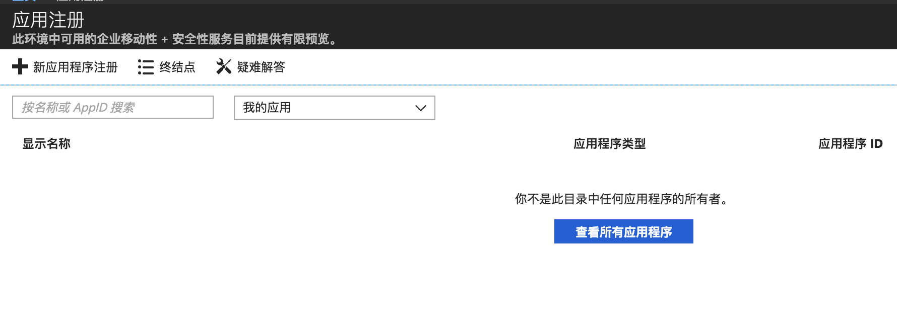
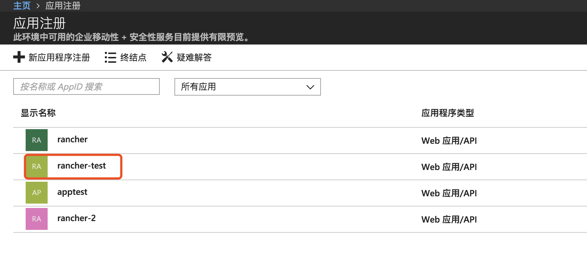

2、点击`rancher-test`后弹出新的窗口

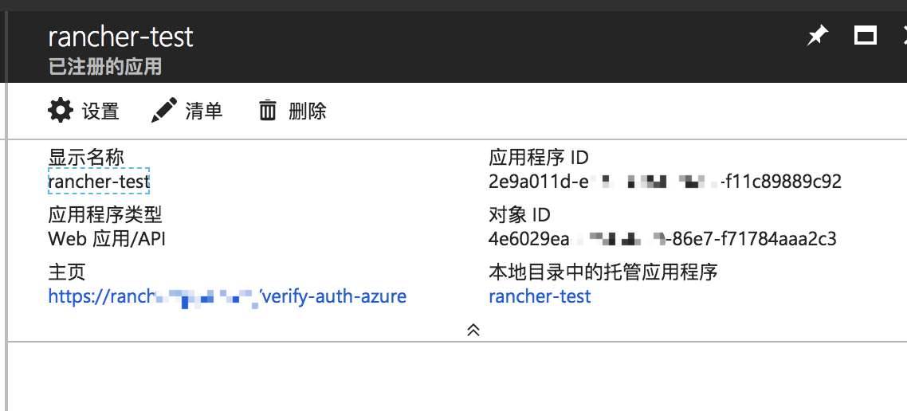

3、单击**设置**，从**设置**边栏中选择`密钥`。

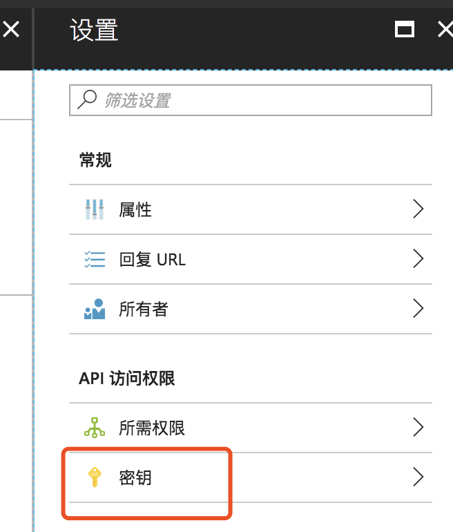

4、输入**密钥描述**,比如`rancher-test`，选择密钥的**有效期**，最后点击保存。

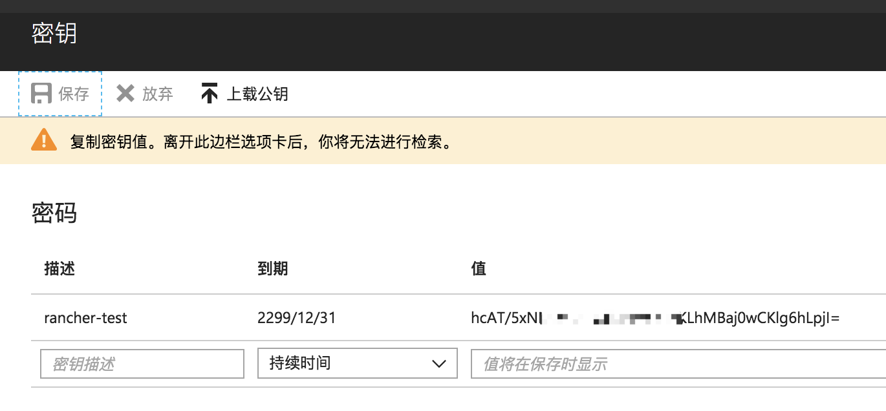

> **注意** 因为密钥只显示一次，所以需要复制密钥并保存到一个安全的地方。

## 三、设置Rancher的必需权限

接下来，在Azure中为Rancher设置API权限。

1、紧接上一步，从`设置`边栏选择`所需权限`。

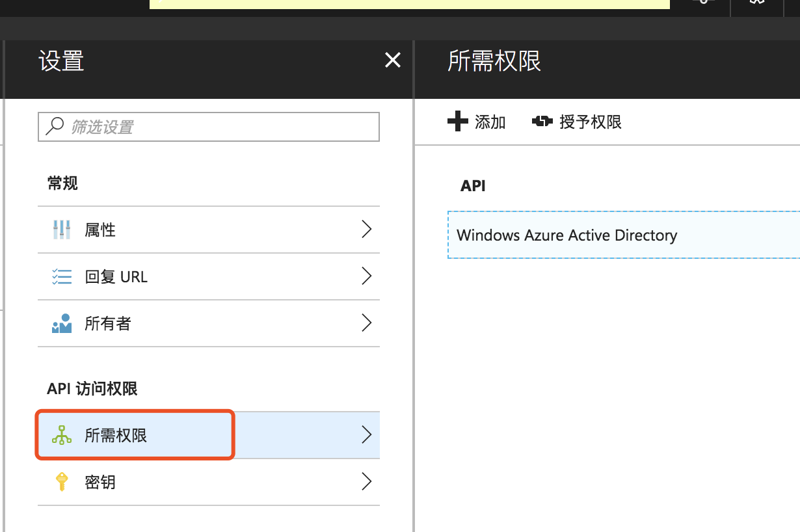

2、单击**Windows Azure Active Directory**。

3、从**启用访问权限**边栏选项卡中，勾选以下**委派权限**：

1. 以登录用户身份访问该目录
2. 读取目录数据
3. 读取所有群组
4. 读取所有用户的完整个人资料
5. 读取所有用户的基本配置文件
6. 登录并读取用户个人资料

    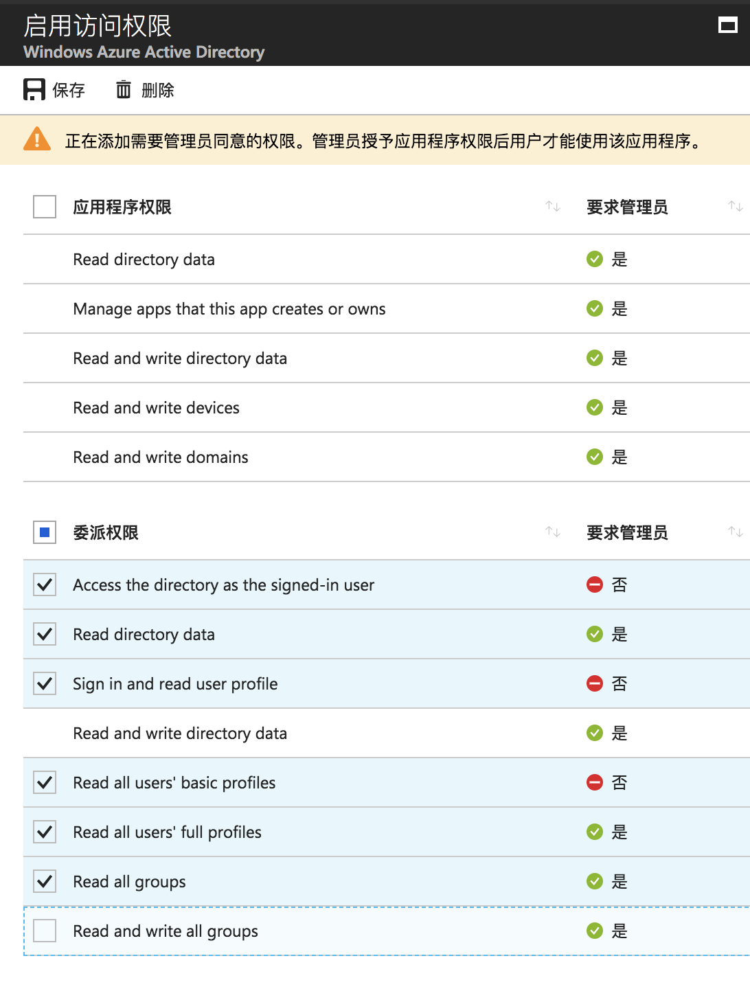

> **注意** 必须以Azure管理员身份登录才能成功保存权限设置。

## 四、复制Azure应用程序数据

Azure配置的最后一步，复制用于配置Rancher进行Azure AD身份验证的相关配置参数到空文本文件中。

1、获取`目录ID`

1. 搜索Azure Active Directory服务
    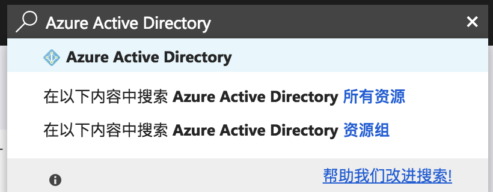
2. 从Azure Active Directory菜单中，打开`属性`
    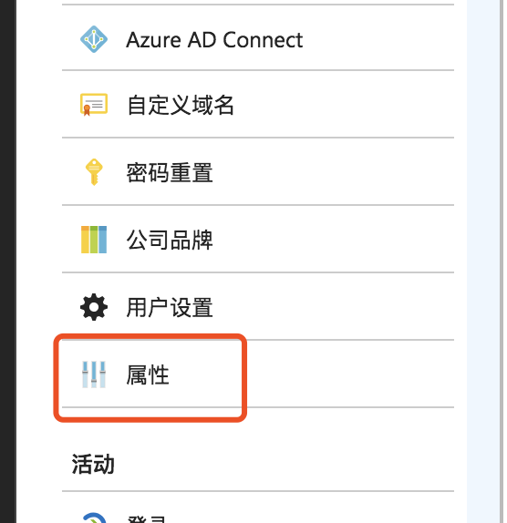
3. 复制`目录ID`并将其粘贴到文本文件中
    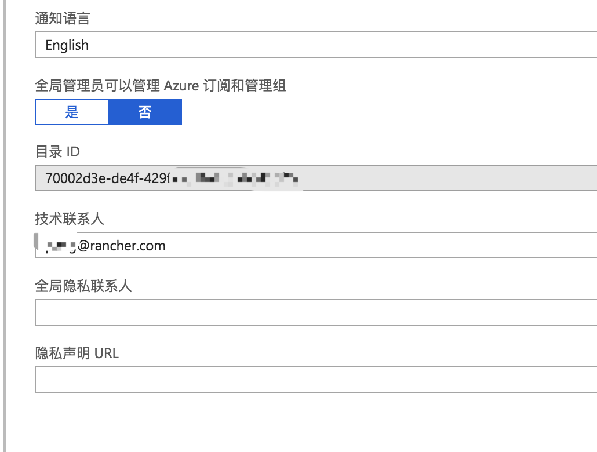

2、获取`应用ID`。

1. 搜索`应用注册`
2. 找到创建的`rancher-test`应用
3. 复制应用程序ID并将其粘贴到你的文本文件中

    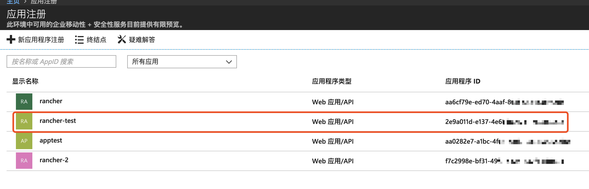

3、获取`MICROSOFT AZURE AD GRAPH API终结点`、`OAUTH 2.0令牌终结点`和`OAUTH 2.0授权终结点`。

1. 搜索`应用注册`，并点击`终结点`

    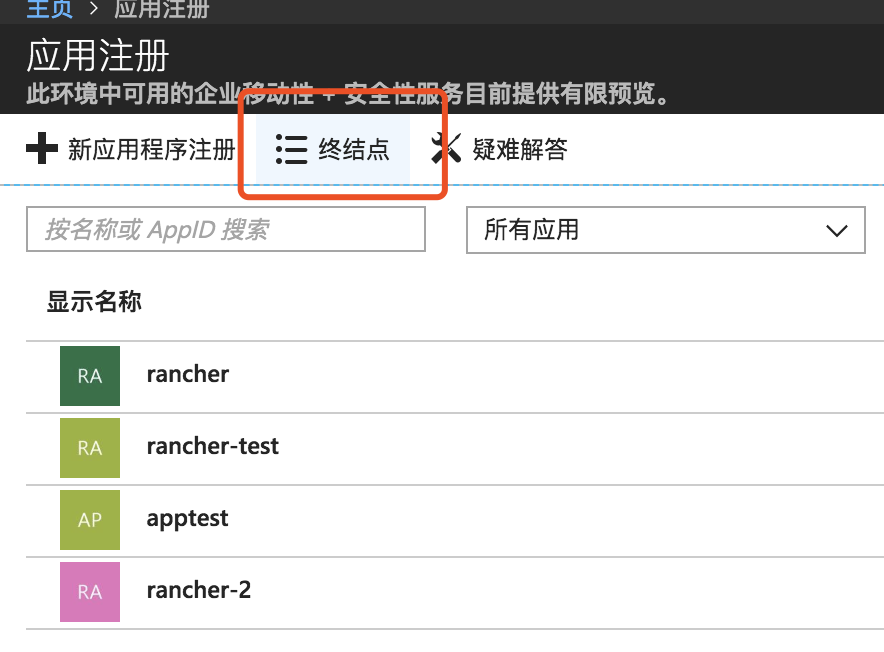
    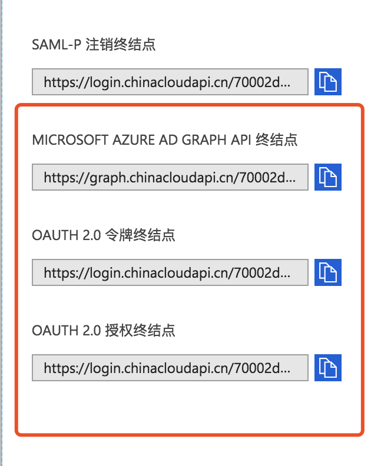

4、将以下端点复制到剪贴板并将其粘贴到文本文件中

1. MICROSOFT AZURE AD GRAPH API终结点
2. OAUTH 2.0令牌终结点
3. OAUTH 2.0授权终结点

## 五、在Rancher中配置Azure AD

在Rancher UI中，输入在Azure中获取到的AD配置信息以完成配置。

1、登录RancherUI,从`全局`视图中，选择`安全>认证`。

2、选择Azure AD。

3、输入对应的配置信息:

下表是Azure门户配置与Rancher认证配置的字段对应表:

| Rancher                | Azure AD                             |
| ---------------------- | ------------------------------------ |
| 租户ID(Tenant ID)      | 目录ID(Directory ID)                  |
| 应用ID(Application ID) | 应用ID(Application ID)                    |
| Application Secret         | 密钥                                  |
| Endpoint                   | <https://login.chinacloudapi.cn>     |
| Graph Endpoint             | <https://graph.chinacloudapi.cn>     |
| Token Endpoint             | OAUTH 2.0 令牌终结点                   |
| Auth Endpoint              | OAUTH 2.0 授权终结点                   |

>**重要提示**
> Global区Endpoint地址: `https://login.windows.net/`\
> Global区Graph Endpoint地址：`https://graph.windows.net/`\
> 具体信息请查阅：[Check-endpoints-in-Azure](https://docs.microsoft.com/en-us/azure/china/china-get-started-developer-guide#Check-endpoints-in-Azure)

4、最后点击`启用Azure AD`。
