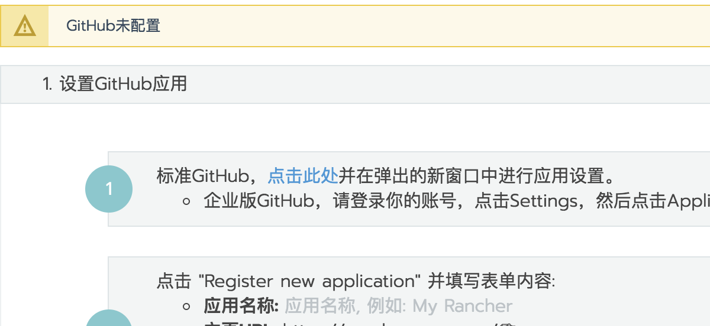
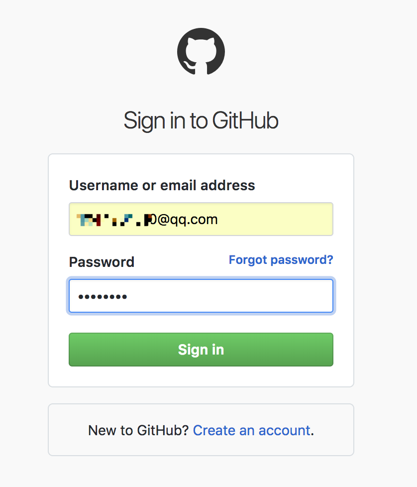
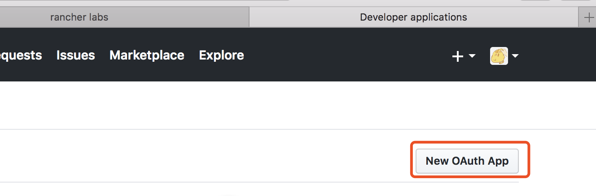
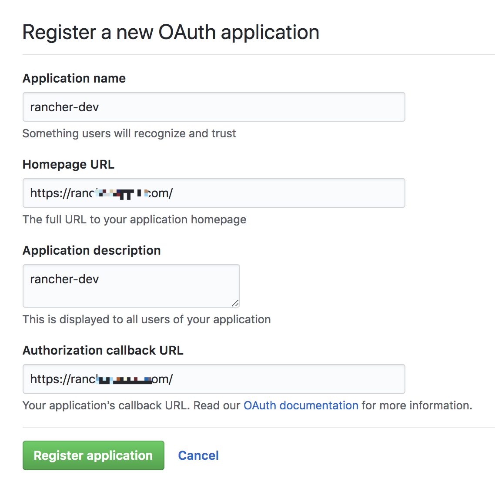
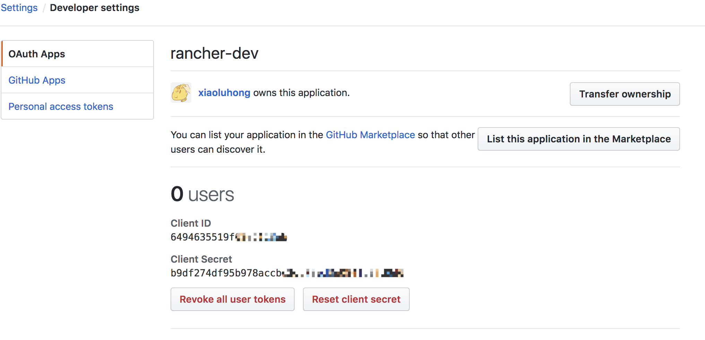
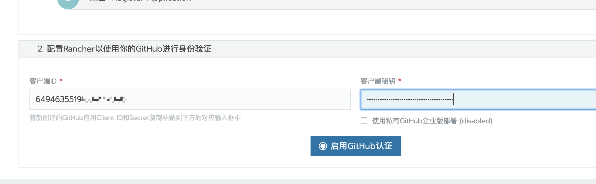
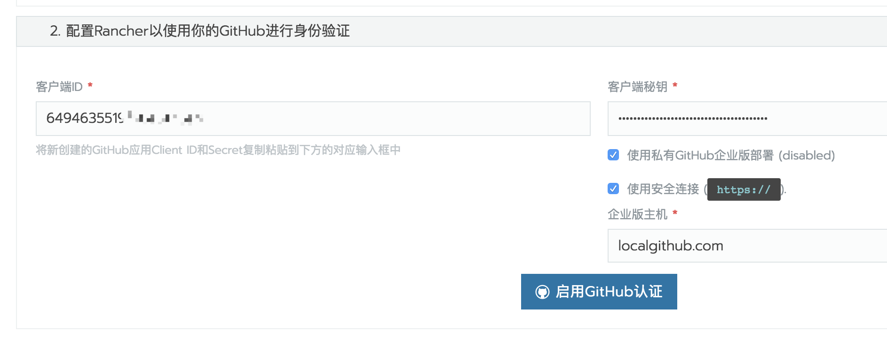
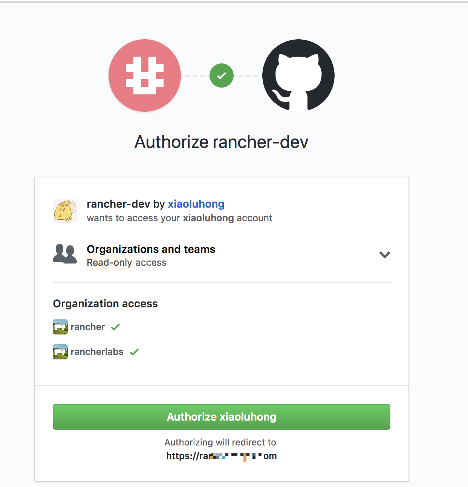

在使用GitHub的环境中，您可以配置Rancher以允许使用GitHub凭据登录。

1、使用具有`管理员角色`的本地用户登录Rancher。

2、在全局视图中，从主菜单中选择`安全>认证`。

3、选择GitHub。

4、在`1.设置Github应用`中，点击`点击此处`。

5、接着弹出Github的登录页面，输入账号和密码进行登录。

> 如果您使用的是本地部署的企业版Github服务器，请通过浏览器打开新的窗口直接访问`https://<github_server_url>/settings/developers`

6、登录Github后，点击`new OAuth app`，并填写相关参数。

1. Application name: 任意填写，比如：Rancher-dev；
2. Homepage URL: 主页URL,查看Rancher Github配置页面；
3. Application description: 可选；
4. Application description: 授权回调URL,查看Rancher Github配置页面；
5. 最后点击`Register application`

    

    > **什么是授权回调网址?** 使用外部身份验证时，实际上不会在您的应用程序中进行身份验证。相反，身份验证在外部进行(在本例中为GitHub)。在外部身份验证成功完成后，用户将通过`授权回调URL`重新进入应用程序。

7、点击`Register application`后，自动创建应用。复制`Client ID`和`Client Secret`

8、在Rancher Github配置页面，输入复制的`Client ID`和`Client Secret`

9、如果是本地部署的私有Github企业版服务器，需要勾选`使用私有GitHub企业版部署`,根据实际情况是否勾选`使用安全连接`。

10、单击`启用GitHub`进行身份验证。

点击`启用GitHub`后会弹出新的窗口镜像认证授权，如果未弹出窗口请坚持浏览器安全设置是否阻止了弹窗。

11、授权通过后会自动回到Rancher Github配置页面， 在`站点访问`选项中配置用户授权范围

1. **允许所有有效用户**

    所有的GitHub用户，以及本地用户，还有其他第三方认证用户都可以访问Rancher。我们通常不鼓励使用此设置！

2. 允许集群、项目以及授权用户和组成员

    配置为集群成员或项目成员的所有GitHub用户或组，以及本地用户都可以登录到Rancher。此外，您添加到`授权用户和组织`列表的任何GitHub用户或组都可以登录到Rancher。

3. 仅限授权用户和组织的访问权限

    只有添加到授权用户和组织的`GitHub用户或组`才能登录Rancher。相对安全性更高，但是灵活性较低。

12、点击**保存**。
