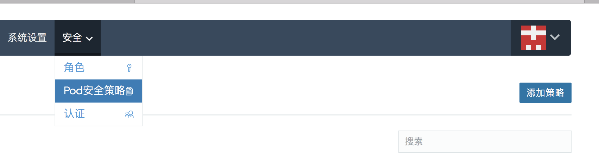

Pod安全策略(或PSP)是控制Pod规范中安全敏感方面的对象(如root权限)。如果Pod不符合PSP中指定的条件，Kubernetes将不允许它启动，并且Rancher将显示错误消息`Pod <NAME> is forbidden: unable to validate...`。

- 可以在群集或项目级别分配Pod安全策略。
- PSP通过继承来工作:
  - 默认情况下，分配给集群的Pod安全策略由其项目以及添加到这些项目中的所有命名空间继承。
  - **例外:** 无论是否给群集或项目分配Pod安全策略，未分配给项目的命名空间不会继承P`od安全策略`。由于这些命名空间没有分配Pod安全策略，因此在这些命名空间中部署工作负载将失败，这是默认的Kubernetes行为。
    - 可以通过直接为项目分配不同的Pod安全策略来覆盖默认的Pod安全策略。
- 在分配Pod安全策略之前,已在群集或项目中运行的工作负载不会被检查,需要克隆或升级工作负载来检查它们是否满足Pod安全策略要求。

在[Kubernetes文档](https://kubernetes.io/docs/concepts/policy/pod-security-policy/)中了解更多有关Pod安全策略的信息。

>**最佳实践:** 在群集级别设置pod安全策略。

使用Rancher，您可以在UI创建Pod安全策略，而不需使用YAML文件来创建。

## 默认Pod安全策略

`自v2.0.7起可用`

Rancher附带两个默认的Pod安全策略: `restricted`和`unrestricted`。

- `restricted`

  This policy is based on the Kubernetes [example restricted policy](https://raw.githubusercontent.com/kubernetes/website/master/content/en/examples/policy/restricted-psp.yaml). It significantly restricts what types of pods can be deployed to a cluster or project. This policy:

  - 阻止Pod作为特权用户运行，并防止特权升级。
  - Validates that server-required security mechanisms are in place (such as restricting what volumes can be mounted to only the core volume types and preventing root supplemental groups from being added). 

- `unrestricted`

  此策略等同于在禁用Pod安全策略的情况下运行Kubernetes，它对pod部署到集群或项目中没有限制。

## 创建Pod安全策略

1. 在`全局`视图中，从主菜单中选择`安全>Pod安全策略`,然后单击添加策略。

    

2. 设置策略名称。

3. 根据实际需求设置策略功能，了解更多信息，请参阅下面链接的Kubernetes文档。

    - 基本策略:

        - [提升特权][6]
        - [主机命名空间][2]
        - [只读跟根文件系统][1]

    - [内核安全策略][5]
    - [Volume Policy][1]
    - [Allowed Host Paths Policy][1]
    - [FS Group Policy][1]
    - [Host Ports Policy][2]
    - [Run As User Policy][3]
    - [SELinux Policy][4]
    - [Supplemental Groups Policy][3]

### What's Next

您可以在以下上下文中添加Pod安全策略:

- [创建集群](/rancher/v2.x/cn/configuration/global/clusters/creating-cluster/create-cluster-custom/)
- [编辑已有集群](/rancher/v2.x/cn/configuration/global/clusters/editing-clusters/)
- [创建项目](/rancher/v2.x/cn/configuration/clusters/projects-namespaces/create-project/)
- [编辑已有项目](/rancher/v2.x/cn/configuration/clusters/projects-namespaces/editing-project/)

> **Note:** 我们建议在创建群集和项目时添加Pod安全策略，而不是编辑现有的集群或者项目。

<!-- links -->

[1]: https://kubernetes.io/docs/concepts/policy/pod-security-policy/#volumes-and-file-systems
[2]: https://kubernetes.io/docs/concepts/policy/pod-security-policy/#host-namespaces
[3]: https://kubernetes.io/docs/concepts/policy/pod-security-policy/#users-and-groups
[4]: https://kubernetes.io/docs/concepts/policy/pod-security-policy/#selinux
[5]: https://kubernetes.io/docs/concepts/policy/pod-security-policy/#capabilities
[6]: https://kubernetes.io/docs/concepts/policy/pod-security-policy/#privilege-escalation
