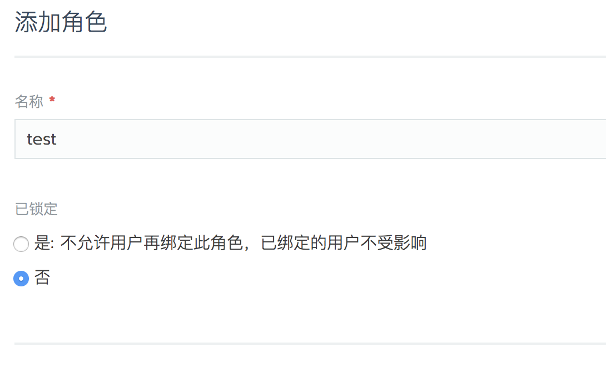
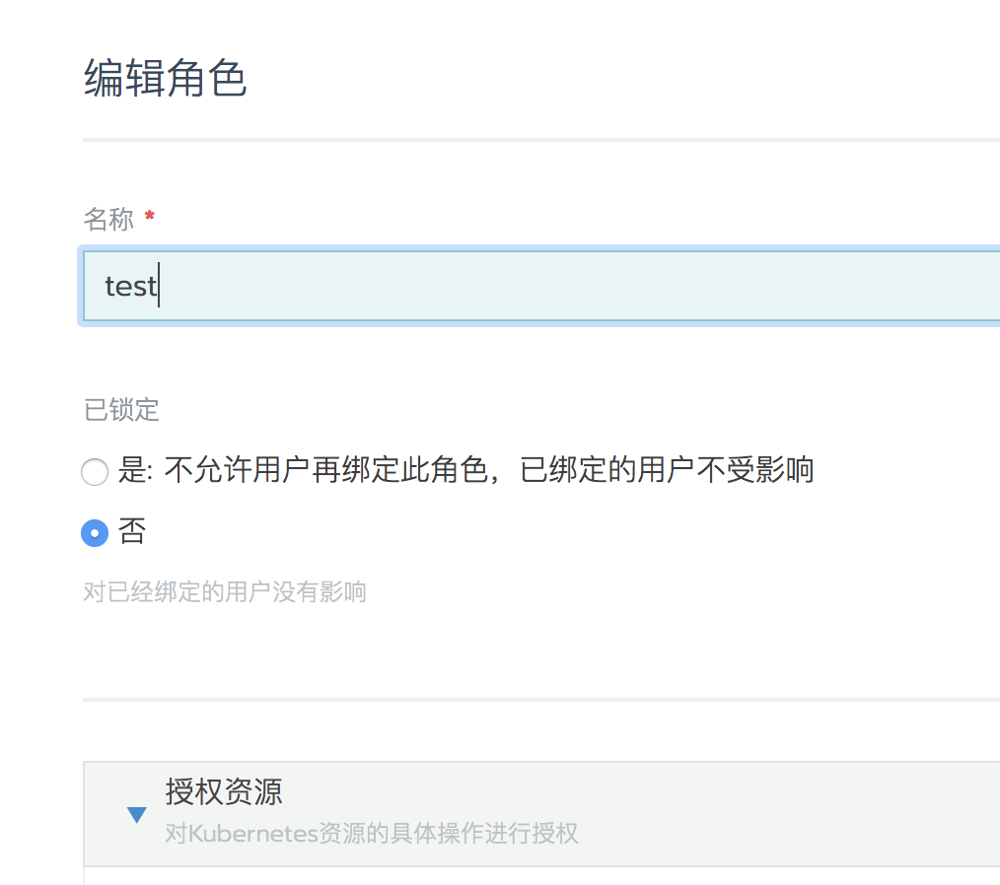

你可以将角色设置为`locked`状态,锁定角色可防止为其分配用户。

锁定角色：

- 无法分配给尚未分配角色的用户。
- 将用户添加到集群或项目时，不会在`成员角色`下拉列表中列出。
- 在锁定角色之前，不要影响分配了该角色的用户。这些用户保留角色提供的访问权限。

角色可以被以下用户锁定：

- 分配了`Administrator`全局权限的用户。
- 分配了`Custom Users`权限的用户以及`Manage Roles`角色。

## 锁定/解锁角色

`锁定角色`可以在新建角色或者编辑已有角色来实现，解锁角色只能通过编辑已有的角色。

- 新建角色

- 编辑角色

