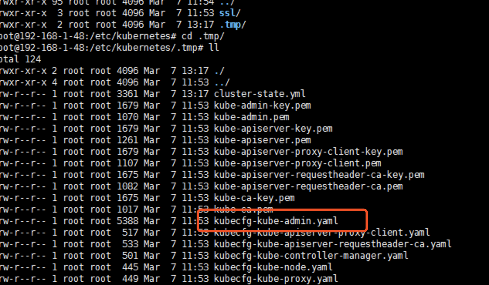
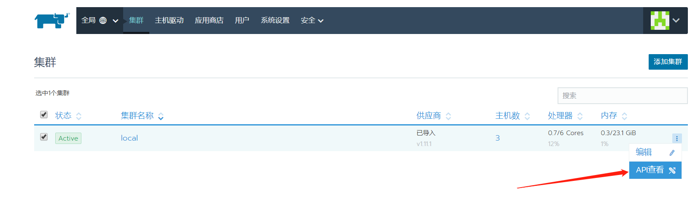
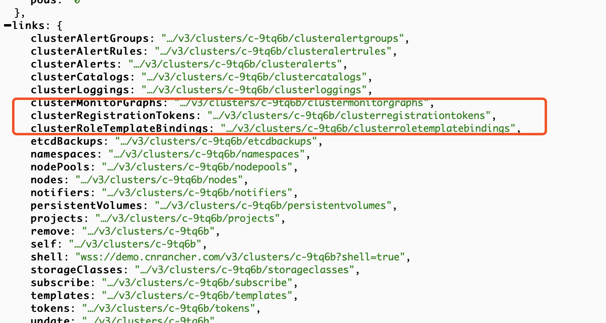
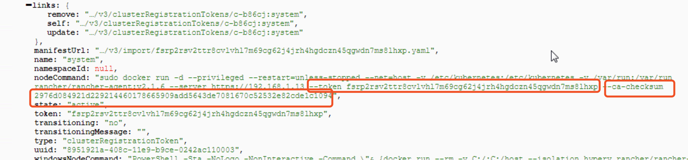
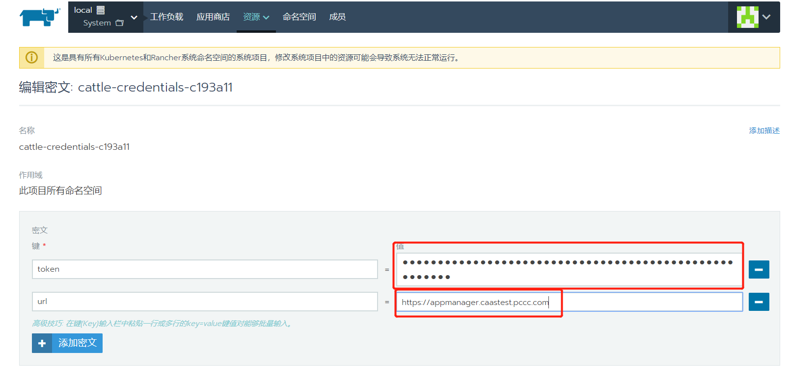
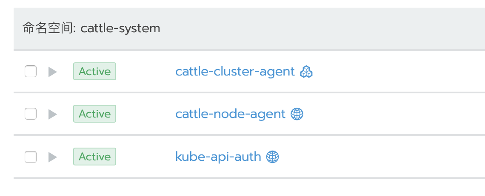
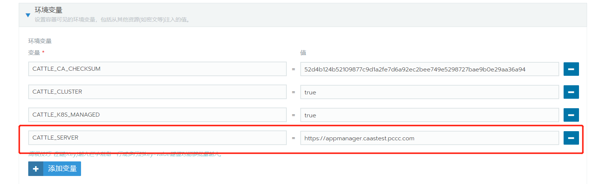
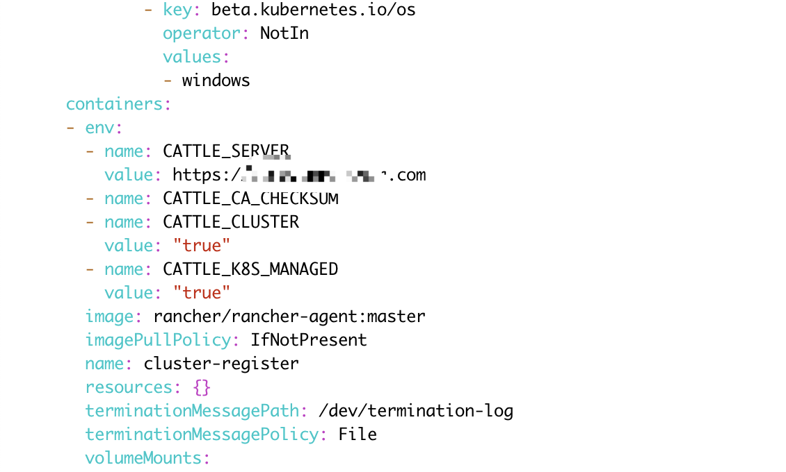

## **重要提示**

- 2.1.x以前的版本，可在master节点的/etc/kubernetes/.tmp路径下找到kubecfg-kube-admin.yaml

  

- 操作之前备份Rancher Server

  备份方法参考：/rancher/v2.x/cn/backups-and-restoration/

## 一、准备证书

更换域名后，会涉及到证书无法验证的问题,所以更换证书也一般会涉及到证书的更换。

- 自签名ssl证书

复制以下代码另存为`create_self-signed-cert.sh`或者其他您喜欢的文件名。修改代码开头的`CN`(域名)，如果需要使用ip去访问rancher server，那么需要给ssl证书添加扩展IP，多个IP用逗号隔开。如果想实现多个域名访问rancher server，则添加扩展域名(SSL_DNS),多个`SSL_DNS`用逗号隔开。

```bash
#!/bin/bash -e

# * 为必改项
# * 更换为你自己的域名
CN='' # 例如: demo.rancher.com

# 扩展信任IP或域名
## 一般ssl证书只信任域名的访问请求，有时候需要使用ip去访问server，那么需要给ssl证书添加扩展IP，
## 多个IP用逗号隔开。如果想多个域名访问，则添加扩展域名（SSL_DNS）,多个SSL_DNS用逗号隔开
SSL_IP='' # 例如: 1.2.3.4
SSL_DNS='' # 例如: demo.rancher.com

# 国家名(2个字母的代号)
C=CN

# 证书加密位数
SSL_SIZE=2048

# 证书有效期
DATE=${DATE:-3650}

# 配置文件
SSL_CONFIG='openssl.cnf'

if [[ -z $SILENT ]]; then
echo "----------------------------"
echo "| SSL Cert Generator |"
echo "----------------------------"
echo
fi

export CA_KEY=${CA_KEY-"cakey.pem"}
export CA_CERT=${CA_CERT-"cacerts.pem"}
export CA_SUBJECT=ca-$CN
export CA_EXPIRE=${DATE}

export SSL_CONFIG=${SSL_CONFIG}
export SSL_KEY=$CN.key
export SSL_CSR=$CN.csr
export SSL_CERT=$CN.crt
export SSL_EXPIRE=${DATE}

export SSL_SUBJECT=${CN}
export SSL_DNS=${SSL_DNS}
export SSL_IP=${SSL_IP}

export K8S_SECRET_COMBINE_CA=${K8S_SECRET_COMBINE_CA:-'true'}

[[ -z $SILENT ]] && echo "--> Certificate Authority"

if [[ -e ./${CA_KEY} ]]; then
    [[ -z $SILENT ]] && echo "====> Using existing CA Key ${CA_KEY}"
else
    [[ -z $SILENT ]] && echo "====> Generating new CA key ${CA_KEY}"
    openssl genrsa -out ${CA_KEY} ${SSL_SIZE} > /dev/null
fi

if [[ -e ./${CA_CERT} ]]; then
    [[ -z $SILENT ]] && echo "====> Using existing CA Certificate ${CA_CERT}"
else
    [[ -z $SILENT ]] && echo "====> Generating new CA Certificate ${CA_CERT}"
    openssl req -x509 -sha256 -new -nodes -key ${CA_KEY} \
    -days ${CA_EXPIRE} -out ${CA_CERT} -subj "/CN=${CA_SUBJECT}" > /dev/null || exit 1
fi

echo "====> Generating new config file ${SSL_CONFIG}"
cat > ${SSL_CONFIG} <<EOM
[req]
req_extensions = v3_req
distinguished_name = req_distinguished_name
[req_distinguished_name]
[ v3_req ]
basicConstraints = CA:FALSE
keyUsage = nonRepudiation, digitalSignature, keyEncipherment
extendedKeyUsage = clientAuth, serverAuth
EOM

if [[ -n ${SSL_DNS} || -n ${SSL_IP} ]]; then
    cat >> ${SSL_CONFIG} <<EOM
subjectAltName = @alt_names
[alt_names]
EOM
    IFS=","
    dns=(${SSL_DNS})
    dns+=(${SSL_SUBJECT})
    for i in "${!dns[@]}"; do
      echo DNS.$((i+1)) = ${dns[$i]} >> ${SSL_CONFIG}
    done

    if [[ -n ${SSL_IP} ]]; then
        ip=(${SSL_IP})
        for i in "${!ip[@]}"; do
          echo IP.$((i+1)) = ${ip[$i]} >> ${SSL_CONFIG}
        done
    fi
fi

[[ -z $SILENT ]] && echo "====> Generating new SSL KEY ${SSL_KEY}"
openssl genrsa -out ${SSL_KEY} ${SSL_SIZE} > /dev/null || exit 1

[[ -z $SILENT ]] && echo "====> Generating new SSL CSR ${SSL_CSR}"
openssl req -sha256 -new -key ${SSL_KEY} -out ${SSL_CSR} \
-subj "/CN=${SSL_SUBJECT}" -config ${SSL_CONFIG} > /dev/null || exit 1

[[ -z $SILENT ]] && echo "====> Generating new SSL CERT ${SSL_CERT}"
openssl x509 -sha256 -req -in ${SSL_CSR} -CA ${CA_CERT} \
    -CAkey ${CA_KEY} -CAcreateserial -out ${SSL_CERT} \
    -days ${SSL_EXPIRE} -extensions v3_req \
    -extfile ${SSL_CONFIG} > /dev/null || exit 1

if [[ -z $SILENT ]]; then
echo "====> Complete"
echo "keys can be found in volume mapped to $(pwd)"
echo
echo "====> Output results as YAML"
echo "---"
echo "ca_key: |"
cat $CA_KEY | sed 's/^/  /'
echo
echo "ca_cert: |"
cat $CA_CERT | sed 's/^/  /'
echo
echo "ssl_key: |"
cat $SSL_KEY | sed 's/^/  /'
echo
echo "ssl_csr: |"
cat $SSL_CSR | sed 's/^/  /'
echo
echo "ssl_cert: |"
cat $SSL_CERT | sed 's/^/  /'
echo
fi

if [[ -n $K8S_SECRET_NAME ]]; then

  if [[ -n $K8S_SECRET_COMBINE_CA ]]; then
    [[ -z $SILENT ]] && echo "====> Adding CA to Cert file"
    cat ${CA_CERT} >> ${SSL_CERT}
  fi

  [[ -z $SILENT ]] && echo "====> Creating Kubernetes secret: $K8S_SECRET_NAME"
  kubectl delete secret $K8S_SECRET_NAME --ignore-not-found

  if [[ -n $K8S_SECRET_SEPARATE_CA ]]; then
    kubectl create secret generic \
    $K8S_SECRET_NAME \
    --from-file="tls.crt=${SSL_CERT}" \
    --from-file="tls.key=${SSL_KEY}" \
    --from-file="ca.crt=${CA_CERT}"
  else
    kubectl create secret tls \
    $K8S_SECRET_NAME \
    --cert=${SSL_CERT} \
    --key=${SSL_KEY}
  fi

  if [[ -n $K8S_SECRET_LABELS ]]; then
    [[ -z $SILENT ]] && echo "====> Labeling Kubernetes secret"
    IFS=$' \n\t' # We have to reset IFS or label secret will misbehave on some systems
    kubectl label secret \
      $K8S_SECRET_NAME \
      $K8S_SECRET_LABELS
  fi
fi

echo "4. 重命名服务证书"
mv ${CN}.key tls.key
mv ${CN}.crt tls.crt
```

- 权威认证证书

把证书重命名为需要的文件名称

```bash
cp xxx.key tls.key
cp xxx.crt tls.crt
```

## 二、更新证书

### 1、Rancher单节点运行

>注意：操作前先备份，/rancher/v2.x/cn/backups-and-restoration/backups/

如果是以容器映射证书文件运行的rancher server，只需要停止原有rancher server容器，然后使用相同的运行配置，替换新证书后重新运行新容器即可，注意容器名称不要相同。

### 2、Rancher HA运行

>注意：操作前先备份，/rancher/v2.x/cn/backups-and-restoration/backups/

- 保存原有证书yaml文件

```bash
kubectl --kubeconfig=kube_configxxx.yml -n cattle-system \
get secret tls-rancher-ingress  -o yaml > tls-ingress.yaml

kubectl --kubeconfig=kube_configxxx.yml -n cattle-system \
get secret tls-ca  -o yaml > tls-ca.yaml
```

- 删除旧的secret，然后创建新的secret

```bash
# 指定kube配置文件路径

kubeconfig=

# 删除旧的secret
kubectl --kubeconfig=$kubeconfig -n cattle-system \
delete secret tls-rancher-ingress

kubectl --kubeconfig=$kubeconfig -n cattle-system \
delete secret tls-ca

# 创建新的secret
kubectl --kubeconfig=$kubeconfig -n cattle-system \
create secret tls tls-rancher-ingress --cert=./tls.crt --key=./tls.key

kubectl --kubeconfig=$kubeconfig -n cattle-system \
create secret generic tls-ca --from-file=cacerts.pem

# 重启Pod
kubectl --kubeconfig=$kubeconfig -n cattle-system \
delete pod `kubectl --kubeconfig=$kubeconfig -n cattle-system \
get pod |grep -E "cattle-cluster-agent|cattle-node-agent|rancher" | awk '{print $1}'`
```

>**重要提示：**如果环境不是按照标准的rancher安装文档安装，secret名称可能不相同，请根据实际secret名称操作。

## 三、更新local集群的密文`cattle-credentials-xxxx`

1. 查看集群API 
2. 点击**clusterRegistrationTokens** 
3. 此处找到新的TOKEN 和CA-CHECKSUM，记下来备用

4. 在`system`项目\资源\密文 路径页面下，找到并编辑密文`cattle-credentials-xxxx`



- url字段修改为新的域名
- token字段修改为查找到的新token

## 四、修改local集群agent的域名和CA-CHECKSUM

- 在`system`项目下找到cattle-system命名空间，分别编辑cattle-cluster-agent和cattle-node-agent

- 修改`CATTLE_SERVER`为新的域名，检查`CA-CHECKSUM`是否有变化，如果有则需要一并修改。

## 五、修改业务集群agent pod

因为token和域名的更改，业务集群的agent pod无法连接rancher server,这个时候需要通过命令行工具去编辑yaml文件。

- 执行以下命令：

```bash
kubeconfig=''
kubectl --kubeconfig=$kubeconfig -n cattle-system \
edit deployments cattle-cluster-agent

kubectl --kubeconfig=$kubeconfig -n cattle-system \
edit daemonsets cattle-node-agent
```

- 然后编辑环境变量

