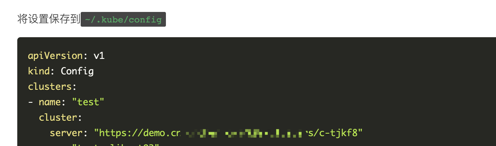
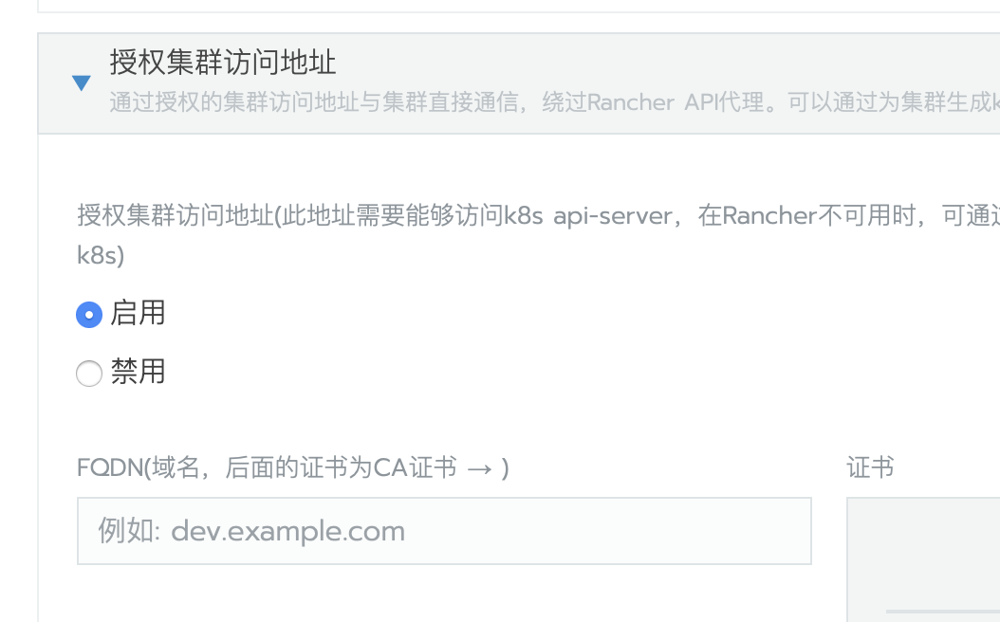
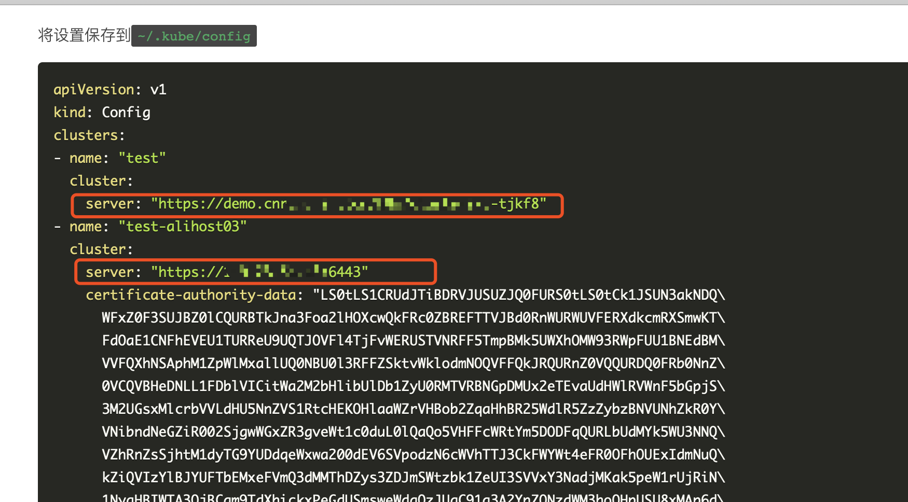

分析Rancher UI生成的kubecfg文件可以发现，第一个`server`与Rancher server的url 域名或者IP相同。当kubectl访问API SERVER的时候，请求是先发送到rancher，然后再通过`cluster agent`转发给`API SERVER`。



在v2.2.2版本以前，Rancher UI生成的kubecfg文件中只设置了一个`server`。

从v2.2.2开始，在创建集群时开启`授权集群访问地址`，创建好集群后，Rancher UI生成的kubecfg文件中将显示多个master 节点IP的`server`。





## 恢复kubecfg文件

当rancher agent与rancher server端口连接，rancher ui将无法查看kubecfg。如果需要对K8S集群做操作，将需要使用kubectl去操作集群。如果是v2.2.2之前的版本或者v2.2.2没有开启`授权集群访问地址`功能，那么需要恢复内置kubecfg配置文件。

### 操作方法

> 因工具兼容性问题，以下命令仅支持linux下执行

- `docker run`安装的单容器Rancher Server

    ```bash
    # 进入容器
    docker exec -ti <容器ID> bash

    # 集群ID，可通过浏览器地址栏查询
    cluster_id=c-xxx

    kubectl get secret c-${cluster_id} -n cattle-system -o=jsonpath='{.data.cluster}' \
    | base64 --decode | jq .metadata.state | awk '{print substr($0,2,length($0)-2)}' \
    > ${cluster_id}-kube-config.yml

    sed -i 's/\\n/\n/g' ${cluster_id}-kube-config.yml && \
    sed -i 's/\\"/"/g' ${cluster_id}-kube-config.yml

    ```

- Rancher HA

    ```bash
    # 依赖工具: jq、awk
    # local集群的kube配置文件
    local_kube_config=xxx
    # 集群ID，可通过浏览器地址栏查询
    cluster_id=c-xxx

    kubectl --kubeconfig=$local_kube_config get secret c-${cluster_id} \
    -n cattle-system \
    -o=jsonpath='{.data.cluster}' | base64 --decode | \
    jq .metadata.state | awk '{print substr($0,2,length($0)-2)}' \
    > ${cluster_id}-kube-config.yml

    sed -i 's/\\n/\n/g' ${cluster_id}-kube-config.yml && \
        sed -i 's/\\"/"/g' ${cluster_id}-kube-config.yml
    ```
