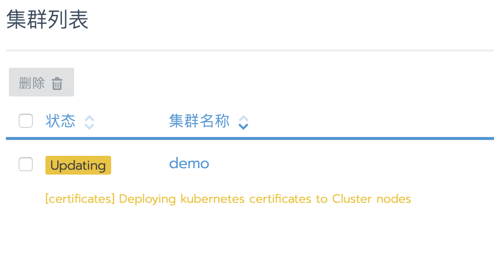
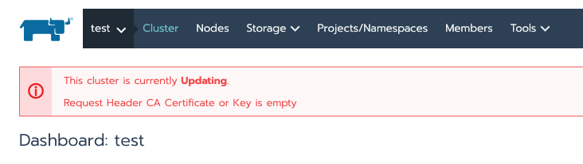
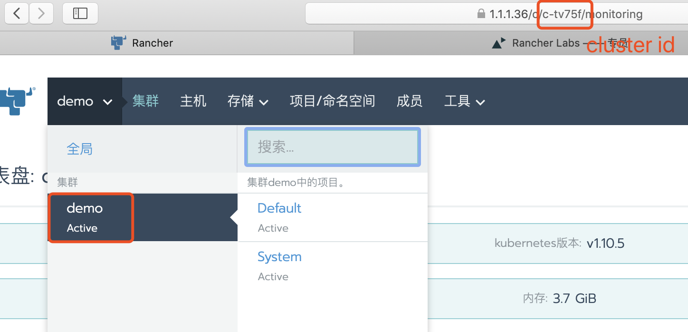
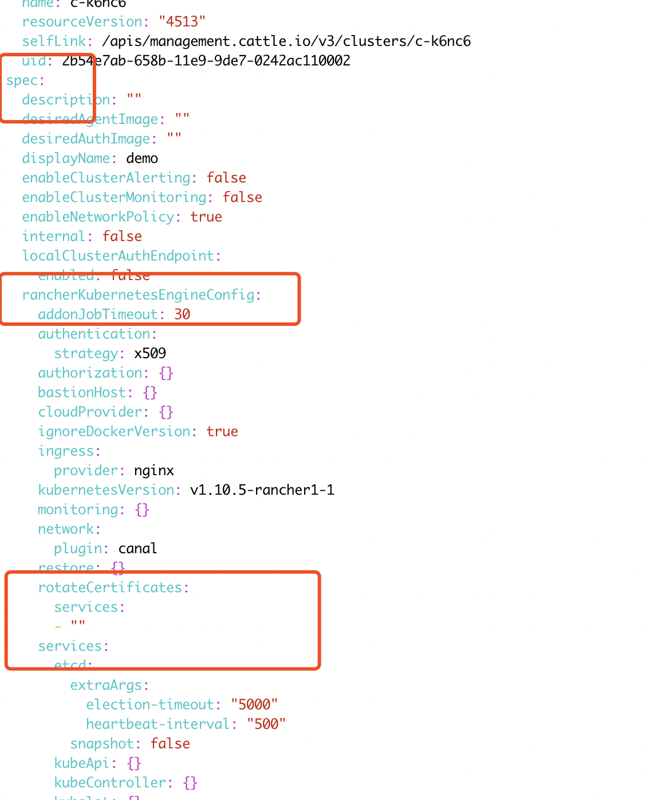
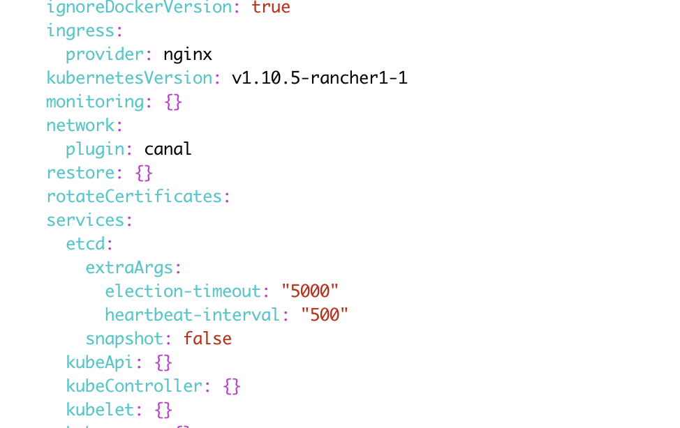

> **警告** 如果你的证书已经过期，请先不要升级`Rancher Server`，根据[证书已过期导致无法连接k8s](#2-证书已过期导致无法连接k8s)进行处理。

默认情况下，Kubernetes集群使用ssl证书来加密通信，Rancher自动为集群生成证书。在`Rancher v2.0.14、v2.1.9`之前的版本，Rancher创建的集群ssl证书默认有效期为1年(CA证书默认10年)，在`Rancher v2.0.14、v2.1.9`以及更高的版本中，Rancher创建的集群ssl证书默认为10年(CA证书默认10年)。

对于使用`Rancher v2.0.14、v2.1.9`之前版本安装的Kubernetes集群，证书即将到期，请尽快更新集群证书。

## 一: 通过UI轮换证书(业务集群)

*可用版本: Rancher v2.2.0 +*

在Rancher v2.2.0以及更高版本，可通过UI的证书轮换功能对集群证书进行更新，此功能适用于`自定义安装的集群`。

证书轮换之后，Kubernetes组件将自动重新启动，重启不影响应用Pod，重启时间需要3到5分钟。

- 证书轮换可用于下列服务:

  - etcd
  - kubelet
  - kube-apiserver
  - kube-proxy
  - kube-scheduler
  - kube-controller-manager

- 通过UI轮换证书，目前支持:

  - 批量更新所有服务证书(CA证书不变)
  - 更新某个指定服务(CA证书不变)

### 1、(重要)集群更新

如果Rancher版本是从`v2.x.x升级到2.2.x`，则需要先做一次`集群更新`操作。

1. 进入`全局\集群`视图；
1. 选择`目标集群`右侧的`省略号`菜单，选择升级；
1. 点击右侧`显示高级选项`，检查`Etcd快照轮换`功能是否开启，建议开启此功能；
1. 在`授权集群访问地址`中，检查功能是否已开启，建议开始此功能，下边的域名可以不用填写；
1. 最后点击`保存`，集群将自动进行更新

### 2、轮换证书

1. 进入`全局\集群`视图；
1. 选择对应集群右侧的`省略号`菜单,选择更新证书有效期；
1. 选择更新所有服务证书，并点击保存
1. 集群将自动更新证书
1. 因为证书改变，相应的`token`也会变化，在集群证书更新完成后，需要对连接`API SERVER`的Pod进行重建，以获取新的`token`。
    - cattle-system/cattle-cluster-agent
    - cattle-system/cattle-node-agent
    - cattle-system/kube-api-auth
    - ingress-nginx/nginx-ingress-controller
    - kube-system/canal
    - kube-system/kube-dns
    - kube-system/kube-dns-autoscaler
    - 其他应用Pod

## 二: 通过UI API轮换证书(业务集群)

*可用版本: Rancher v2.0.14+ v2.1.9+*

对于`Rancher v2.0.14、v2.1.9`以及更高版本，可通过API对集群证书进行更新。API证书轮换将会同时对所有组件证书进行更新，不支持指定组件更新证书。

1. 在`全局`视图中，定位到需要更新证书的集群，然后点击右侧省略号菜单，然后点击`API查看`
1. 点击右上方的`RotateCertificates`
1. 点击**Show Request**
1. 点击 **Send Request**
1. 因为证书改变，相应的`token`也会变化，在集群证书更新完成后，需要对连接`API SERVER`的Pod进行重建，以获取新的`token`。
   - cattle-system/cattle-cluster-agent
   - cattle-system/cattle-node-agent
   - cattle-system/kube-api-auth
   - ingress-nginx/nginx-ingress-controller
   - kube-system/canal
   - kube-system/kube-dns
   - kube-system/kube-dns-autoscaler
   - 其他应用Pod

## 三: RKE 证书轮换(local集群和业务集群通用)

*可用版本: rke v0.2.0+*

> **注意** 如果以前是通过`rke v0.2.0`之前的版本创建的Kubernetes集群，在轮换证书前先执行`rke up`操作，参考: https://www.cnrancher.com/docs/rke/latest/cn/cert-mgmt/

- 通过RKE轮换证书，目前支持:

  - 批量更新所有服务证书(CA证书不变)
  - 更新某个指定服务(CA证书不变)
  - 轮换CA和所有服务证书

1. 批量更新所有服务证书(CA证书不变)

    ```bash
    rke cert rotate 

    INFO[0000] Initiating Kubernetes cluster
    INFO[0000] Rotating Kubernetes cluster certificates
    INFO[0000] [certificates] Generating Kubernetes API server certificates
    INFO[0000] [certificates] Generating Kube Controller certificates
    INFO[0000] [certificates] Generating Kube Scheduler certificates
    INFO[0001] [certificates] Generating Kube Proxy certificates
    INFO[0001] [certificates] Generating Node certificate   
    INFO[0001] [certificates] Generating admin certificates and kubeconfig
    INFO[0001] [certificates] Generating Kubernetes API server proxy client certificates
    INFO[0001] [certificates] Generating etcd-xxxxx certificate and key
    INFO[0001] [certificates] Generating etcd-yyyyy certificate and key
    INFO[0002] [certificates] Generating etcd-zzzzz certificate and key
    INFO[0002] Successfully Deployed state file at [./cluster.rkestate]
    INFO[0002] Rebuilding Kubernetes cluster with rotated certificates
    .....
    INFO[0050] [worker] Successfully restarted Worker Plane..
    ```

2. 更新指定服务(CA证书不变)

    ```bash

    rke cert rotate --service kubelet
    INFO[0000] Initiating Kubernetes cluster
    INFO[0000] Rotating Kubernetes cluster certificates
    INFO[0000] [certificates] Generating Node certificate
    INFO[0000] Successfully Deployed state file at [./cluster.rkestate]
    INFO[0000] Rebuilding Kubernetes cluster with rotated certificates
    .....
    INFO[0033] [worker] Successfully restarted Worker Plane..
    ```

3. 轮换CA和所有服务证书

    ```bash
    rke cert rotate --rotate-ca

    INFO[0000] Initiating Kubernetes cluster
    INFO[0000] Rotating Kubernetes cluster certificates
    INFO[0000] [certificates] Generating CA kubernetes certificates
    INFO[0000] [certificates] Generating Kubernetes API server aggregation layer requestheader client CA certificates
    INFO[0000] [certificates] Generating Kubernetes API server certificates
    INFO[0000] [certificates] Generating Kube Controller certificates
    INFO[0000] [certificates] Generating Kube Scheduler certificates
    INFO[0000] [certificates] Generating Kube Proxy certificates
    INFO[0000] [certificates] Generating Node certificate   
    INFO[0001] [certificates] Generating admin certificates and kubeconfig
    INFO[0001] [certificates] Generating Kubernetes API server proxy client certificates
    INFO[0001] [certificates] Generating etcd-xxxxx certificate and key
    INFO[0001] [certificates] Generating etcd-yyyyy certificate and key
    INFO[0001] [certificates] Generating etcd-zzzzz certificate and key
    INFO[0001] Successfully Deployed state file at [./cluster.rkestate]
    INFO[0001] Rebuilding Kubernetes cluster with rotated certificates
    ```

4. 因为证书改变，相应的`token`也会变化，在集群证书更新完成后，需要对连接`API SERVER`的Pod进行重建，以获取新的`token`。

   - cattle-system/cattle-cluster-agent
   - cattle-system/cattle-node-agent
   - cattle-system/kube-api-auth
   - ingress-nginx/nginx-ingress-controller
   - kube-system/canal
   - kube-system/kube-dns
   - kube-system/kube-dns-autoscaler
   - 其他应用Pod

## 四: 独立容器Rancher Server证书更新

- 证书未过期

证书未过期时，rancher server可以正常运行。升级到Rancher v2.0.14+ 、v2.1.9+、v2.2.0+ 后会自动检查证书有效期，如果发现证书即将过期，将会自动生成新的证书。所以独立容器运行的Rancher Server，只需在证书过期前把rancher版本升级到支持自动更新ssl证书的版本即可，无需做其他操作。

- 证书已过期

如果证书已过期，那么rancher server无法正常运行。即使升级到Rancher v2.0.14+ 、v2.1.9+、v2.2.0+ 也可能会提示证书错误。如果出现这种情况，可通过以下操作进行处理：

1. 正常升级rancher版本到v2.0.14+ 、v2.1.9+、v2.2.0+；
1. 执行以下命令：

    ```bash
    docker exec c -ti <rancher_server_id> mv /var/lib/rancher/management-state/certs/bundle.json /var/lib/rancher/management-state/certs/bundle.json-bak

    docker restart <rancher_server_id>
    ```

## 五: 故障处理

### 1、提示CA证书为空

如果执行更新证书后出现如下错误提示，因为没有执行集群更新操作



**解决方法**

1. 选择对应问题集群，然后查看浏览器的集群ID,如下图：
1. 执行命令 `kubectl edit  clusters <clusters_ID>`
    - 如果Rancher是HA安装，直接在local集群中，通过`rke`生成的`kube`配置文件执行以上命令；
    - 如果Rancher是单容器运行，通过`docker exec -ti <容器ID> bash`进入容器中，然后执行`apt install vim -y`安装vim工具，然后再执行以上命令；
1. 删除`spec.rancherKubernetesEngineConfig.rotateCertificates`层级下的配置参数:修改为
1. 输入`:wq`保存yaml文件后集群将自动更新，更新完成后再进行证书更新。

### 2、证书已过期导致无法连接K8S

如果集群证书已经过期，那么即使升级到`Rancher v2.0.14、v2.1.9`以及更高版本也无法轮换证书。rancher是通过`Agent`去更新证书，如果证书过期将无法与`Agent`连接。

**解决方法**

可以手动设置节点的时间，把时间往后调整一些。因为`Agent`只与`K8S master`和`Rancher Server`通信，如果Rancher Server证书未过期，那就只需调整`K8S master`节点时间。

调整命令：

```bash
# 关闭ntp同步，不然时间会自动更新
timedatectl set-ntp false
# 修改节点时间
timedatectl set-time '2019-01-01 00:00:00'
```

然后再对Rancher Server进行升级，接着按照证书轮换步骤进行证书轮换，等到证书轮换完成后再把时间同步回来。

```bash
timedatectl set-ntp true
```

检查证书有效期

```bash
openssl x509 -in /etc/kubernetes/ssl/kube-apiserver.pem -noout -dates
```
