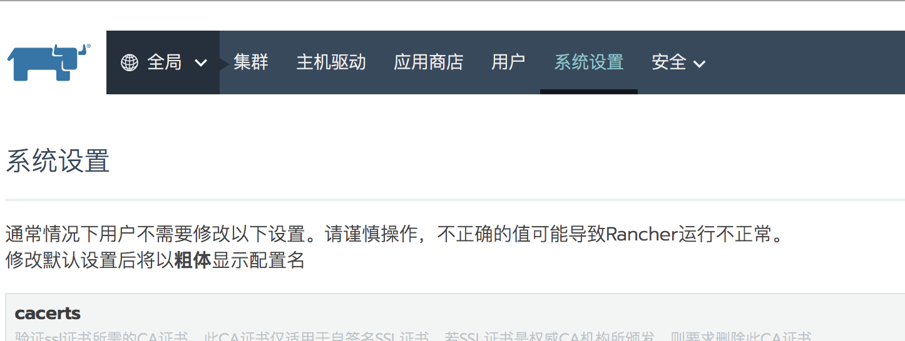
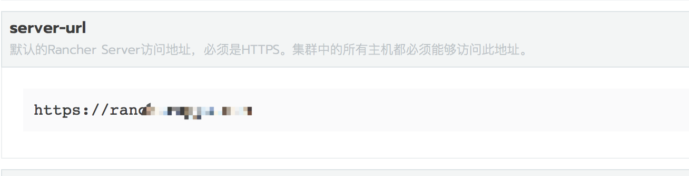
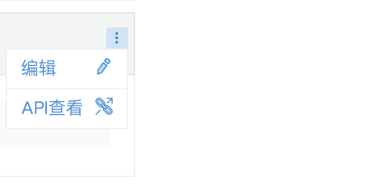
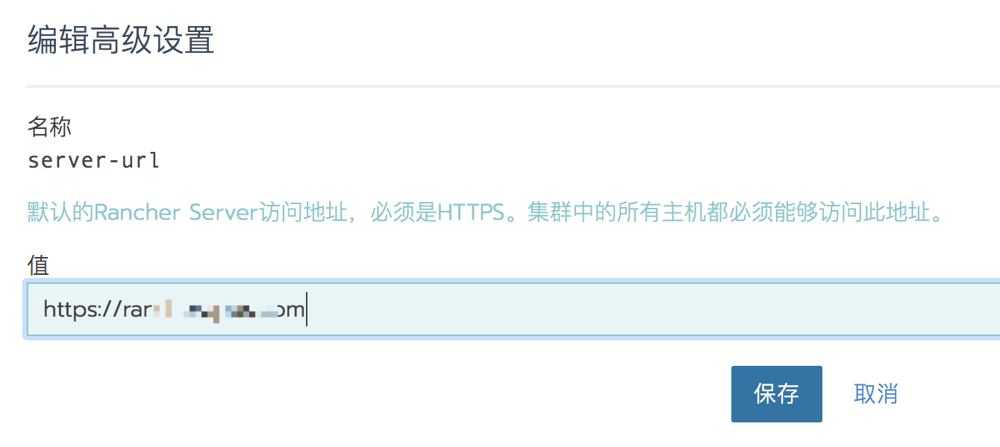

此`URL`地址可以是IP也可以是域名，集群所有节点将使用该URL来注册到Rancher，所以需要保证所有节点能访问该地址。

如果Rancher server是多节点HA运行，请不要设置`Rancher Server URL`为某一个节点的IP地址，避免因某一个节点出现故障影响整个集群。如果`Rancher Server URL`使用域名，请把域名解析到所有`Rancher Server`节点IP或者VIP上。

首次登录`Rancher Server`时，系统会提示你设置此`URL`。如果登录时设置有误，需要在创建集群前修改，如果在创建好集群后修改`Rancher Server URL`,之前注册的集群将会受到影响。

## 修改Rancher Server URL

- 1、登录Rancher server UI后点击 `系统设置`(全局视图下):

  

- 2、页面往下翻找到`server-url`,点击右侧菜单(三个点),点击编辑：

  

  

- 3、设置`server-url`并保存：

  
