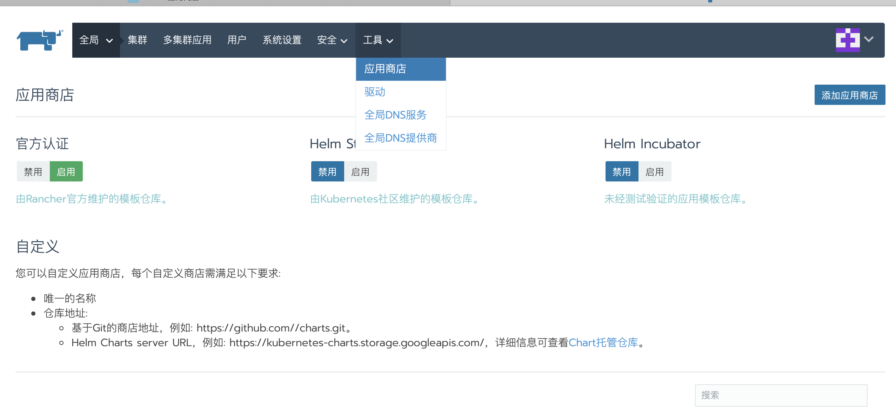
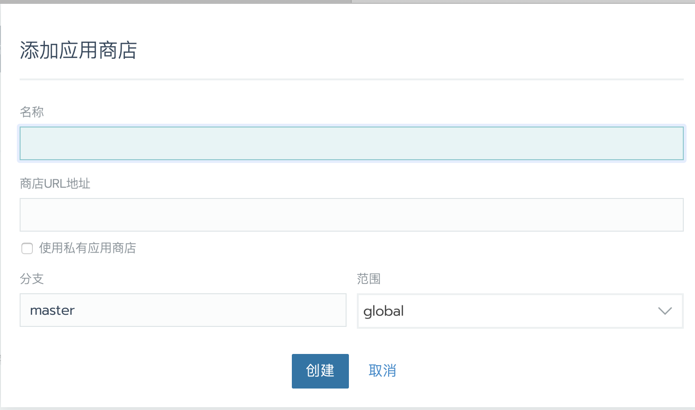
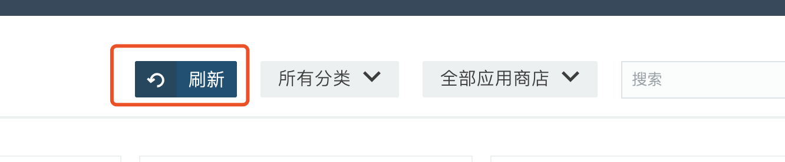
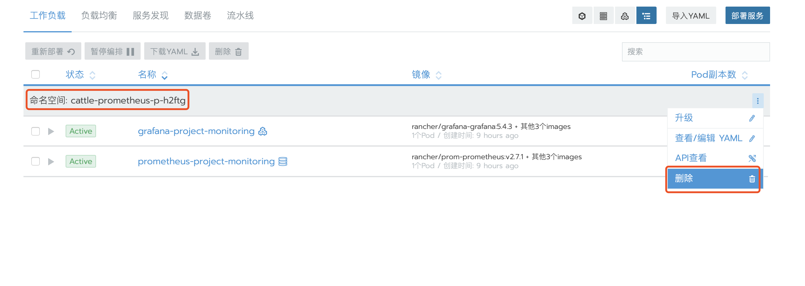

Rancher提供了一个Charts应用商店，可以轻松地重复部署任何应用程序。

Catalogs是GitHub存储库，其中包含用于部署的应用程序模板。**Charts**是[Helm](https://docs.helm.sh/)支持的包装格式，可将它们视为部署模板 。

Rancher改进了Helm catalogs and charts. 。所有本机Helm catalogs都可以在Rancher中运行，但Rancher增加并增强了一些功能以改善用户体验。

## 启用内置 Catalogs

在Rancher中，有一些默认catalogs作为Rancher的一部分被打包，这些可以由管理员启用或禁用。

1. 从**全局**视图中，从主菜单中选择`应用商店`(2.2路径为`工具\应用商店`)。

2. 将要使用的默认Catalogs切换到“**启用”**。

    - **Library**

      Library的Catalogs由于Rancher整理并维护，Rancher将Charts存储在Git存储库中，以加快Charts的获取和更新。

      > Rancher2.1.x以前的版本，只支持在全局添加应用商店，`2.2.x`开始支持在集群级别和项目级别添加应用商店。

      该应用商店以Rancher Charts为特色，其中包括一些优于本机Helm Charts的 [明显优势](/rancher/v2.x/en/catalog/custom/#chart-types)

    - **Helm Stable**

      该应用商店由Kubernetes社区维护，包括原生 [Helm charts](https://github.com/kubernetes/helm/blob/master/docs/chart_template_guide/getting_started.md)，这个商店包含最多的应用Charts。

    - **Helm Incubator**

      与Helm Stable的用户体验类似，但此目录中包含**测试版的**应用程序。

 **结果:** 启用应用商店，等待几分钟让Rancher下载Charts。下载完成后，您可以在任何项目中通过从主菜单中选择**目录应用程序**来查看它们。

## 添加自定义应用商店

点击应用商店视图下，页面右上角的`添加应用商店`，在弹出页面中输入名称、url、和分支。

 URL 必须是`git clone` [可以处理](https://git-scm.com/docs/git-clone#_git_urls_a_id_urls_a)并且必须以`.git`结尾的URL 。分支名称必须是应用商店URL中的分支，如果未提供分支名称，则默认情况下将使用`master`分支。每当向Rancher添加应用商店后，它都会立即启用。

>**注意:**
>
>- 2.2之前的版本，只能在全局级别向Rancher添加自定义应用商店，添加的应用商店都将与所有集群和项目共享。
>- 如果是私有git仓库，可以配置git仓库用户名和密码，此功能2.2可用。2.2之前的版本，仅支持未经身份验证的代码库。 

## 运行Charts应用

在启用内置应用商店或添加自定义应用商店后，可以开始启动应用商店部署Charts应用。

1. 从“ **全局”**视图中，打开要部署应用的项目。

2. 从主菜单中，选择**应用商店**。然后单击**启动**。

3. 找到要启动的Charts应用程序，然后单击**“查看详情”**。

    > 网络原因需要等一会儿才能看到Charts应用，或者点击页面上的刷新。

4. 在“ **配置选项”下，**输入**名称**。默认情况下，此名称还用于为应用程序创建Kubernetes命名空间。

    - 如果要更改**命名空间**，请单击“ **自定义”**并输入新名称。
    - 如果要使用已存在的其他命名空间，请单击“ **自定义”**，然后单击“ **使用现有命名空间”**，从列表中选择一个命名空间。

5. 选择**模板版本**。

6. 完成其余的**配置选项**。

    * 对于原生Helm Charts（即**Helm Stable**或**Helm Incubator**商店中的Charts），答案在**Answers**部分作为键值对提供。
    * **详细说明**中提供了键和值。
    * 输入答案时，必须使用 [Using Helm: The format and limitations of –set](https://github.com/helm/helm/blob/master/docs/using_helm.md#the-format-and-limitations-of---set)中的语法规则对其进行格式化，因为Rancher将它们作为`--set`标志传递给Helm。例如，当输入包含由逗号分隔的两个值的答案（即，`abc, bcd`）时，请用双引号（即，`"abc, bcd"`）包装值。

7. 查看**预览中**的文件。如果您满意，请单击“ **启动”**。

**结果**：您的应用程序已部署到您选择的命名空间。您可以从项目中查看应用程序状态：

- **Workloads** 视图
- **Catalog Apps** 视图

## 删除Charts应用

作为防止您无意中删除共享命名空间的其他应用程序的安全措施，删除Charts应用程序不会删除分配给它们的命名空间。因此，当您要删除已部署的目录应用程序时，假设它是其命名空间中唯一的应用程序，请删除命名空间而不是Charts应用。

1. 在 **全局**视图中，打开包含要删除的Charts应用的项目。

1. 从主菜单中，选择“ **命名空间”**。

1. 找到运行目录应用程序的命名空间。选择它并单击“ **删除”**。

   

**结果：**删除Charts应用程序及其命名空间。