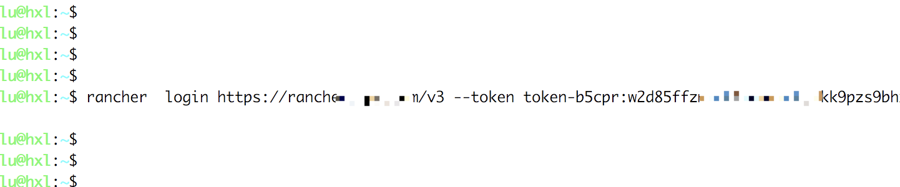
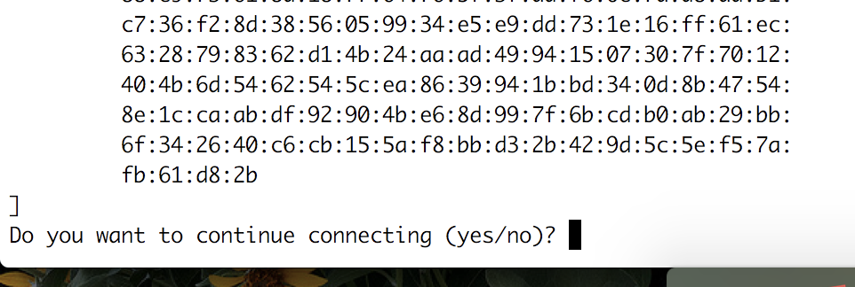
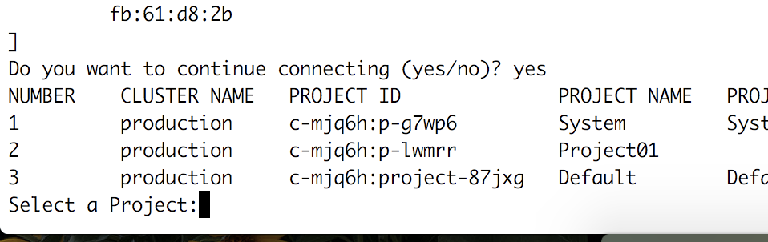
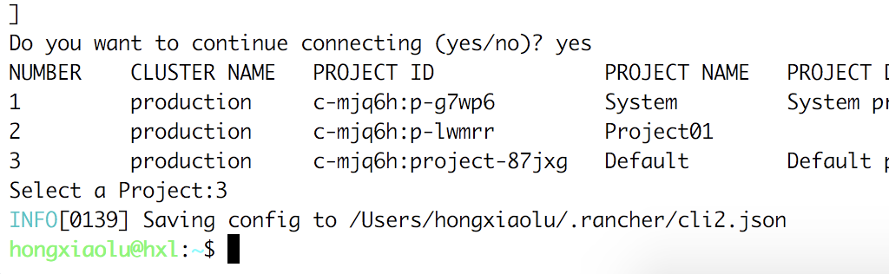
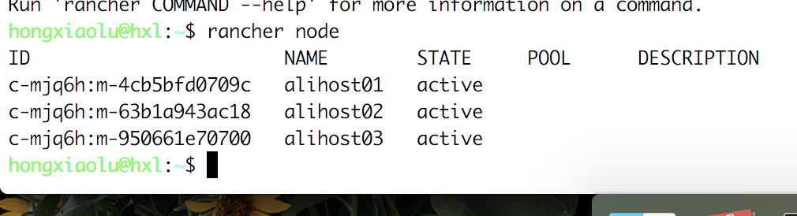

Rancher CLI是一个统一的工具，可用于与Rancher进行交互。使用此工具，你可以使用命令行而不是GUI来操作Rancher。

## 一、下载Rancher CLI

`Rancher CLI`二进制文件可以直接从Rancher UI下载，下载链接可以从`Rancher UI`右下角找到。`Rancher CLI`有Windows，Mac和Linux的二进制文件。你还可以从[文件下载](/rancher/v2.x/cn/installation/download/)页面下载最新版本的二进制文件。

## 二、运行要求

下载Rancher CLI后，你需要进行一些配置。 Rancher CLI要求：

- 需要使用[Rancher Server URL](/rancher/v2.x/en/admin-settings/server-url)去连接Rancher Server.
- API KEY，用于向Rancher进行身份验证。更多信息，请参考[Creating an API Key](/rancher/v2.x/en/user-settings/api-keys/).

## 三、CLI登录认证

​1、在使用Rancher CLI控制Rancher Server之前，必须使用`API Bearer Token`登录进行身份验证。

使用以下命令登录:

```bash
./rancher login https://<SERVER_URL> --token <BEARER_TOKEN>
```

> 替换`<BEARER_TOKEN>`和`<SERVER_URL>`



2、如果Rancher Server使用自签名证书，Rancher CLI会提示你是否继续连接



3、输入`yes`，接着会让你选择默认项目：(输入编号)



4、输入番号后，会自动保存一个cli配置文件，后期的登录就不会再次要求登录了



5、接着可以输入`rancher node`查看节点信息:



## 四、项目切换

如果需要操作其他项目，需要先进行项目切换，通过 `./rancher context switch` 切换到其他项目，输入编号进行项目选择：

```bash
User:rancher-cli-directory user$ ./rancher context switch
NUMBER    CLUSTER NAME   PROJECT ID              PROJECT NAME
1         cluster-2      c-7q96s:p-h4tmb         project-2
2         cluster-2      c-7q96s:project-j6z6d   Default
3         cluster-1      c-lchzv:p-xbpdt         project-1
4         cluster-1      c-lchzv:project-s2mch   Default
Select a Project:
```

输入编号后，控制台会显示一条消息，表明你已切换到其他项目，并生成新的配置文件。

```bash
INFO[0005] Setting new context to project project-1
INFO[0005] Saving config to /Users/markbishop/.rancher/cli2.json
```

## 五、命令参数

以下命令可用于Rancher CLI:

- `apps, [app]`

    Performs operations on catalog applications (i.e. individual [Helm charts](https://docs.helm.sh/developing_charts/) or [Rancher charts](/rancher/v2.x/en/catalog/custom/#chart-directory-structure)).

- `catalog`

    Performs operations on [catalogs](/rancher/v2.x/en/catalog/).

- `clusters, [cluster]`

    Performs operations on your [clusters](/rancher/v2.x/en/cluster-provisioning/).

- `context`

    切换项目。

- `inspect [OPTIONS] [RESOURCEID RESOURCENAME]`

    Displays details about [Kubernetes resources](https://kubernetes.io/docs/reference/kubectl/cheatsheet/#resource-types) or Rancher resources (i.e.: [projects](/rancher/v2.x/en/k8s-in-rancher/projects-and-namespaces/) and [workloads](/rancher/v2.x/en/k8s-in-rancher/workloads/)). Specify resources by name or ID.

- `kubectl`

    Runs [kubectl commands](https://kubernetes.io/docs/reference/kubectl/overview/#operations).

- `login, [l]`

    登录Rancher server。

- `namespaces, [namespace]`

    Performs operations on [namespaces](/rancher/v2.x/en/k8s-in-rancher/projects-and-namespaces/#namespaces).

- `nodes, [node]`

    Performs operations on [nodes](/rancher/v2.x/en/overview/architecture/#kubernetes).

- `projects, [project]`

    Performs operations on [projects](/rancher/v2.x/en/k8s-in-rancher/projects-and-namespaces/).

- `ps`

    显示一个项目中的工作负载。

- `settings, [setting]`

    显示Rancher Server的当前设置。

- `ssh`

    使用SSH协议连接到其中一个集群节点。

- `help, [h]`

    显示一个命令的命令列表或帮助。

## Rancher CLI帮助

使用CLI登录Rancher Server后，输入`./rancher --help`以获取命令列表。  所有命令都接受`--help`标志，该标志记录每个命令的用法。