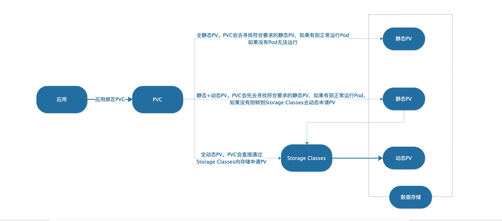

- Persistent Volume Claims( PVC) ：应用Pod从集群请求存储资源的对象，可以理解为应用Pod可以访问和使用多少存储空间的凭证。 通过PVC，可以指定存储服务器类型(SC)，可以指定需要多大的存储空间(PV)，可以配置卷的访问模式(单主机读写、多主机只读、多主机读写)。
- Persistent Volume(PV)：在Storage上划分的一块用于存储数据的空间。
- Storage Class(SC)：对接后端存储服务器(Storage)的驱动(插件)，配置Storage Class对象时，需要提供对接存储的相关信息，比如存储地址、认证用户名和密码等。
- Storage：真实存储数据的服务器，包含服务器地址和认证等信息。

