>**注意:** 1、本文编写的前提是已有正常工作的ceph存储服务，并且Rancher集群能正常访问ceph存储服务，另外这里我们对接的是Rancher持久化存储的存储类。\
>2、随着UI翻译的更新，可能有些参数名称与实际名称不相同。

## 配置ceph secret

Rancher连接ceph集群需要`ceph secret`，在ceph服务器中执行以下命令生成ceph secret:

```bash
ceph auth get-key client.admin |base64
```

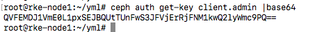

## 创建secret对象

将`key`替换为实际ceph的`secret`，然后import yaml到rancher集群。

```bash
apiVersion: v1
kind: Secret
metadata:
  name: ceph-secret-admin
type: "kubernetes.io/rbd"
data:
  key: QVFEMDJ1VmE0L1pxSEJBQUtTUnFwS3JFVjErRjFNM1kwQ2lyWmc9PQ==
```

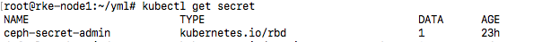

## UI配置存储类

1. 进入`集群`视图，在`存储`菜单下选择`存储类`

    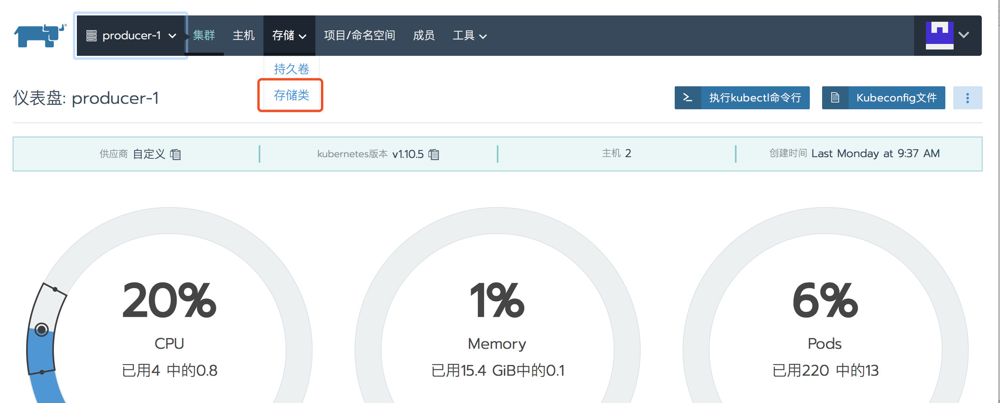

2. 设置存储名称，并选择`ceph-rbd`类

    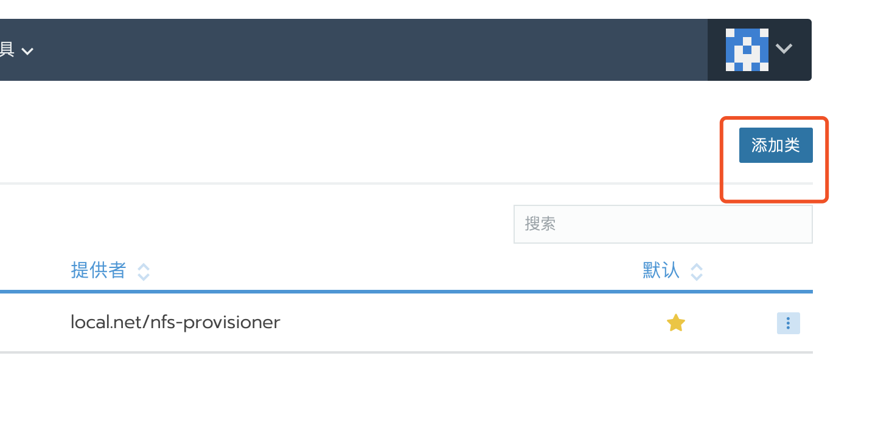

    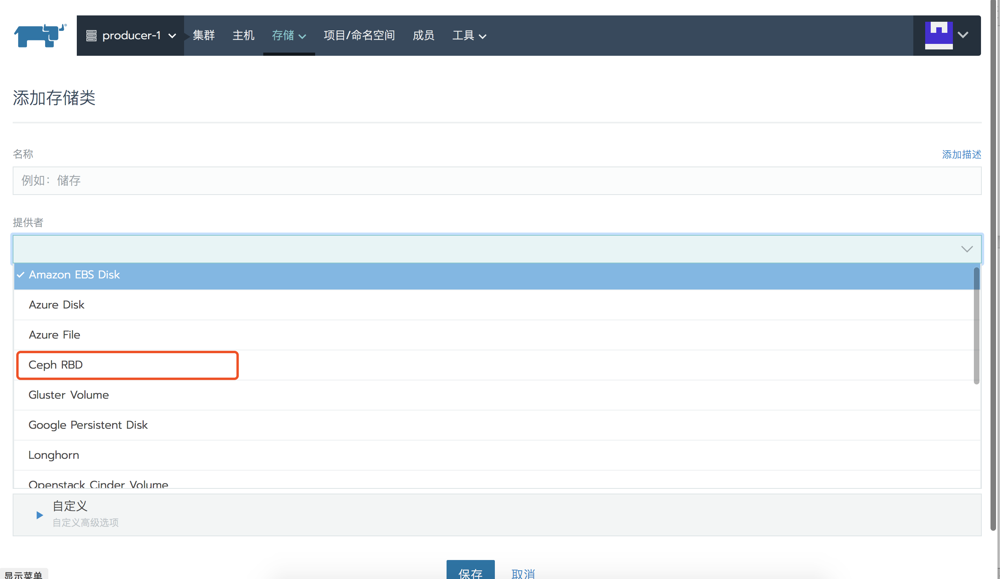

3. 配置ceph-rbd参数，填写对应的ceph-monitor地址和管理员ID(),还有secret-name
    - 监控：ceph-monitor地址
    - 管理员ID：ceph-monitor登录账户
    - 管理密文命名空间：管理密文导入的命名空间，根据实际导入的命名空间填写

    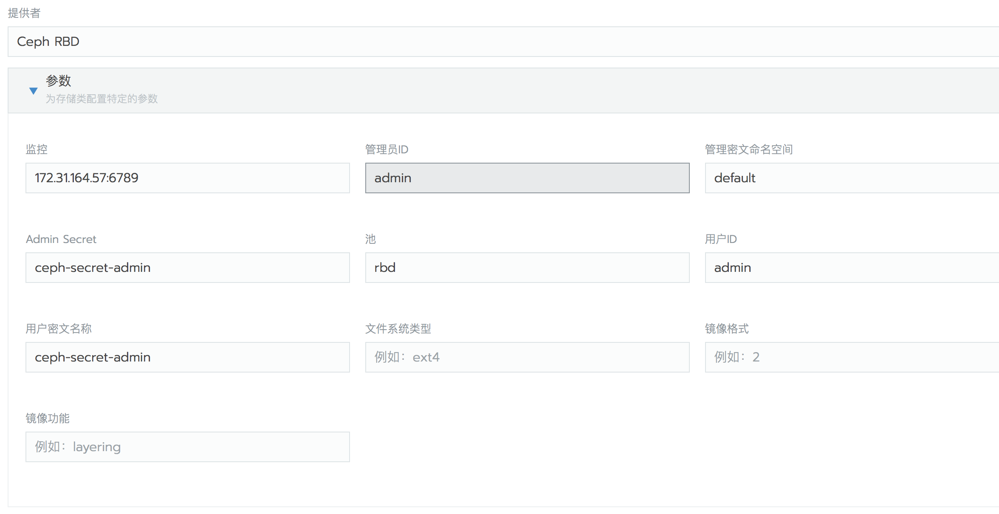

4. 点击页面最下方的保存

    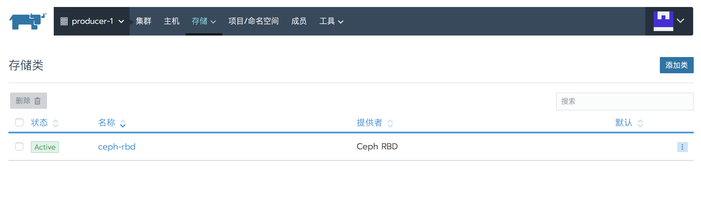

## 创建应用并挂载数据卷

### 方法一：手动创建卷再挂载

1. 切换到项目视图，依次点击`工作负载`/`数据卷`/`添加卷`

    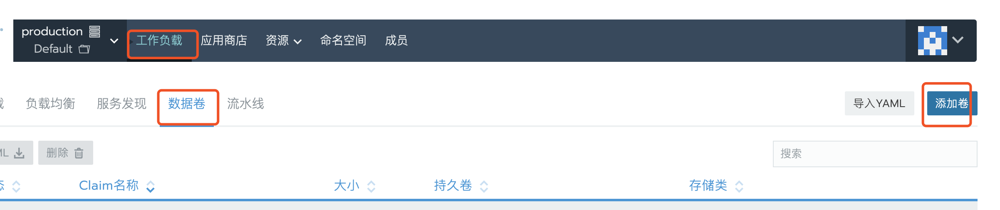

2. 填写卷配置信息，比如选择对应的存储类和卷的大小

    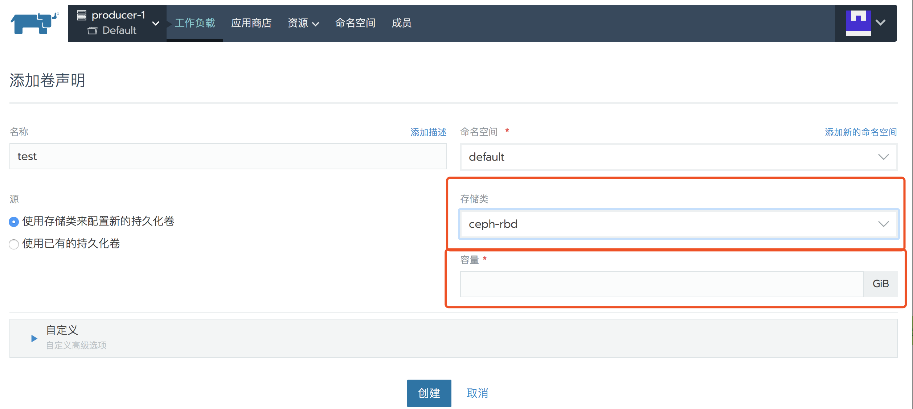

3. 点击页面下方的`创建`

    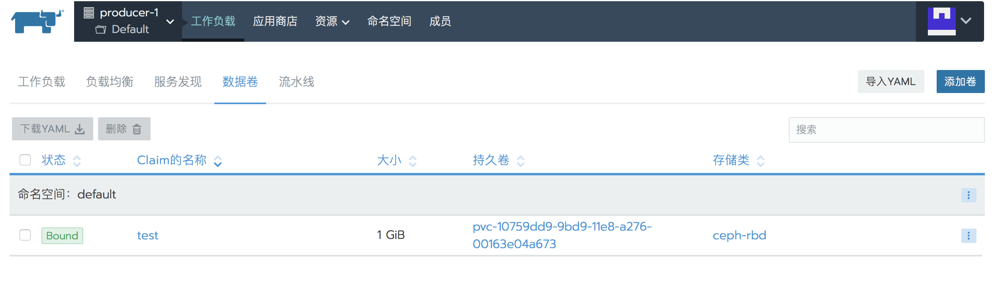

4. 创建工作负载，选择对应的存储卷和挂载的目录

    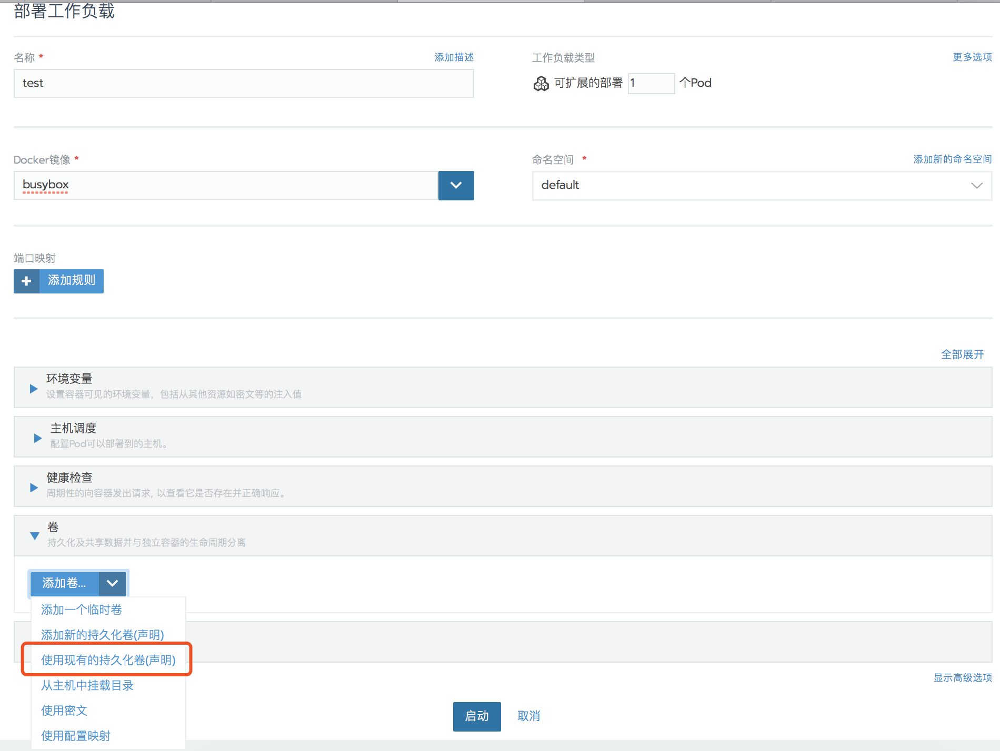

    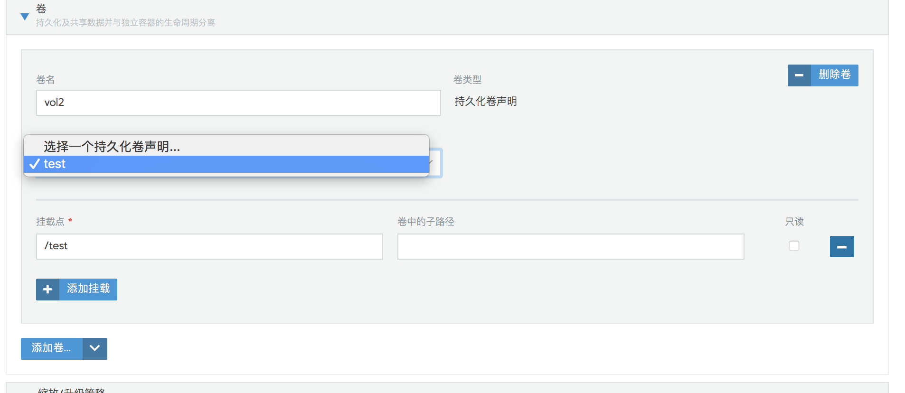

    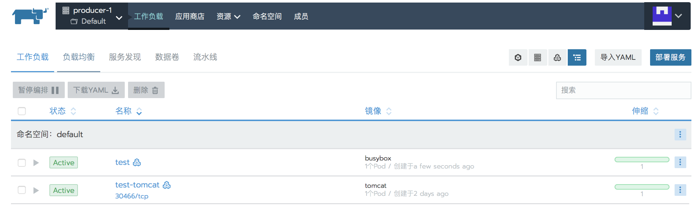

5. 通过`web终端`登录Pod查看挂载情况

    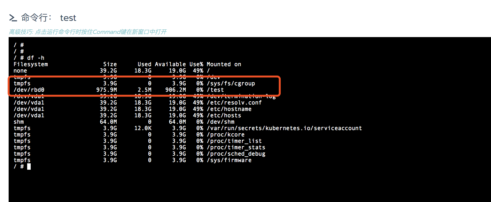

6. 登录ceph server查看

    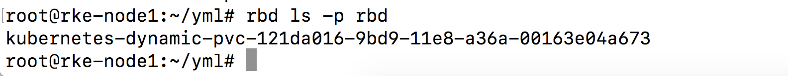

### 方法二：创建应用的时候同时创建卷

1. 创建工作负载，配置数据卷选择`添加新的持久化卷(声明)`

    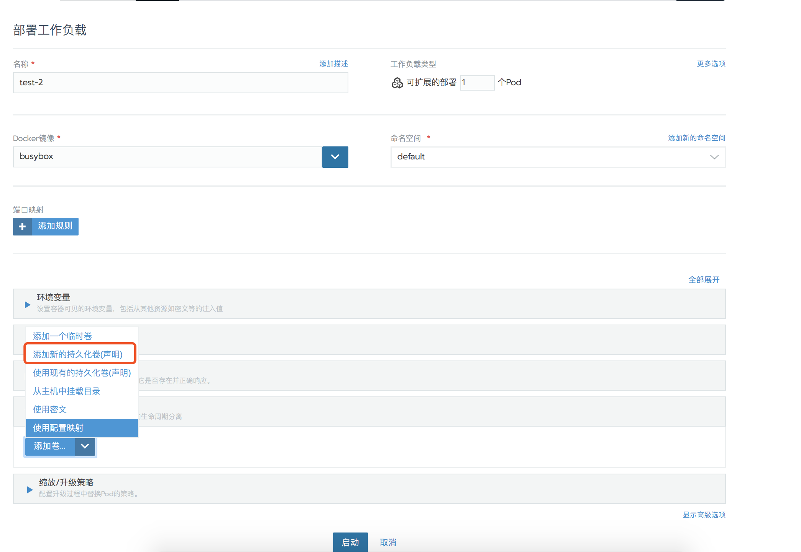

2. 配置相应参数，比如添加`卷声明名称`，选择对应的`存储类`和`容量大小`

    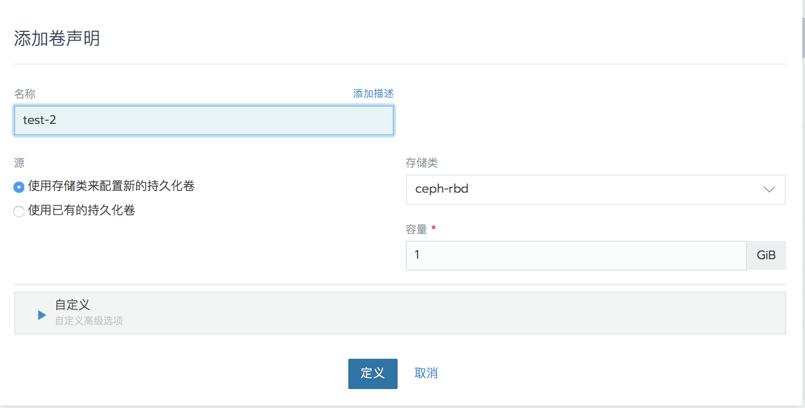

3. 配置容器的挂载路径

    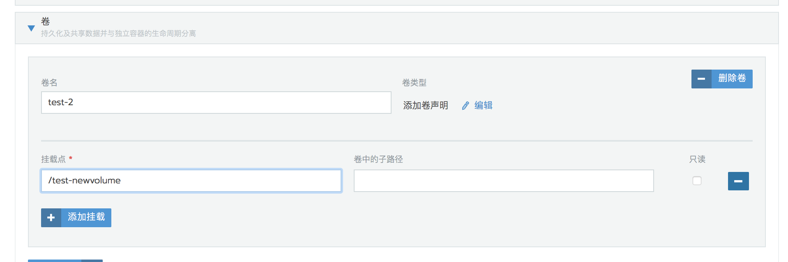

4. 启动工作负载并登录容器查看卷挂载

    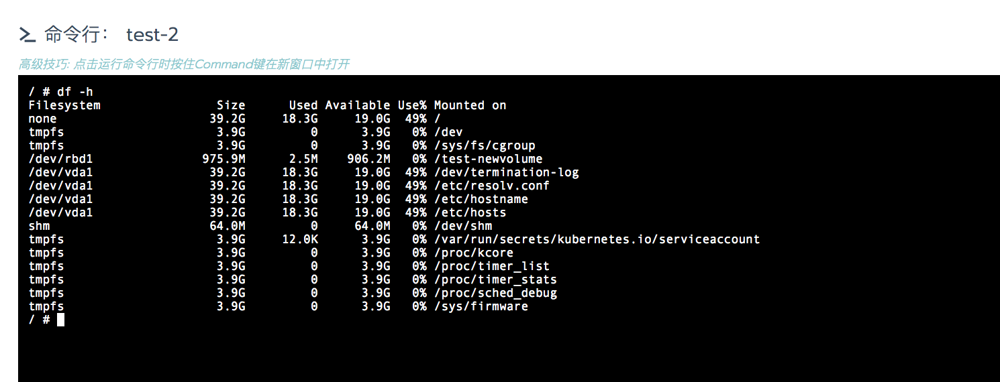

5. 登录ceph server查看

    
    
