## 一、iSCSI 命名约定

iSCSI 使用一种特殊、唯一的名称来标识 iSCSI 节点（目标或启动器）。此名称类似于与光纤通道设备相关联的全球名称 (WWN)，可作为一种通用的节点识别方式使用。iSCSI 名称通过两种不同方式格式化。最常见的是 IQN 格式。有关 iSCSI 命名要求和字符串配置文件的更多详细信息，请参见 IETF 网站上的 RFC 3721 和 RFC 3722。

### 1、iSCSI 限定名 (IQN) 格式

IQN 格式采用 iqn.yyyy-mm.naming-authority:unique name 的形式，其中：

- yyyy-mm 是命名机构成立的年份和月份。
- naming-authority 通常是命名机构的 Internet 域名的反向语法。例如，iscsi.vmware.com 命名机构的 iSCSI 限定名形式可能是 iqn.1998-01.com.vmware.iscsi。此名称表示 vmware.com 域名于 1998 年 1 月注册，iscsi 是一个由 vmware.com 维护的子域。

- unique name 是希望使用的任何名称，如主机的名称。命名机构必须确保在冒号后面分配的任何名称都是唯一的，例如：

iqn.1998-01.com.vmware.iscsi:name1

iqn.1998-01.com.vmware.iscsi:name2

iqn.1998-01.com.vmware.iscsi:name999

### 2、企业唯一标识符 (EUI) 格式

EUI 格式采用 eui.16 hex digits 的形式。例如，eui.0123456789ABCDEF。

16 位十六进制数字是 IEEE EUI（扩展唯一标识符）格式的 64 位数的文本表示形式。前 24 位是 IEEE 向特定公司注册的公司 ID。后 40 位由持有该公司 ID 的实体分配，并且必须是唯一的。

## 二、创建ISCSI服务器

### 1、操作系统以为centos7.6为例

| 主机名              | 配置 |  IP地址  |      角色       | 操作系统用户 | 操作系统 |
| :------------------ | :--: | :------: | :-------------: | :----------: | -------- |
| iscsi-target-server | 2C4G | 1.1.1.47 |  iSCSI Target   |     root     | centos   |
| iscsi-target-agent  |  -   | 1.1.1.46 | iSCSI Initiator |     root     | centos   |

> 注意：以上配置仅用于本次文档演示

### 2、iSCSI Target服务器搭建

1. 基础环境配置

    ```bash
    # 禁止selinux
    setenforce 0 # 临时禁止，重启后恢复
    sudo sed -i 's/SELINUX=enforcing/SELINUX=disabled/g' /etc/selinux/config # 永久禁止，需要重启服务器
    # 关闭防火墙
    systemctl disable firewalld.service \
    && systemctl stop firewalld.service 
    # 安装ntp时间同步服务器
    yum install ntp -y \
    && systemctl enable ntpd.service \
    && systemctl start ntpd.service
    ```

2. 安装iSCSI target管理工具

    ```bash
    yum targetcli.noarch -y \
    && systemctl enable target.service \
    && systemctl start target.service
    ```

3. 创建一个用于存放磁盘文件的目录，比如`/iscsi_disks`

    ```bash
    mkdir /iscsi_disks
    ```

4. 进入target管理命令行

    ```bash
    targetcli
    ```

5. 创建磁盘镜像

    iscsi支持多种存储对象，可以通过`ls /backstores/`查看，这里演示选择文件存储`fileio`，如果用于生产建议选择`块设备block`。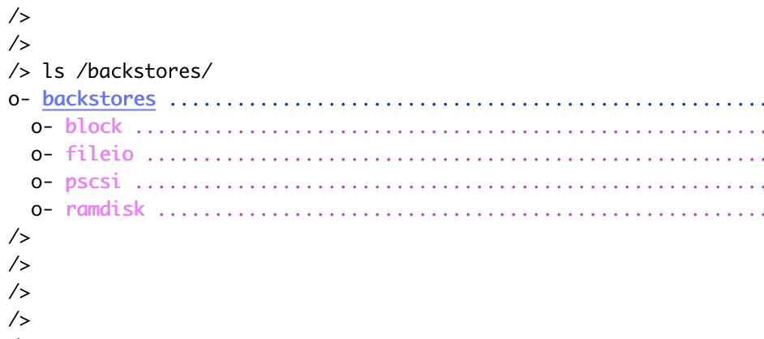

    ```bash
    # 创建磁盘镜像
    cd /backstores/fileio
    create disk01 /iscsi_disks/disk01.img 10G
    ```

    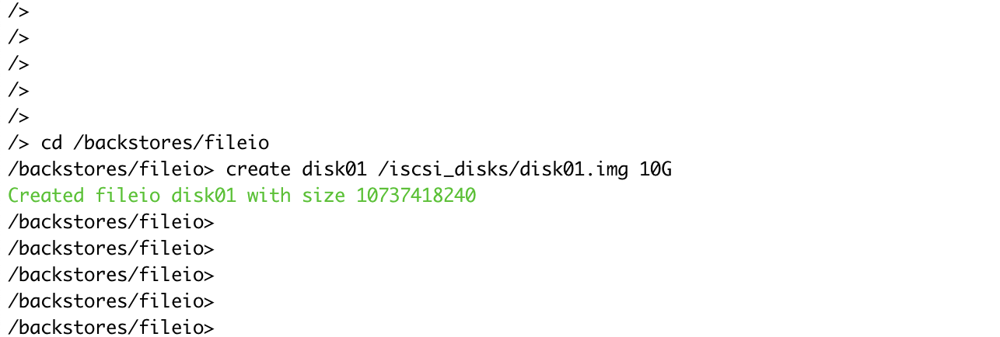

6. 创建`target`

    ```bash
    cd /iscsi
    create iqn.2019-05.com.example:servers1
    ```

    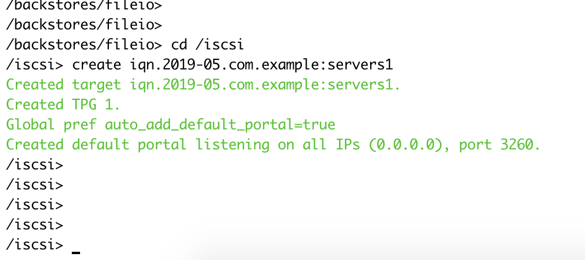

7. 创建**LUN**

    ```bash
     cd /iscsi/iqn.2019-05.com.example:servers1/tpg1/luns
     create /backstores/fileio/disk01
    ```

    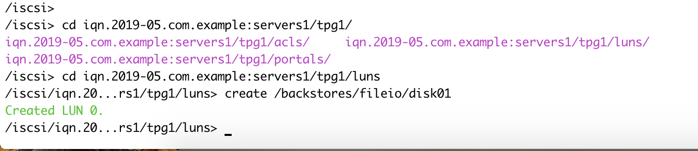

8. (可选)配置**ACL**，限制哪些客户端能连接

    ```bash
    cd /iscsi/iqn.2019-05.com.example:servers1/tpg1/acls
    create iqn.2019-05.com.example:agent1
    ```

    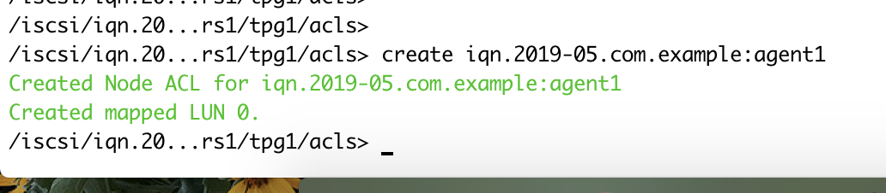

9. 配置通信身份验证

   - 单向登录认证

     ```bash
     cd /iscsi/iqn.2019-05.com.example:servers1/tpg1/

     # 开启tpg1级别的登录认证
     set attribute authentication=1

     # 启用 read/write 模式
     set attribute demo_mode_write_protect=0
     set attribute generate_node_acls=1

     # 配置tpg1级别的登录认证
     set attribute authentication=1
     set auth userid=agent_login_user1 # 传入账号，也就是客户端访问服务端认证使用的账号
     set auth password=agent_login_passwd1 #传入账号对应的密码

     # 配置acls级别的登录认证
     cd /iscsi/iqn.2019-05.com.example:servers1/tpg1/acls/iqn.2019-05.com.example:agent1
     set auth userid=agent_login_user1 # 传入账号，也就是客户端访问服务端认证使用的账号
     set auth password=agent_login_passwd1 #传入账号对应的密码
     ```

     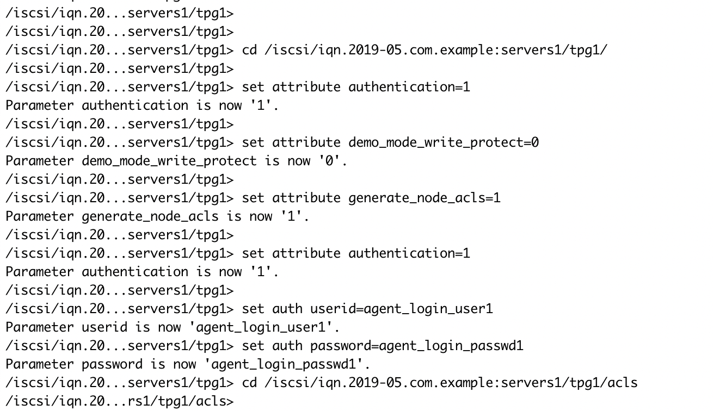

     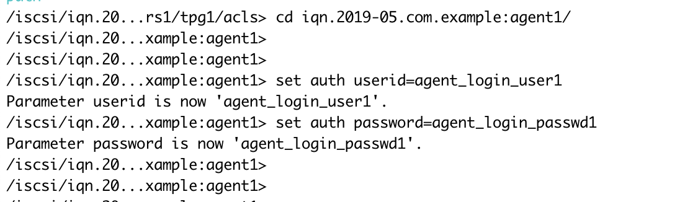

   - 双向登录认证

     ```bash
     cd /iscsi/iqn.2019-05.com.example:servers1/tpg1/

     # 开启tpg1级别的登录认证
     set attribute authentication=1

     # 启用 read/write 模式
     set attribute demo_mode_write_protect=0
     set attribute generate_node_acls=1

     # 配置tpg1级别的登录认证
     set attribute authentication=1
     set auth userid=agent_login_user1 # 传入账号，客户端登录服务端用于校验的账号
     set auth password=agent_login_passwd1 # 传入账号对应的密码
     set auth mutual_userid=server_check_user1 # 传出账号，服务器用于验证客户端的账号
     set auth mutual_password=server_check_passwd1 # 传出账号对应的密码

     # 配置acls级别的登录认证
     cd /iscsi/iqn.2019-05.com.example:servers1/tpg1/acls/iqn.2019-05.com.example:agent1
     set auth userid=agent_login_user1 # 传入账号，客户端登录服务端用于校验的账号
     set auth password=agent_login_passwd1 # 传入账号对应的密码
     set auth mutual_userid=server_check_user1 # 传出账号，服务器用于验证客户端的账号
     set auth mutual_password=server_check_passwd1 # 传出账号对应的密码
     ```

    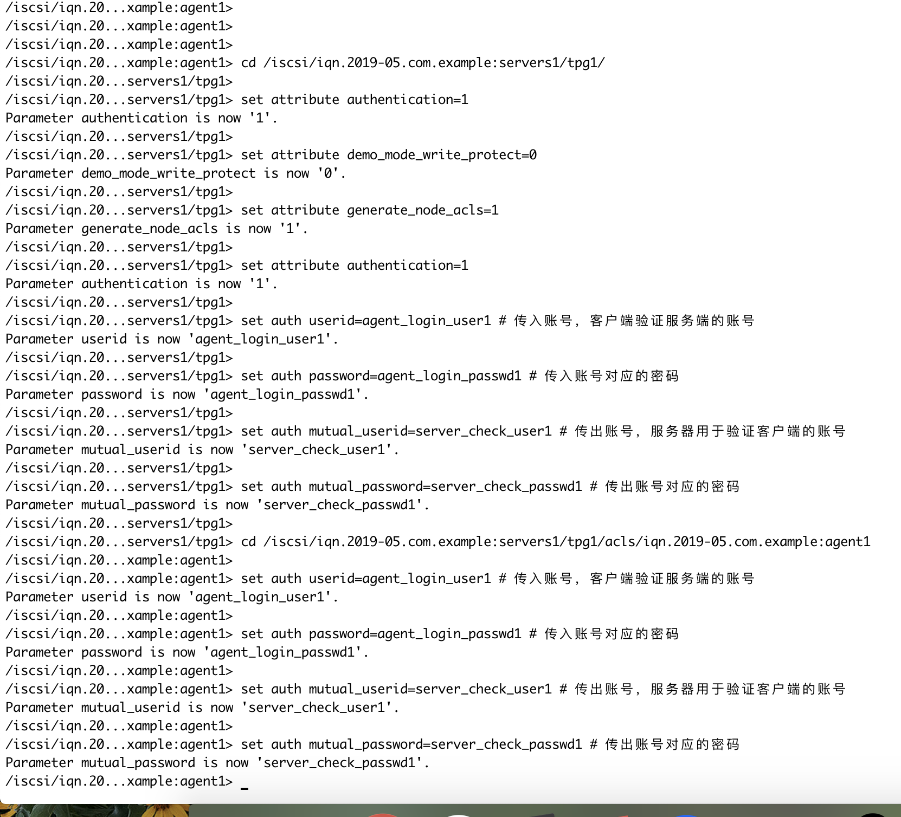

   - 单向发现认证

     ```bash
     cd /iscsi
     set discovery_auth enable=1
     set discovery_auth userid=agent_discovery_user2 # 传入账号，客户端发现服务端用于校验的账号
     set discovery_auth password=agent_discovery_passwd2 # 传入账号对应的密码
     ```

     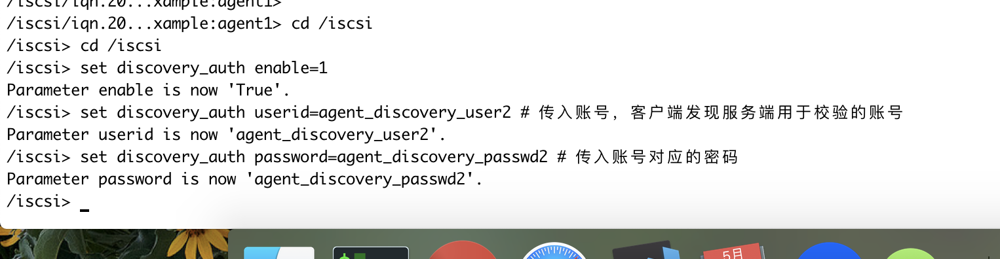

   - 双向发现认证

     ```bash
     cd /iscsi
     set discovery_auth enable=1
     set discovery_auth userid=agent_discovery_user2 # 传入账号，客户端发现服务端用于校验的账号
     set discovery_auth password=agent_discovery_passwd2 # 传入账号对应的密码
     set discovery_auth mutual_userid=server_check_user2 # 传出账号，服务器用于验证客户端的账号
     set discovery_auth mutual_password=server_check_passwd2 # 传出账号对应的密码
     ```

10. 执行`exit`退出编辑并自动保存

    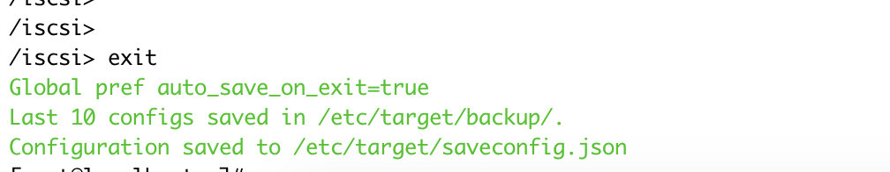

### 3、客户端校验

1. 基础环境配置

    ```bash
    # 禁止selinux
    setenforce 0 # 临时禁止，重启后恢复
    # 关闭防火墙
    systemctl disable firewalld.service \
    && systemctl stop firewalld.service 
    # 安装ntp时间同步服务器
    yum install ntp -y \
    && systemctl enable ntpd.service \
    && systemctl start ntpd.service
    ```

2. 安装iscsi-initiator-utils工具

    ```bash
    yum install iscsi-initiator-utils -y
    ```

3. 配置客户端iqn

    ```bash
    vi /etc/iscsi/initiatorname.iscsi
    # 修改为之前ACL中创建的客户端iqn
    InitiatorName=iqn.2019-05.com.example:agent1
    ```

4. 配置客户端认证参数

    ```bash
    # 编辑配置文件
    vi /etc/iscsi/iscsid.conf

    # *************
    # CHAP Settings
    # *************

    # 开启登录认证方法
    node.session.auth.authmethod = CHAP
    # 登录认证
    ## 对应服务端的传入账号，客户端用此账号校验服务器
    node.session.auth.username = agent_login_user1
    node.session.auth.password = agent_login_passwd1
    # 双向登录认证
    ## 对应服务端的传出账号，服务器用此账号校验客户端
    node.session.auth.username_in = server_check_user1
    node.session.auth.password_in = server_check_passwd1

    # 开启发现认证方法
    discovery.sendtargets.auth.authmethod = CHAP
    # 单向发现认证
    # 对应服务端的传入账号，客户端用此账号发现服务器
    discovery.sendtargets.auth.username = agent_discovery_user2
    discovery.sendtargets.auth.password = agent_discovery_passwd2
    # 双向发现认证
    # 对应服务端的传出账号，服务器用此账号校验客户端
    discovery.sendtargets.auth.username_in = server_check_user2
    discovery.sendtargets.auth.password_in = server_check_passwd2

    # ********
    # Timeouts
    # ********
    ```

5. 发现测试

    ```bash
    iscsiadm -m discovery -t sendtargets -p 1.1.1.47
    ```

    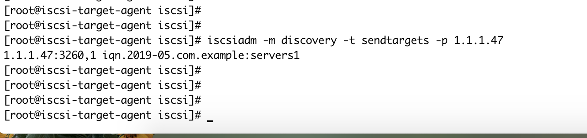

6. 登录测试

    ```bash
    iscsiadm -m node -T iqn.2019-05.com.example:servers1 -p 1.1.1.47 -l
    ```

    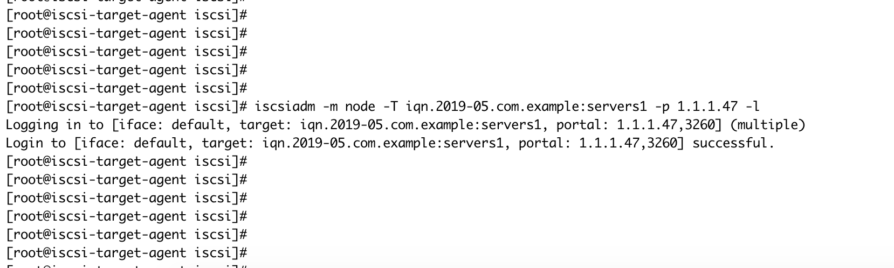

## 三、配置K8S持久卷(PV)

### 1、创建密文

1. K8S中需要以为密文方式传入客户端的认证账号，并且需要base64加密

    ```yaml
    ---
    apiVersion: v1
    kind: Secret
    metadata:
      name: chap-secret
    type: "kubernetes.io/iscsi-chap"
    data:
      discovery.sendtargets.auth.username: YWdlbnRfZGlzY292ZXJ5X3VzZXIyCg==
      discovery.sendtargets.auth.password: YWdlbnRfZGlzY292ZXJ5X3Bhc3N3ZDIK
      discovery.sendtargets.auth.username_in: c2VydmVyX2NoZWNrX3VzZXIyCg==
      discovery.sendtargets.auth.password_in: c2VydmVyX2NoZWNrX3Bhc3N3ZDIK
      node.session.auth.username: YWdlbnRfbG9naW5fdXNlcjEK
      node.session.auth.password: YWdlbnRfbG9naW5fcGFzc3dkMQo=
      node.session.auth.username_in: c2VydmVyX2NoZWNrX3VzZXIxCg==
      node.session.auth.password_in: c2VydmVyX2NoZWNrX3Bhc3N3ZDEK
    ```

    > 参考地址：https://github.com/kubernetes/examples/blob/master/staging/volumes/iscsi/chap-secret.yaml

2. 登录到rancher ui，切换到任意项目(这里以default命名空间为例)\工作负载页面下，点击右上角的`导入YAML`按钮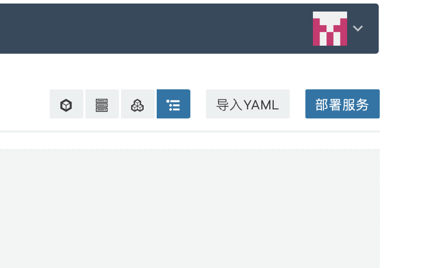

3. 复制粘贴yaml内容，其他参数默认，最后点击`导入`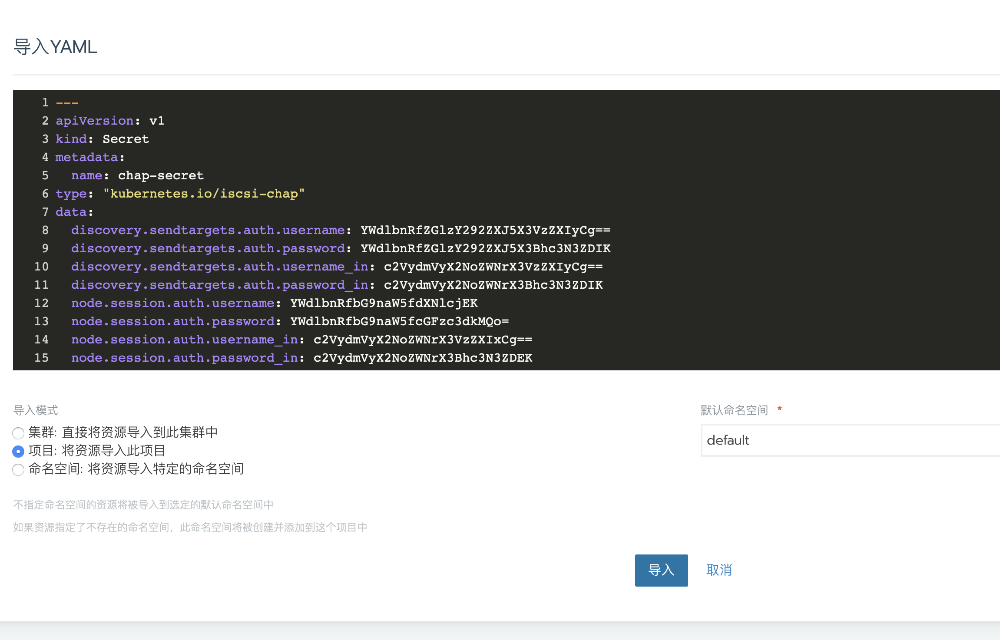

### 2、创建PV

1. 登录rancher ui，切换到`指定集群\存储\持久卷`，点击右上角的添加卷(pv);
2. 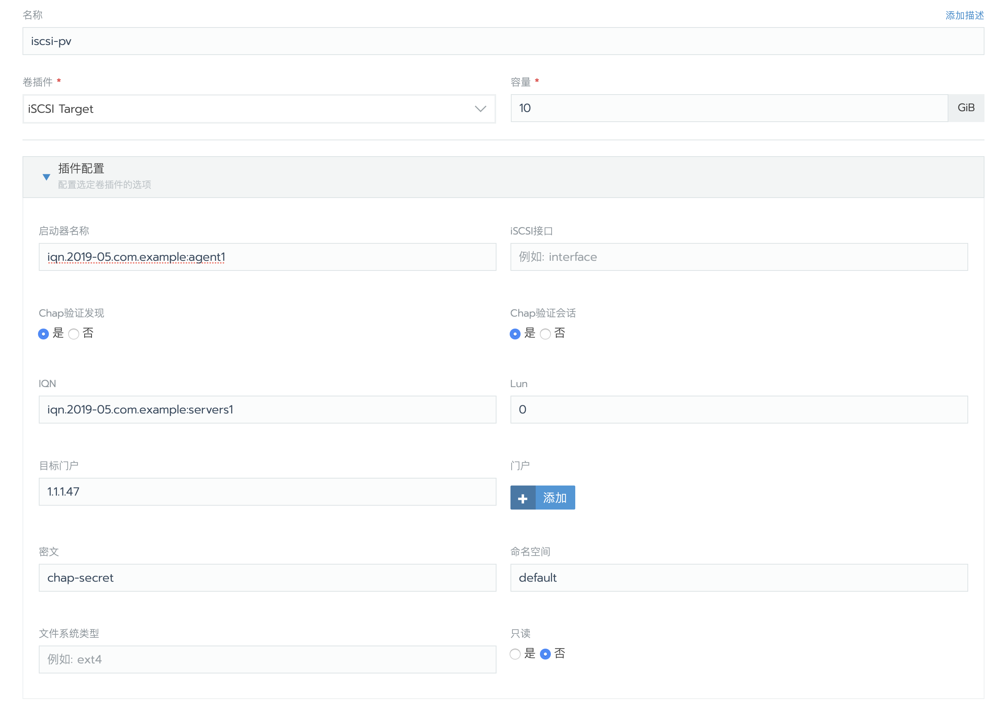
3. 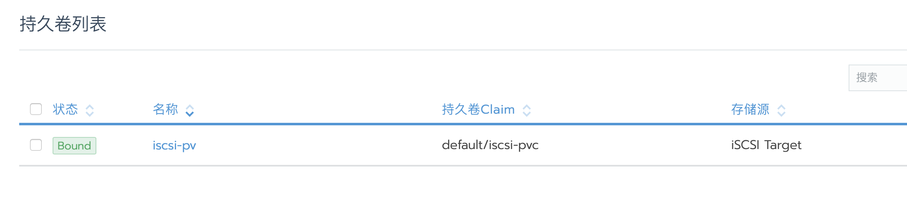

### 3、创建测试应用

1. 切换到项目视图下，点击创建工作负载；
2. 配置应用的基本参数，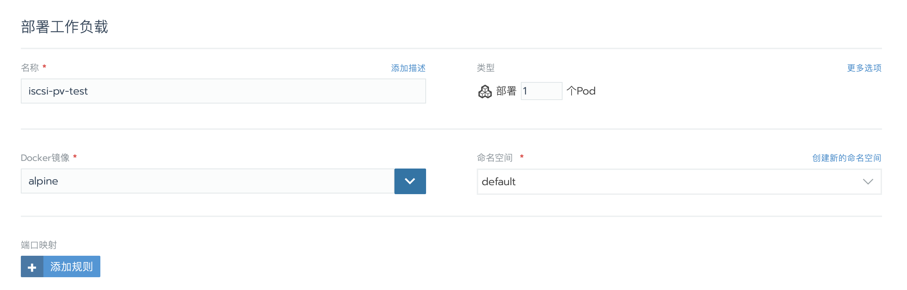
3. 配置容器卷，选择添加新的持久卷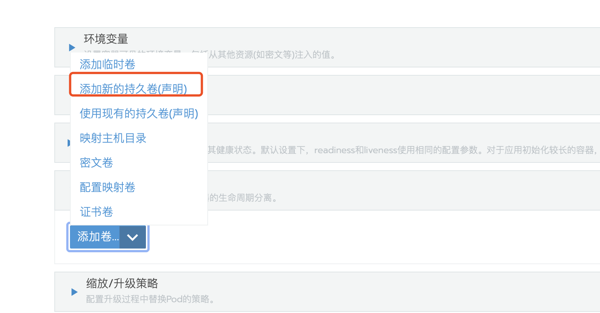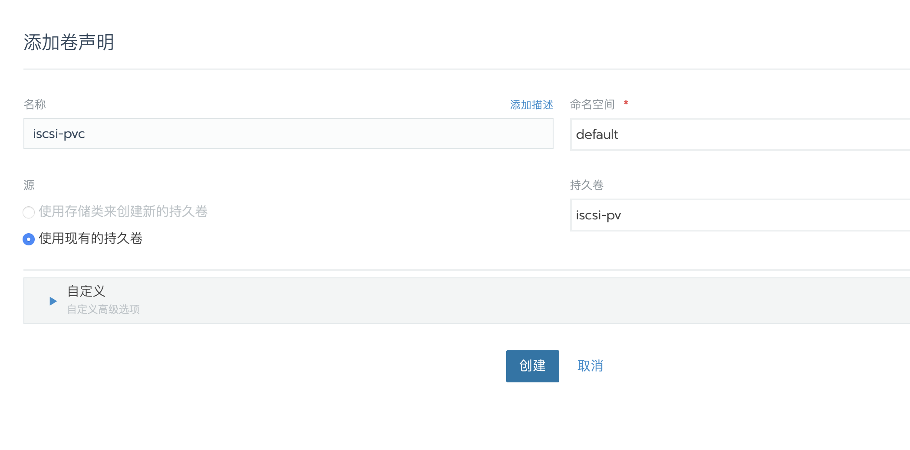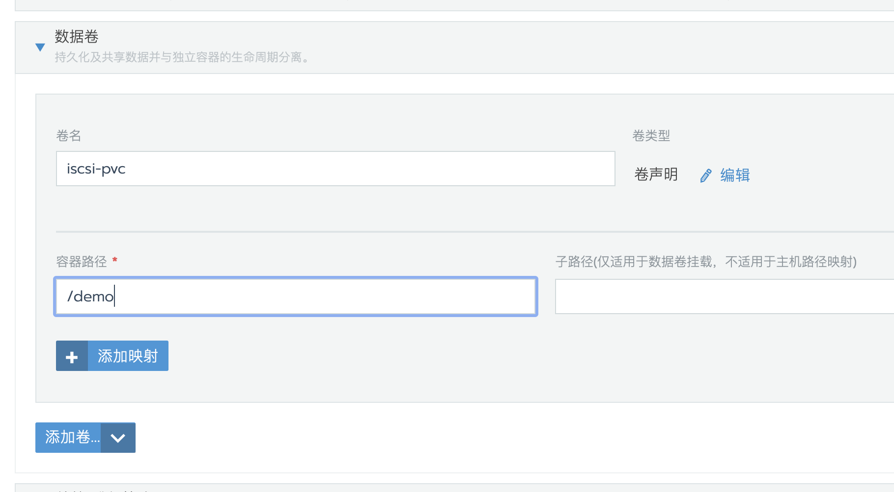

4. 配置完成后点击启动。
5. 应用运行正常后，通过web shell查看磁盘挂载情况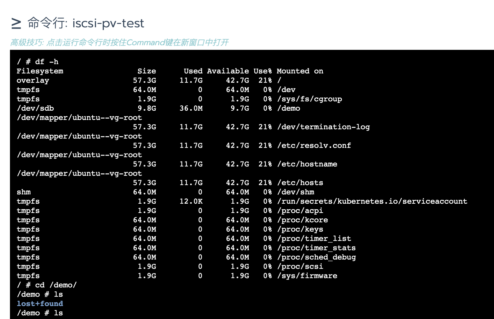

6. 检查测试

    查看target生成的镜像文件大小

    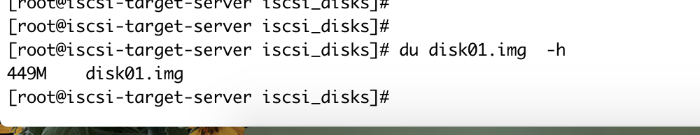

    进入容器/demo路径下，通过`dd`命令写入一个文件

    ```bash
    dd if=/dev/zero of=/demo/demo count=2 bs=1024M
    ```

    

    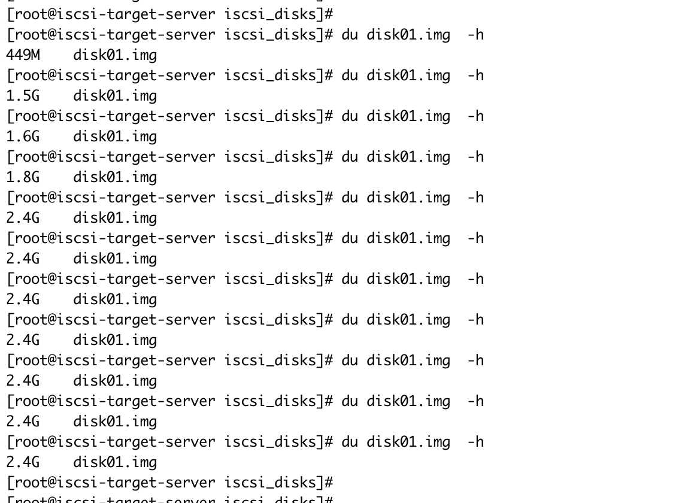