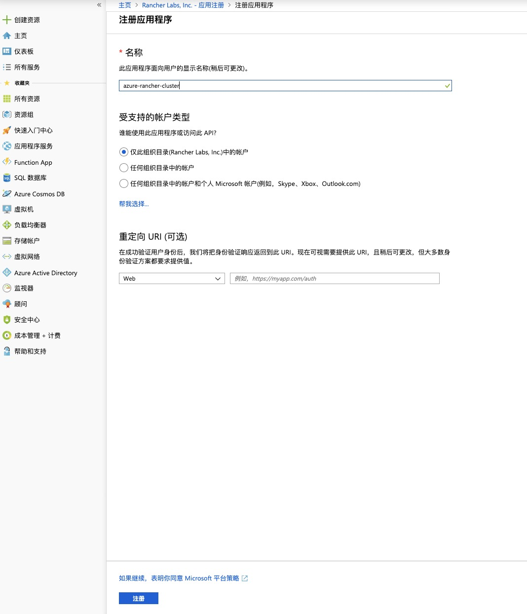
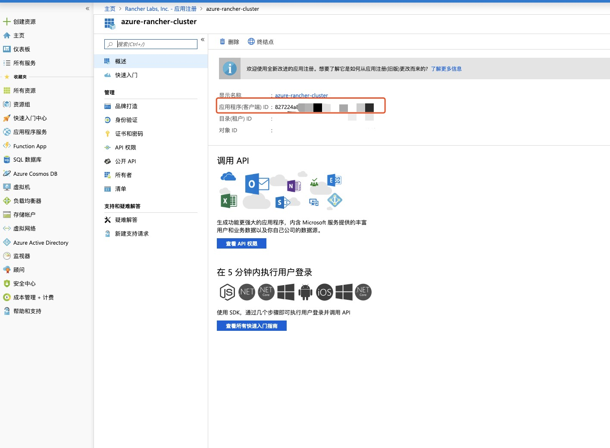
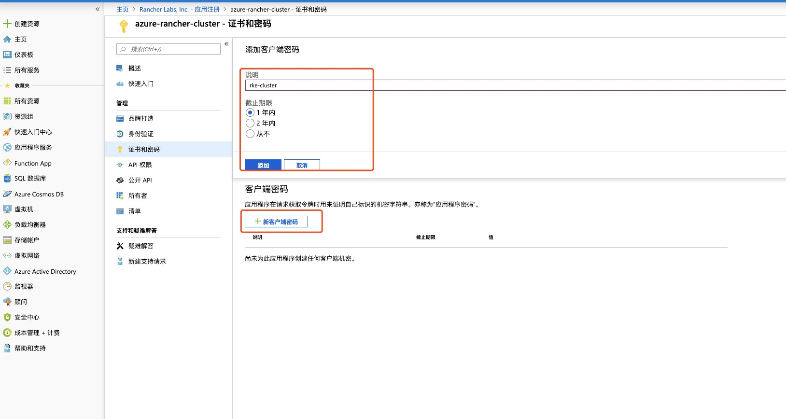
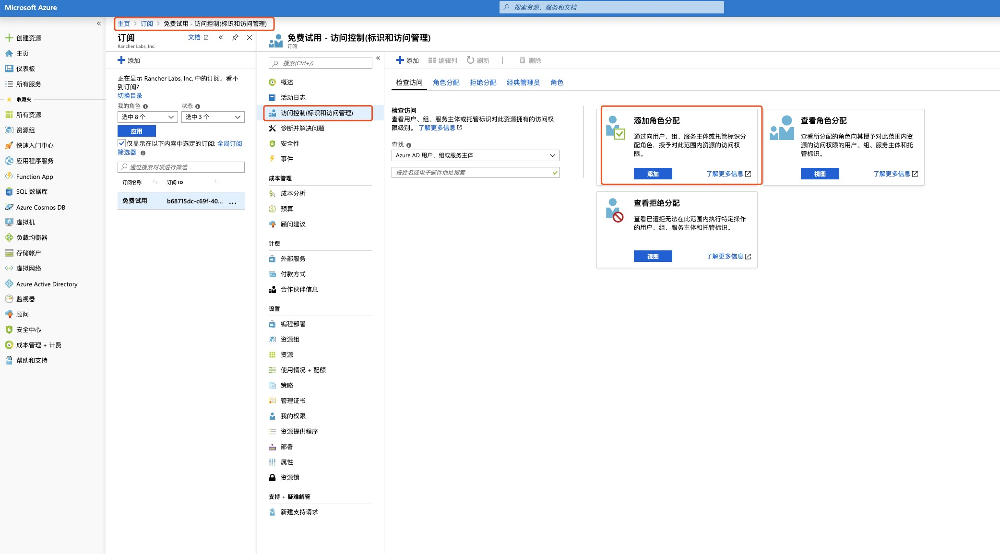

## 一、Azure部分操作

- Rancher对接AKS需要获取一下资源信息或操作
  - 订阅ID(Subscription ID)
  - 应用ID(Client ID)
  - 应用密钥(Client Secret)
  - RBAC 角色授权

### 1、获取订阅ID(Subscription ID)

1. 主页 -> 订阅 -> 查看订阅ID(Subscription ID)

      

### 2、获取应用ID(Client ID)

1. 首先需要注册一个应用(App resgistrations)

    主页 -> Azure Active Directory -> 应用注册(App resgistrations) -> 新注册(New registration)

    

1. 输入应用名称，其余选项默认即可

    

1. 得到应用ID(Client ID)

    

### 3、获取应用密钥(Client Secret)

1. 进去应用页面 -> 证书与密码页面

    

1. 添加一个新客户端密码

    

1. 得到应用密钥(Client Secret)，该密钥仅会显示一次，请注意保存

    

### 4、对应用进行角色授权

通过以上操作后已经获取到了创建Azure主机的一些凭证ID，但是还没有对应用进行角色授权，在创建的时候可能会出现400、403的错误信息，下面操作对应用进行角色绑定。

1. 添加角色分配

    主页 -> 订阅 -> 访问控制(IAM) -> 添加角色分配

    

1. 添加角色

    搜索应用 -> 根据所需要权限添加角色 -> 选中应用 -> 添加

    

1. 至此，Azure上面的操作完成，接下来进行Rancher页面操作

## 二、Rancher部分操作

1. 添加集群，选择Azure AKS
1. 输入集群名称，以及订阅ID(Subscription ID)、应用ID(Client ID)、应用密钥(Client Secret)，选择订阅可创建的可用区

    

1. 选择kubernets版本、节点数量、资源组(可使用已有资源组，也可以新建)、上传公共ca证书等选项

    

1. 点击创建即可完成AKS集群的创建(创建集群需要一定时间，可以通过Azure资源组查看新建资源)

    

PS:创建过程中 ，有可能会出现失败状态，可以查看Azure资源组里面资源创建是否失败，如果遇到失败，删除集群，再来一次，有可能遇到连续失败两次或者更多，删除集群，删除资源组所有资源，重新创建即可