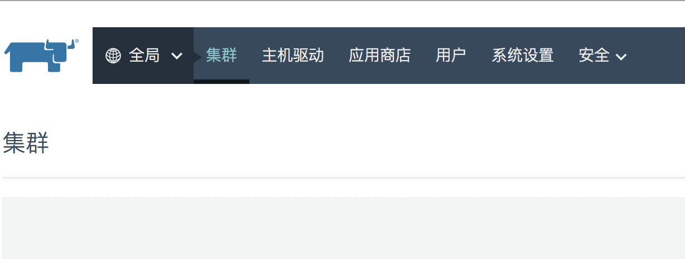
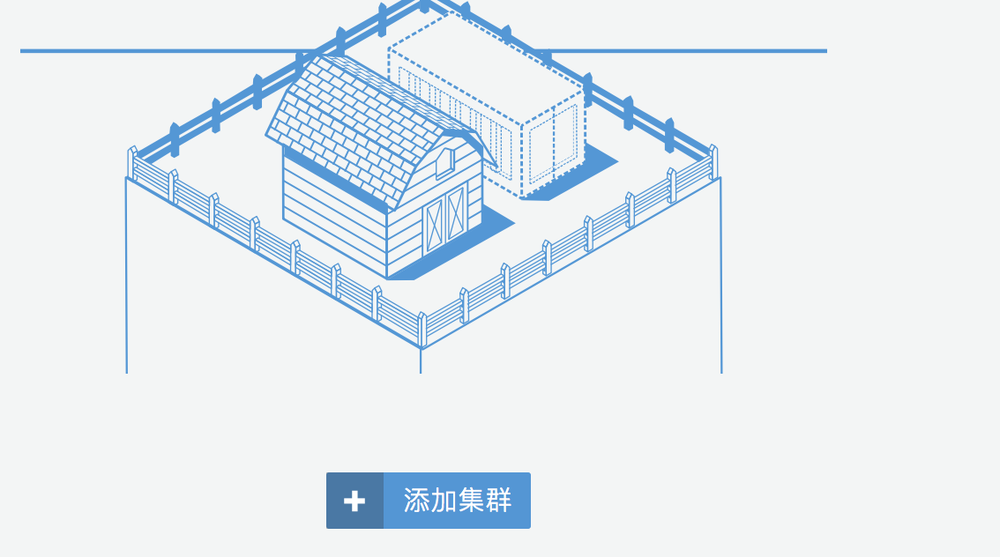
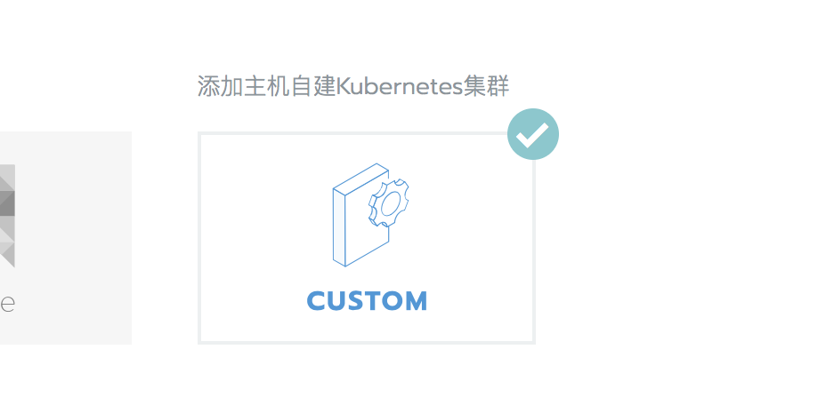
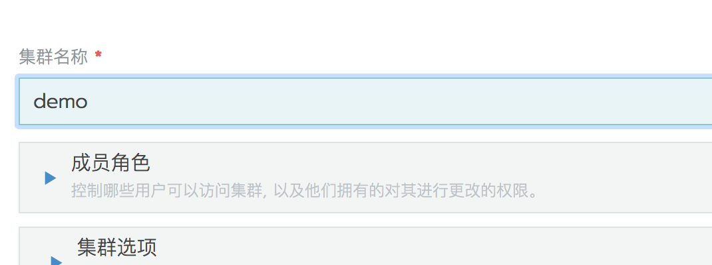
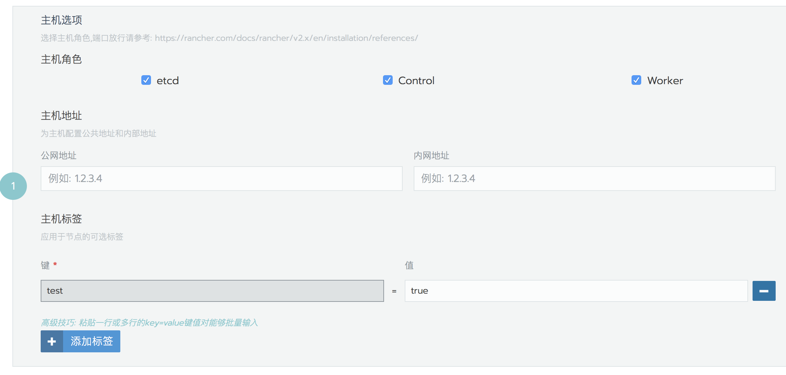
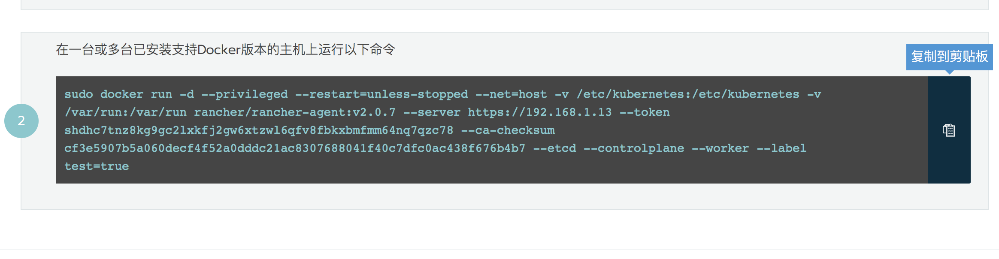

自定义安装kubernetes集群，适用于拥有内部虚拟机、内部物理主机，或者没有提供kubernetes云服务的云服务器，通过自定义安装方式来快速安装kubernetes集群。

## 一、主机和端口需求

查看[基础环境配置](/docs/rancher/v2.x/cn/installation/basic-environment-configuration/)和[端口需求](/docs/rancher/v2.x/cn/installation/references/)获取具体信息。

## 二、添加集群

1、点击集`集群`，再点击`添加集群`

2、选择自定义

3、设置集群名称

4、成员与角色

集群成员对应了Rancher中的一个真实的用户，角色则表示此用户具有的集群权限。要想在创建集群时添加成员和对应的成员角色，需要首先在全局下添加用户和集群角色。[用户](../../users)和[角色](../../security/roles)

5、集群选项

- kubernetes版本

    每个Rancher发行版对应了不同的kubernetes版本，可根据需求进行选择；

- 网络组件

    目前Rancher支持三种网络组件：flannel、calico、canal。canal支持基于`项目`的网络隔离，可根据际需求选择是否开启。

- Nginx Ingress

    Rancher中默认支持Nginx Ingress，v2.0.7开始支持根据自定义是否开启，默认开启。

- Metrics服务监控

   服务监控指标，v2.0.7开始支持根据自定义是否开启，默认开启。

- Pod安全策略

    根据需求选择启用或者禁止，如要启用，需现在`全局| 安全 |Pod安全策略`中创建策略，默认禁止。

- 主机Docker版本

   目前，经过Rancher严格测试的Docker有三个版本：1.12.6、1.13.1、17.03.2，如果设置为`需要支的版本`,主机的Docker版本需要为三个版本其中之一，如果版本不一致将无法安装K8S集群。默认设置`允不受支持的版本`,对于生产环境建议选择`需要支持的版本`。

- 云提供商

    根据主机所属的云平台，选择对应的云提供商。选择对应的云提供商，可以对接公有云上的一些基础设施，比4层负载均衡、存储登录。

6、最后点击下一步。

7、自定义主机运行命令

- 主机角色

    在K8S的架构中，必须至少有一个etcd、Control、Worker，三种角色可以运行在同一台主机上。

- 高级选项

    在高级选项中，可以指定节点的IP地址。对于内网环境的单IP主机，可以忽略此设置；如果是多IP主机，以通过此设置来指定主机的访问IP。

- 主机标签

    标签可用于主机的识别和应用的调度，可以在添加节点的时候为其指定。

    假设目前只有一台主机，可按以下方式选择：

    

- 最后点击点击右侧的复制按钮

    

8、最后点击完成