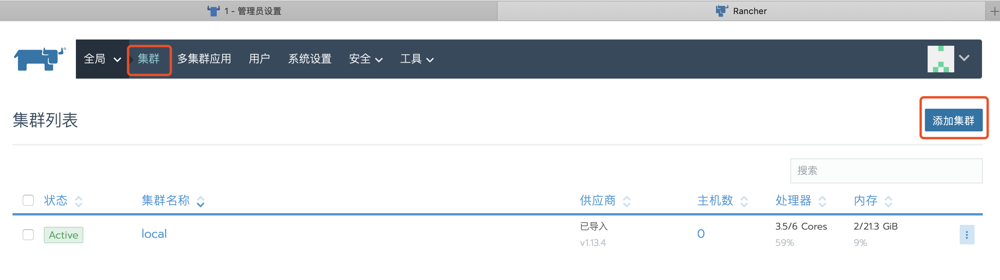
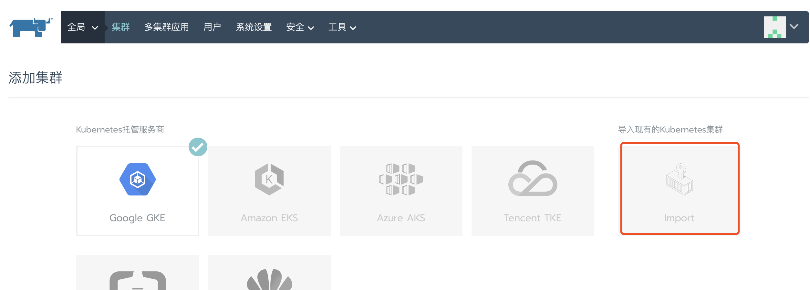
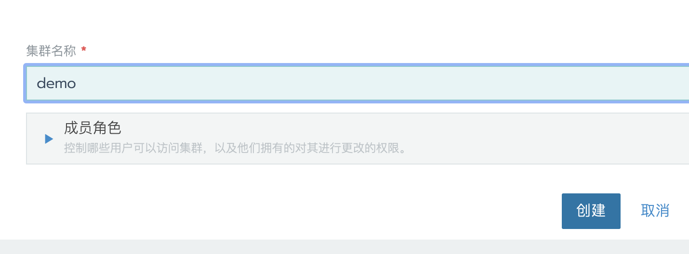
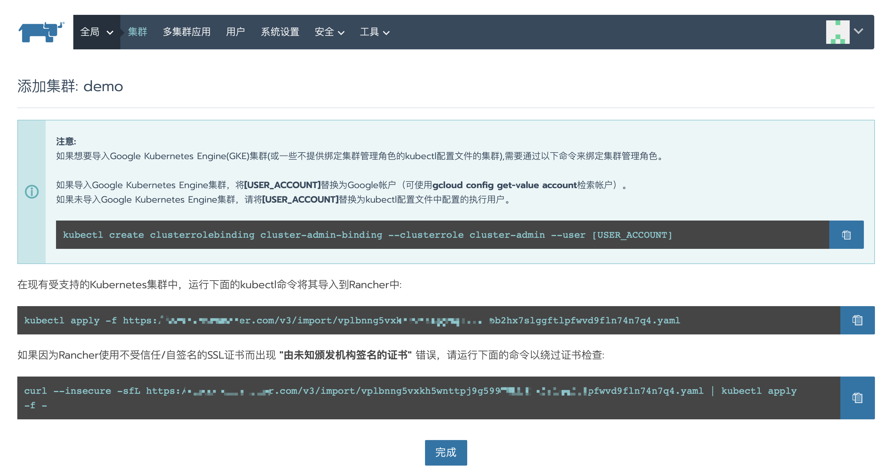

可以导入现有的Kubernetes集群，然后使用Rancher管理它。但是，更新Kubernetes集群（例如：添加/删除节点，升级Kubernetes集群版本和更改Kubernetes组件参数）仍然需要在`Rancher`之外手动完成。

1. 在`全局\集群`视图中，点击`添加集群`

    

2. 选择 **Import**类型,并设置集群名称

    

    

3. 点击**创建**，将跳转到新的页面

    

4. 如果使用权威ssl证书部署的Rancher Server，那么复制第第二条命令备用；如果使用的是自签名ssl证书，那么复制第三条命令备用。

5. 在安装有`kubectl`工具并可以访问待导入rancher的K8S的主机上，执行上一步复制的命令。执行导入命令，需要`kubectl`配置中对应的账号具有`cluster-admin`角色，如果想要导入Google Kubernetes Engine(GKE)集群(或一些不提供绑定集群管理角色的kubectl配置文件的集群),需要通过以下命令来绑定集群管理角色：

    ```bash
    kubectl create clusterrolebinding cluster-admin-binding --clusterrole cluster-admin --user [USER_ACCOUNT]
    ```

    > 执行以上命令也需要有相应权限