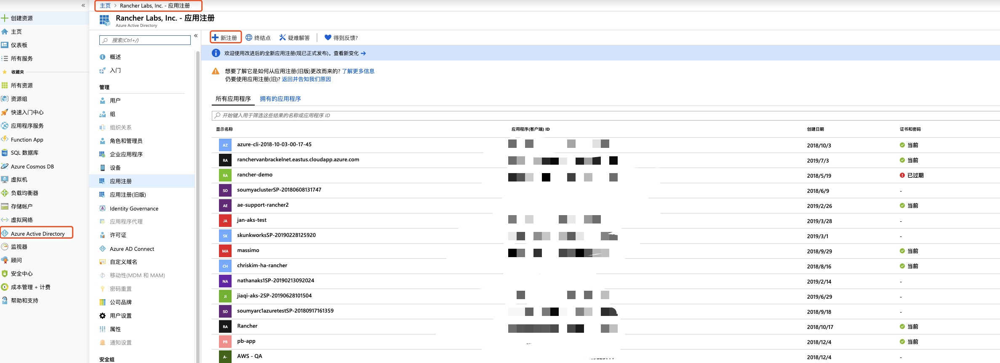
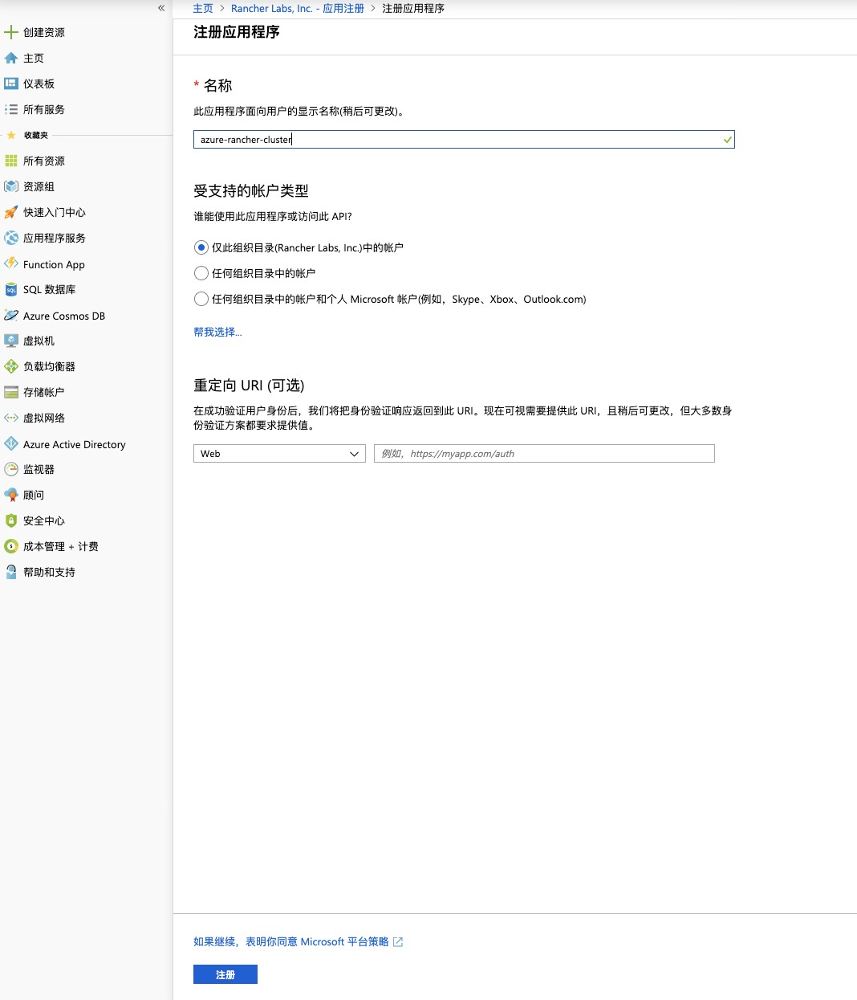
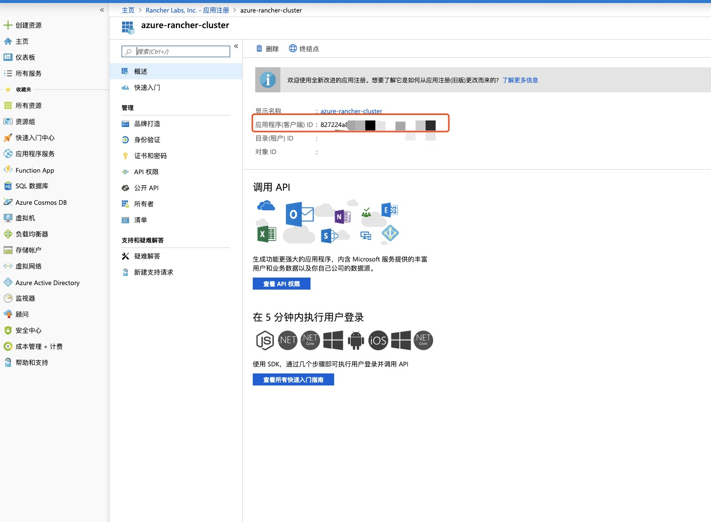
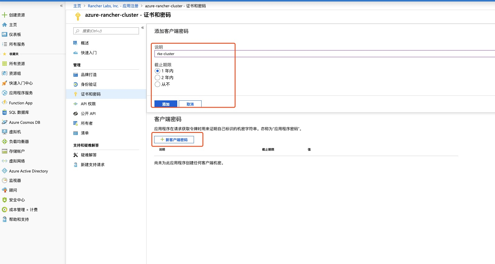
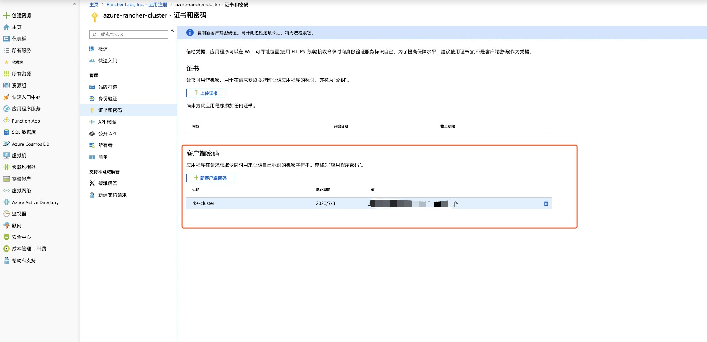
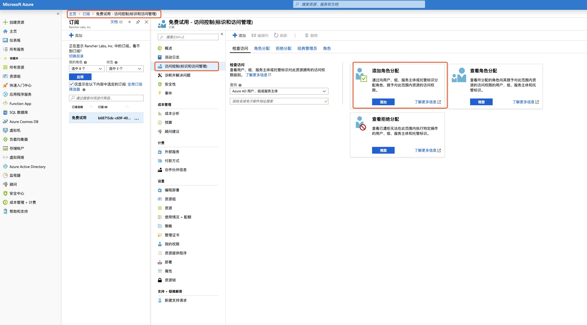
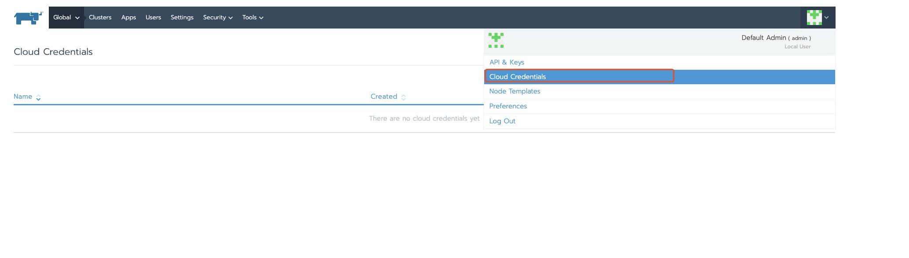
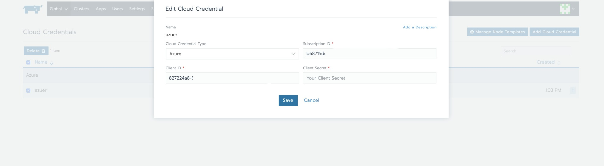
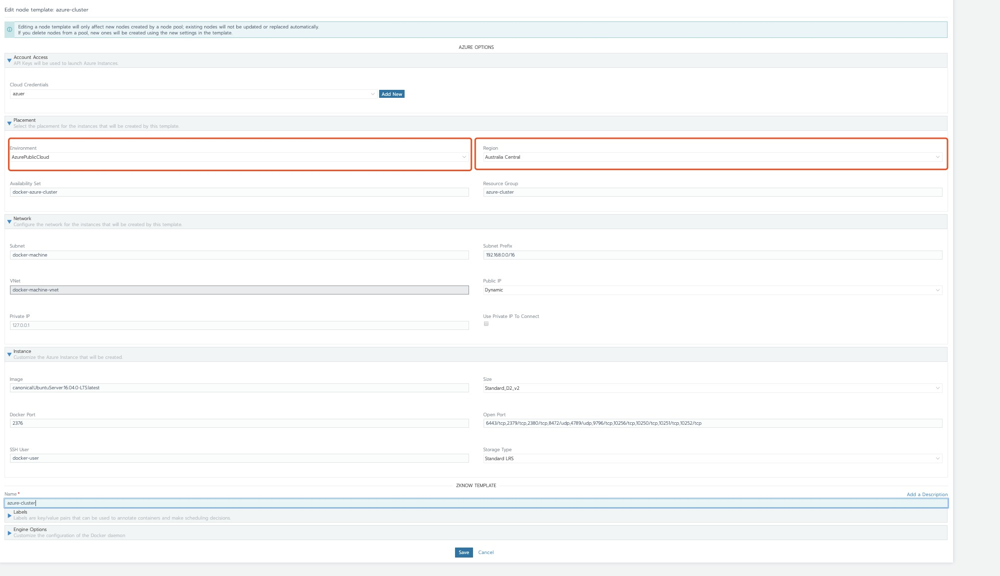

## 一、Azure部分操作

- Rancher对接AKS需要获取一下资源信息或操作
  - 订阅ID(Subscription ID)
  - 应用ID(Client ID)
  - 应用密钥(Client Secret)
  - RBAC 角色授权

### 1、获取订阅ID(Subscription ID)

1. 主页 -> 订阅 -> 查看订阅ID(Subscription ID)

    

### 2、获取应用ID(Client ID)

1. 首先需要注册一个应用(App resgistrations)

    主页 -> Azure Active Directory -> 应用注册(App resgistrations) -> 新注册(New registration)

    

1. 输入应用名称，其余选项默认即可

    

1. 得到应用ID(Client ID)

    

### 3、获取应用密钥(Client Secret)

1. 进去应用页面 -> 证书与密码页面

    

1. 添加一个新客户端密码

    

- 得到应用密钥(Client Secret)，该密钥仅会显示一次，请注意保存

    

### 4、对应用进行角色授权

1. 以上已经过去到了，创建Azure主机的一些凭证ID，但是还没有对应用进行角色授权，在创建的时候可能会出现400、403的错误信息，下面对应用进行角色绑定

1. 添加角色分配

    主页 -> 订阅 -> 访问控制(IAM) -> 添加角色分配

    

1. 添加角色

    搜索应用 -> 根据所需要权限添加角色 -> 选中应用 -> 添加

    

1. 至此，Azure上面的操作完成，接下来进行Rancher页面操作

## 二、Rancher部分操作

### 1、添加云凭证

    

1. 输入刚刚获取的到三个ID信息

    

### 2、添加主机模版

1. 注意这里的可用区一定要是账号订阅有权限创建的可用区，不然会出现400、403的返回状态码

    

1. 至此，对接Azure云主机全部完成，接下来就可以使用该主机模版创建集群
