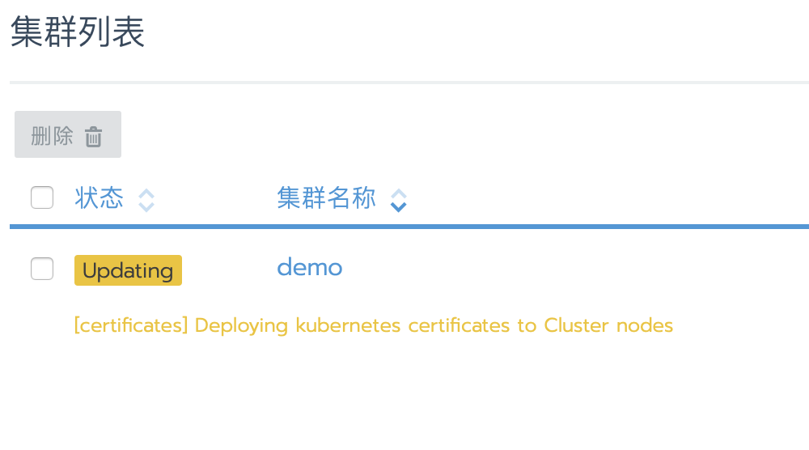
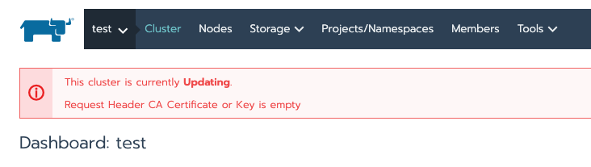
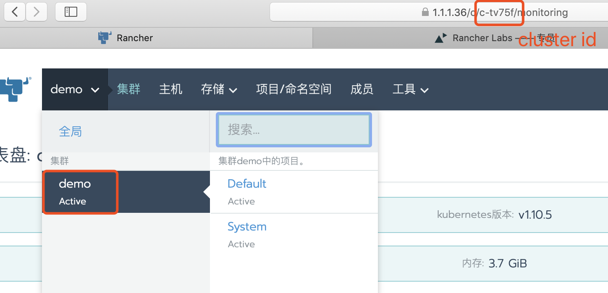
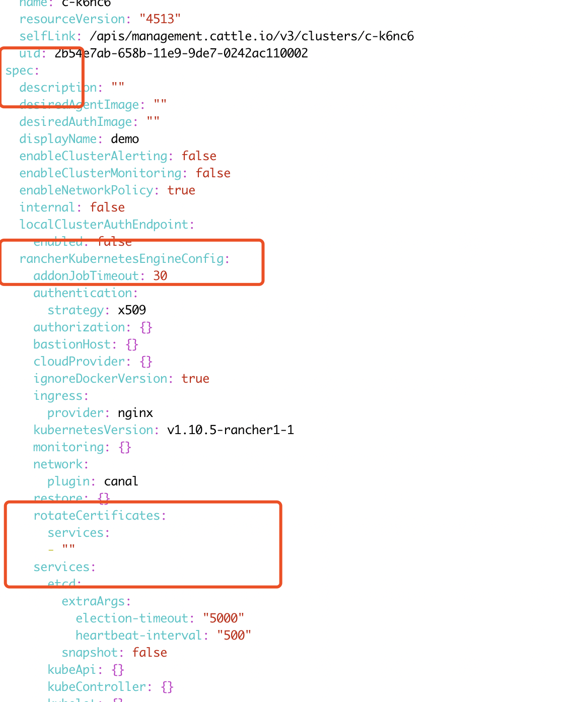
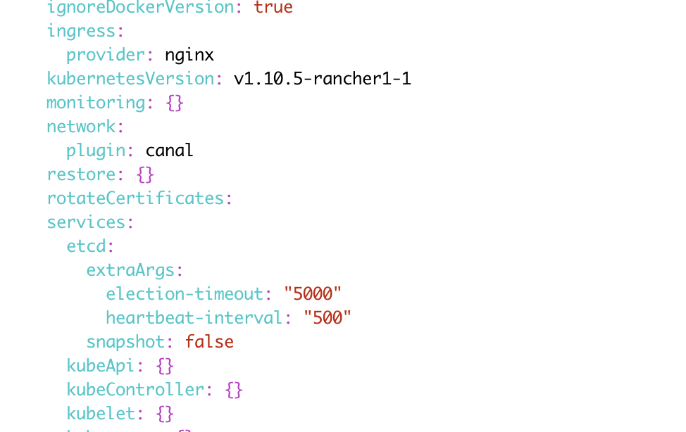

*可用版本v2.2.0*

默认情况下，Kubernetes集群使用ssl证书来加密通信，Rancher自动为集群生成证书。在Rancher2.1.x之前的版本，集群ssl证书默认有效期为1年(CA证书默认10年)，在Rancher2.1.x之后的版本，默认为10年(CA证书默认10年)。在证书到期前，需要对证书有效期进行更新，不然集群通信将会失败。在Rancher2.2.x之后的版本，可通过UI的证书轮换功能对集群证书进行更新。

证书轮换之后，Kubernetes组件将自动重新启动，重启不影响应用POD，重启时间需要3到5分钟。

- 证书轮换可用于下列服务:

    - etcd
    - kubelet
    - kube-apiserver
    - kube-proxy
    - kube-scheduler
    - kube-controller-manager

- 通过UI轮换证书，目前支持:

    - 批量更新所有服务证书(CA证书不变)
    - 更新某个指定服务(CA证书不变)

- 通过RKE轮换证书，目前支持:

    - 批量更新所有服务证书(CA证书不变)
    - 更新某个指定服务(CA证书不变)
    - 轮换CA和所有服务证书

## 一、升级集群(重要)

如果Rancher从`v2.0.x升级到2.2.x`，需要先做一次`集群更新`操作。

1. 进入`全局\集群`视图；
1. 选择对应集群右侧的`省略号`菜单，选择升级；
1. 要升级集群，需要集群配置有一些变动才可以，可以通过修改集群配置，比如开启`Etcd快照轮换`、修改`NodePort端口范围`,从而达到集群配置变动。
1. 最后点击`保存`，集群将自动进行更新

## 二、轮换证书

1. 进入`全局\集群`视图；
1. 选择对应集群右侧的`省略号`菜单,选择更新证书有效期；
1. 选择更新所有服务证书，并点击保存
1. 集群将自动更新证书
1. 因为证书改变，相应的`token`也会变化，在集群证书更新完成后，要对需要了解API SERVER服务的POD进行重建。
    - cattle-system/cattle-cluster-agent
    - cattle-system/cattle-node-agent
    - cattle-system/kube-api-auth
    - ingress-nginx/nginx-ingress-controller
    - kube-system/canal
    - kube-system/kube-dns
    - kube-system/kube-dns-autoscaler
    - 其他应用Pod

## 三、故障处理

如果执行更新证书后出现如下错误提示，因为没有执行集群更新操作

### 解决方法

1. 选择对应问题集群，然后查看浏览器的集群ID,如下图：
1. 执行命令 `kubectl edit  clusters <clusters_ID>`
    - 如果Rancher是HA安装，直接在local集群中，通过`rke`生成的`kube`配置文件执行以上命令；
    - 如果Rancher是单容器运行，通过`docker exec -ti <容器ID> bash`进入容器中，然后执行`apt install vim -y`安装vim工具，然后再执行以上命令；
1. 删除`spec.rancherKubernetesEngineConfig.rotateCertificates`层级下的配置:修改为
1. 数量`:wq`保存yaml文件后集群将自动进行更新，更新完成后再进行证书更新。