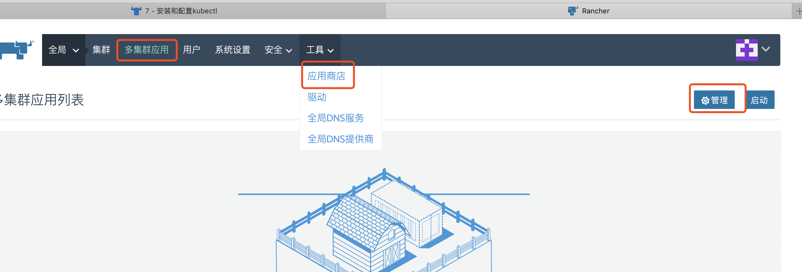
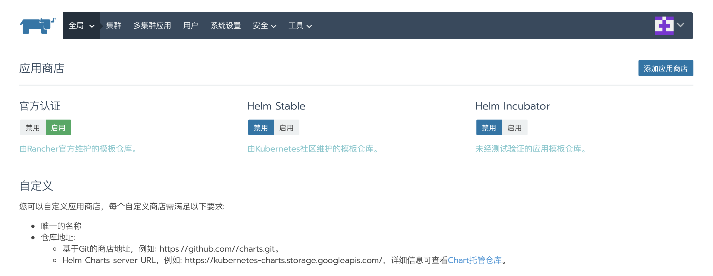
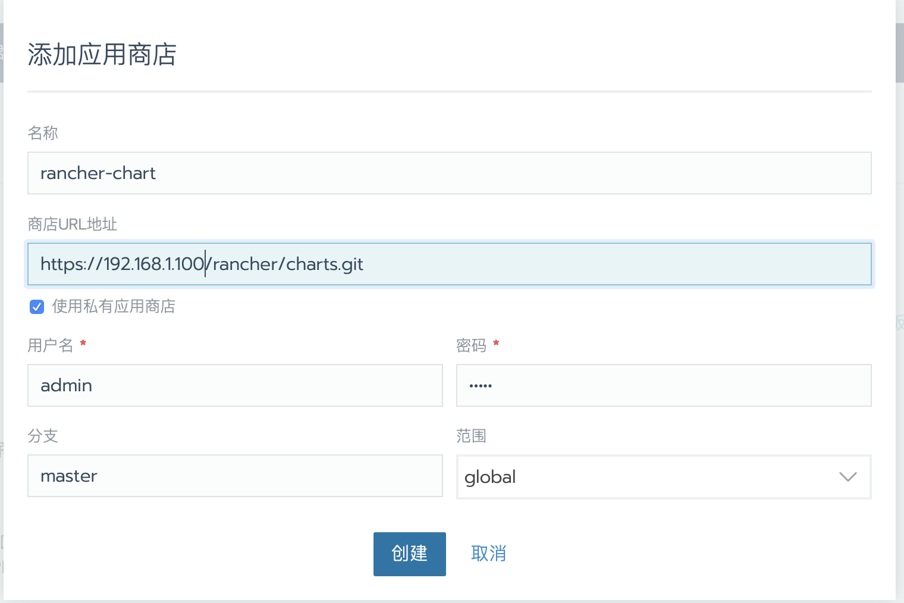
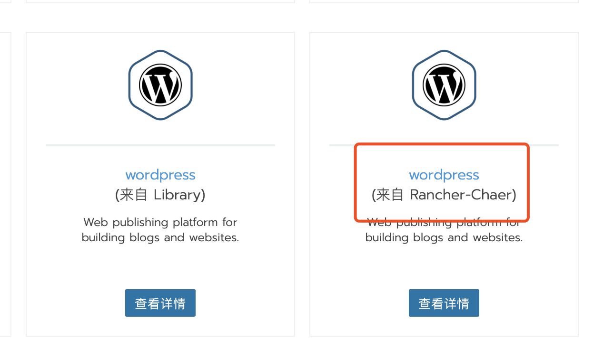

> 所谓多集群应用，是把一个chart应用的多个副本同时部署到多个集群中，并非把一个chart应用拆分后部署在多个集群。

## 一、配置应用商店

1. 进入 `全局\多集群应用`视图点击管理，或者进入`工具\应用商店视图`

2. 这里是全局应用商店的配置页面，在这里可以选择开启或者关闭内置的应用商店。点击`添加应用商店`可添加自定义应用商店，如果git仓库为只有仓库，可以配置认证账号和密码。例如：

   > 可点击查看[内置应用商店说明与自定义应用商店制作](/rancher/v2.x/cn/configuration/catalog/)。

   因为这里是创建的全局应用商店，所以在任何集群或者项目应用商店中均可以看到添加的自定义应用商店。

## 二、创建多集群应用

1. 进入 `全局\多集群应用`视图，点击页面右上角`启动`按钮，选择要安装的应用(这里以WordPress为例),点击`查看详情`。 因为之前有添加一个自定义应用商店，所以这里可以看到应用来着自定义商店	

2. 配置应用参数

   - 输入应用名称；

   - 选择版本号；

   - 选择目标项目: 可以选择一个集群的多个项目，也可以选择多个集群的多个项目；
   - 可用的角色：根据应用实际情况选择，这里选择Project；
   - 其他参数根据实际情况修改，最后点击`启动`按钮;