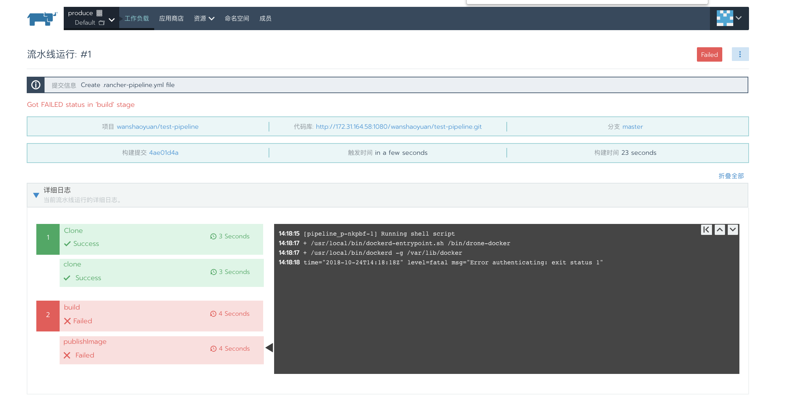
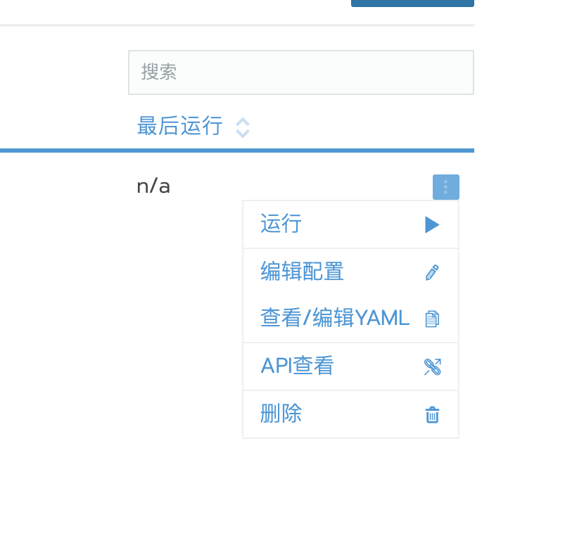
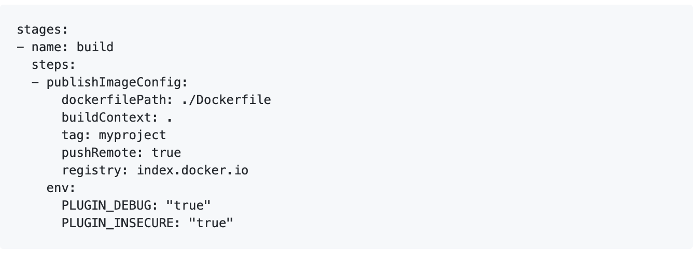

## 构建镜像时，提示未验证



问题主要是仓库是非`https`地址,导致Docker无法验证登陆镜像仓库。

解决方法:

1. 点击`省略号 > 查看/编辑YAML`

    

2. 在`publishImageConfig`下添加环境变量(`env`与`publishImageConfig`同级)，比如:

    ```yaml
        steps:
        - publishImageConfig:
            dockerfilePath: ./Dockerfile
            buildContext: .
            tag: example-helloserver:${CICD_EXECUTION_SEQUENCE}
          env:
            PLUGIN_DEBUG: "true"
            PLUGIN_INSECURE: "true"
    ```

    

    [点击了解具体详情](https://github.com/rancher/rancher/issues/16218#issuecomment-432692025)

3. 最后点击提交到代码库