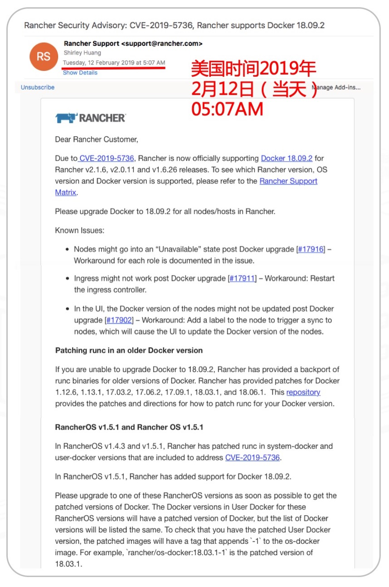
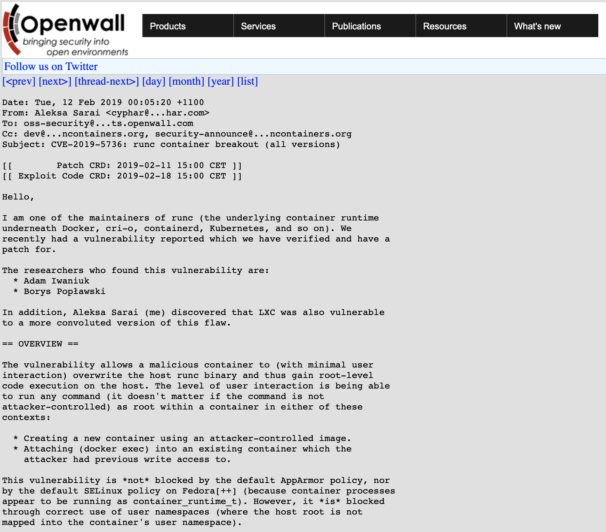
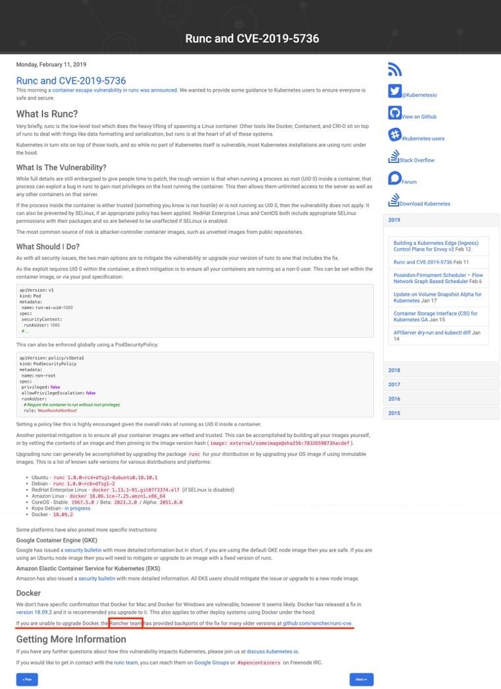

美国时间2019年2月11日晚，runc通过oss-security邮件列表披露了runc容器逃逸漏洞CVE-2019-5736的详情。runc是Docker、CRI-O、Containerd、Kubernetes等底层的容器运行时，此次安全漏洞无可避免地会影响大多数Docker与Kubernetes用户，也因此为整个业界高度关注。

漏洞披露后，Docker在第一时间发布了两个版本18.06.2和18.09.2，这两个版本都可以修复runc漏洞。Rancher Labs极速响应，Rancher Kubernetes管理平台和RancherOS操作系统均在不到一天时间内紧急更新，是业界第一个紧急发布新版本支持Docker补丁版本的平台，并持严谨态度在oss-security邮件列表披露漏洞后的五小时内连夜邮件通知所有Rancher用户此次漏洞的详情及应对之策。

更值得一提的是，尽管Docker发布了修复版本，但因为不是所有用户都能轻易将生产环境中的Docker版本升至最新，Rancher帮忙将修复程序反向移植到所有版本的Docker并提供给用户。且目前Docker官方提供的修复版本并不支持3.x内核（只兼容4.x内核），而runc的开发者特意向Rancher提交了支持3.x内核的PR，目前PR已合并，Rancher提供的方案现已可以支持3.x内核。



**runc安全漏洞事件背景**

runc是一个根据OCI(Open Container Initiative)标准创建并运行容器的CLI tool，目前Docker引擎内部也是基于runc构建的。2019年2月11日，研究人员通过oss-security邮件列表披露了runc容器逃逸漏洞的详情，根据OpenWall的规定EXP会在7天后也就是2019年2月18日公开。

此漏洞允许以root身份运行的容器以特权用户身份在主机上执行任意代码。这意味着容器可能会破坏Docker主机（覆盖Runc CLI），而所需要的只是能够使用root来运行容器。攻击者可以使用受感染的Docker镜像或对未受感染的正在运行的容器运行exec命令。



Rancher在12号当天已通过公众号文章详细分析了漏洞详情和用户的应对之策。相信目前大部分用户已经对漏洞已经有了初步的了解，甚至在Github上已经有人提交了EXP代码。Rancher在第一时间完成了补丁修复，并向企业用户推送的修复方案。同时在我们也收到了大量来自社区用户在后台的提问，为了疏解种种谜团，这篇后续文章，我们将选取大家重点关注的一些热点疑问进行进一步的解答。

**热点问题**

*非特权容器也能发起攻击吗？*

答案是肯定的，Rancher安全团队在第一时间做了一些测试，即使运行容器时不使用privileged参数，一样可以发起攻击。因为这个漏洞核心要素在于，容器内的用户是否对runc有访问权限， 容器内默认是root用户，只是这个root是受限制的root，但是它是具有对runc的访问权限，所以一定可以发起攻击。

*主机上不用root用户启动容器可以避免攻击吗？*

答案是无法避免，如上一个问题分析，它和容器内的用户有关，至于在主机上以什么用户启动无关。Rancher安全团队在Ubuntu系统上做了测试，即使使用ubuntu用户启动容器， 依然可以完成对runc的替换。

*更新官方Docker的注意事项*

Docker也在第一时间发布了两个版本18.06.2和18.09.2，这两个版本都可以修复runc漏洞，但是您需要注意的是他们都只兼容4.x内核，如果您的系统依然使用的3.x内核， 请谨慎使用，因为它基本不会起作用，甚至可能导致额外的问题。

```
Ubuntu 14.04 customers using a 3.13 kernel will need to upgrade to a supported Ubuntu 4.x kernel
```

参考两个版本的RN：

- <https://docs.docker.com/engine/release-notes/#18062>
- <https://docs.docker.com/engine/release-notes/#18092>

*Kubernetes用户怎么办？*

使用K8s的用户都很清楚，K8s并不能兼容太高的Docker版本，所以更新官方Docker版本是很难的一件事，为此K8s官方特意发表了一篇Blog：<https://kubernetes.io/blog/2019/02/11/runc-and-cve-2019-5736/> 。 主要思想就是，不要在容器中使用root，它推荐的方案是使用PodSecurityPolicy。当然很多用户修改PodSecurityPolicy后可能会引发各种问题，所以它也推荐用户更新Docker。 同时它也提到，不能更新Docker的用户，可以使用Rancher提供的方案，Rancher为每个版本都移植了补丁：

```
If you are unable to upgrade Docker, the Rancher team has provided backports of the fix for many older versions at github.com/rancher/runc-cve.
```



*如何使用Rancher提供的补丁？*

如上一个问题提到的，用户可以直接访问<https://github.com/rancher/runc-cve> 来获取方案，值得一提的是Rancher为3.x和4.x内核用户都提供了补丁版本。

```
To install, find the runc for you docker version, for example Docker 17.06.2 for amd64 will be runc-v17.06.2-amd64.
For Linux 3.x kernels use the binaries that end with no-memfd_create. Then replace the docker-runc on your host with the patched one.
```

## 安装

要安装，请找到docker版本对应的runc，例如amd64的Docker 17.06.2将是runc-v17.06.2-amd64。对于Linux 3.x内核，使用以**no-memfd_create**结尾的二进制文件。然后用修补的补丁替换主机上的docker-runc。

```
＃定位docker-runc的位置，通常在/usr/bin/docker-runc中
which docker-runc

＃备份 
mv /usr/bin/docker-runc /usr/bin/docker-runc.orig.$(date -Iseconds)

＃复制文件
cp runc-v17.06.2-amd64 /usr/bin/docker-runc

＃确保它是可执行的
chmod +x /usr/bin/docker-runc

＃测试它是否有效
docker-runc -v
docker run -it --rm ubuntu echo OK

```

> 针对centos或者红帽系统，如果以**no-memfd_create**结尾的二进制文件替换后，如果运行容器报错，可再用非**no-memfd_create**结尾的二进制文件替换。