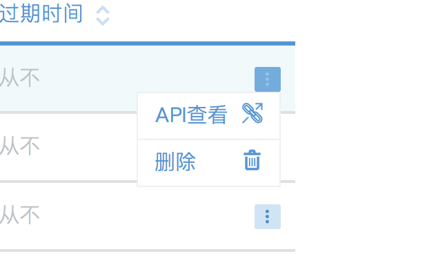
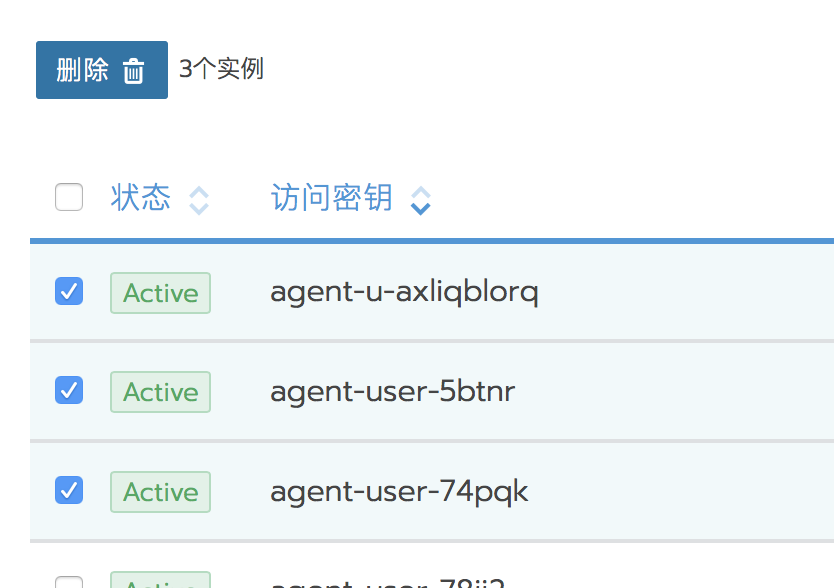

如果要使用外部应用程序访问Rancher集群、项目或其他对象，可以使用Rancher API执行此操作。但是，在您的应用程序可以访问API之前，您必须为应用程序提供用于向Rancher进行身份验证的API密钥。您可以使用Rancher UI获取密钥。

> 使用Rancher CLI还需要API密钥[cli](../cli)。

API密钥由四个组件组成：

- **Endpoint:**

    这是其他应用程序用于向Rancher API发送请求的地址。

- **Access Key:**

    token的用户名

- **Secret Key:**

    token的密码。对于提示您使用API身份验证的应用程序，通常会将两个密钥一起输入。

- **Bearer Token:**

    token的用户名和密码连接在一起。将此字符串用于提示您输入一个验证字符串的应用程序。

## 创建API Key

1. 点击右上角用户头像，选择`API Key`;
2. 点击`添加Key`;
3. 选填API Key的描述，并选择API Key的有效期；
4. 点击创建 ；
5. `重要`: 保存生成的Access Key(用户名)、Secret Key(密码)，这些信息只显示一次，关闭当前页后将无法找回；

## 删除API Keys

- 单个删除

  

- 批量删除

  选择多个API Key前面的复选框，点击删除

  
