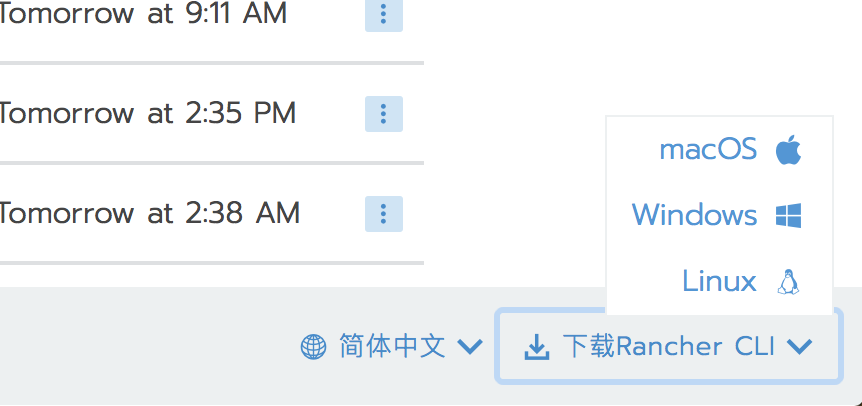

Rancher CLI是一个统一的工具，可用于与Rancher进行交互。使用此工具，你可以使用命令行而不是GUI来操作Rancher。

Rancher CLI有Windows，Mac和Linux的二进制文件。Rancher CLI二进制文件可以直接从Rancher UI下载，下载链接可以从Rancher UI右下角找到。

但是，UI上的下载链接是在Github上，可能网络原因会下载很慢。因此，你还可以从[文件下载](/docs/rancher/v2.x/cn/installation/download/)页面下载最新版本的二进制文件。
