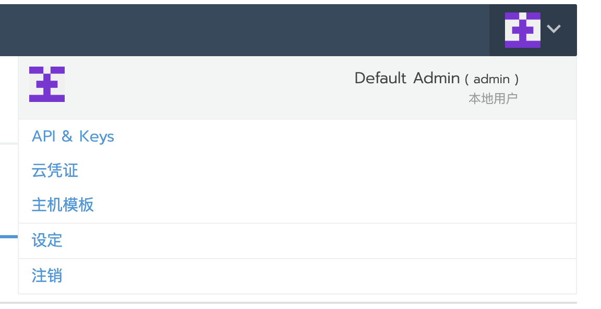
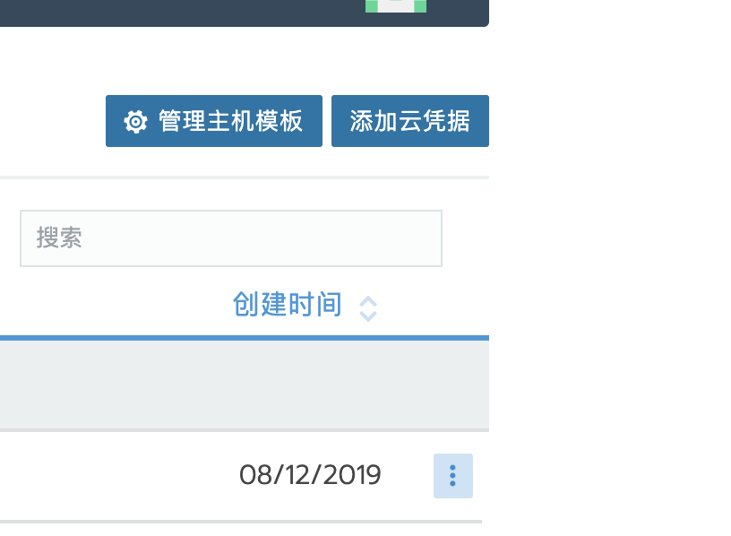
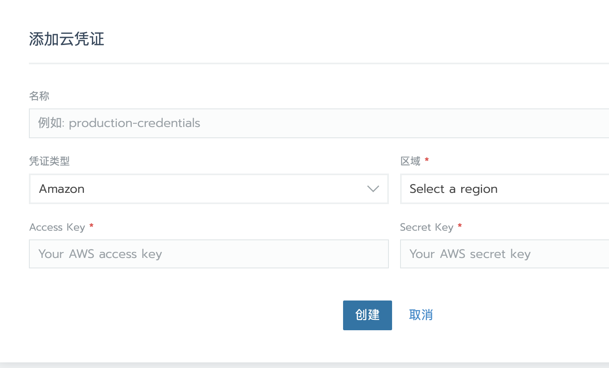

> 云凭证功能2.2 以后版本可用

在通过主机模板添加主机时，第一步需要填写云服务商的`Access Key`和`Access Key`或者账号和密码。为了简化操作，避免每次创建模板手动去填写这些参数，可使用`云凭证`功能来预先保存需要填写的云服务商的`Access Key`和`Access Key`或者账号和密码, 然后在创建模板的时候选择对应的`云凭证`条目。

1. 点击用户头像，选择云凭证

2. 右上角点击`添加云凭证`

3. 设置云凭证的相关信息,
	- 凭证名称：不能为中文
	- 凭证类型：凭证对应什么云平台
	- 区域：云平台区域
	- Access Key和Secret Key

4. 最后点击创建