配置[由基础架构提供程序托管](https://rancher.com/docs/rancher/v2.x/en/cluster-provisioning/rke-clusters/node-pools)的集群时，将使用`主机模板`来配置集群主机。这些模板使用`Docker Machine`配置选项来定义主机的`操作系统镜像和设置/参数`。

创建主机模板时，它将绑定到您的用户配置文件。主机模板不能在用户之间共享。您可以从用户设置中删除不再使用的陈旧主机模板。

## 创建主机模板

1. 从您的用户设置中，选择**用户头像>主机模板**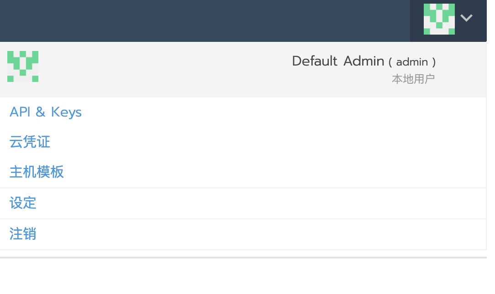

1. 单击**添加模板**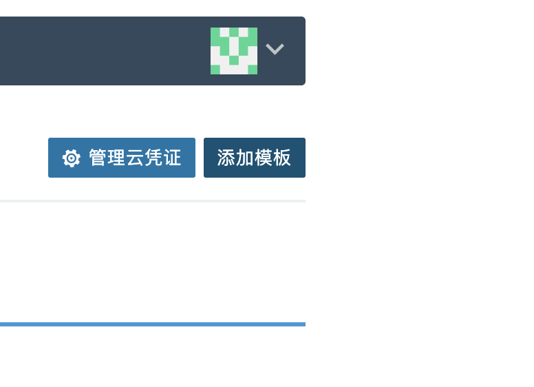

1. 添加模板参数（2.2以前的版本）

   - 选择云提供商，并配置账户访问参数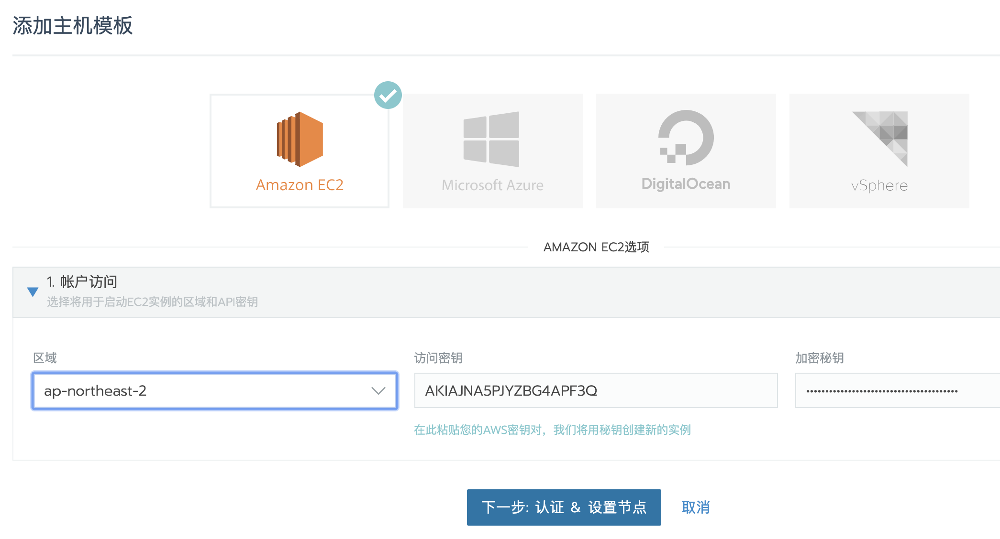

     

   - 配置网络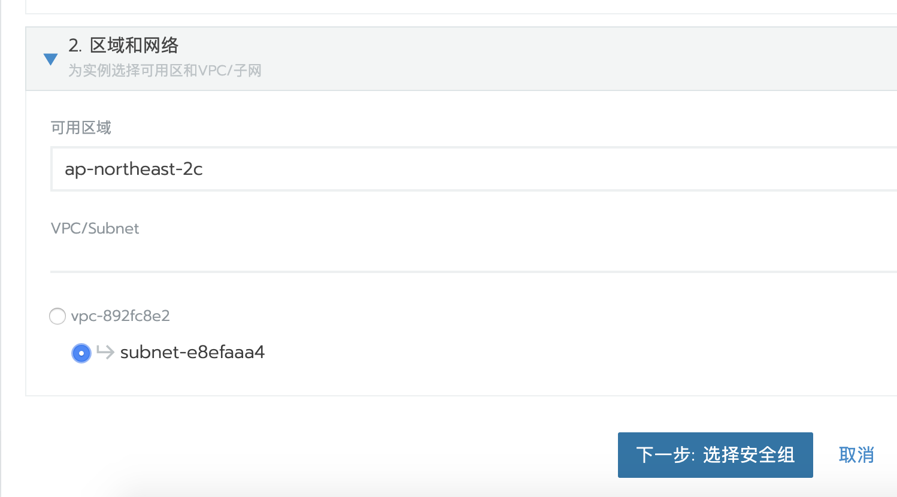

   - 配置安全组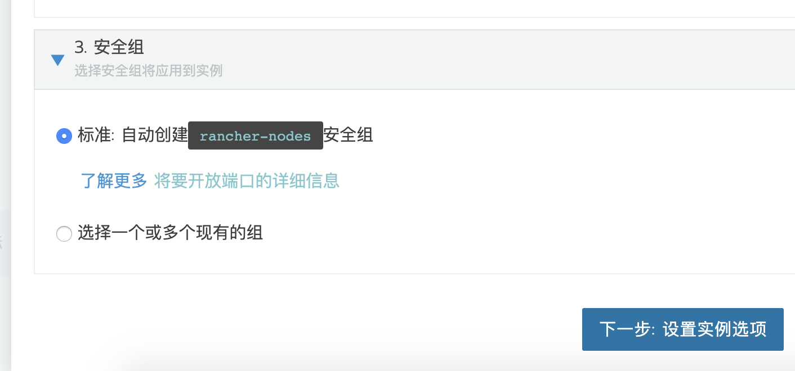

   - 配置实例参数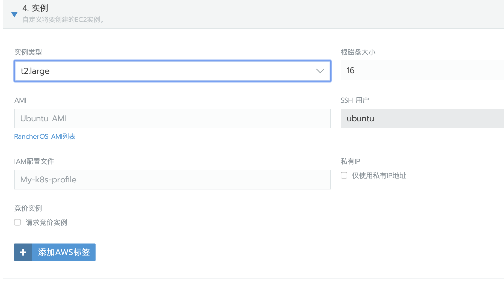

   - RANCHER主机信息，这个主要是设置主机加入RANCHER后需要配置哪些参数,比如配置存储驱动、加速镜像地址等。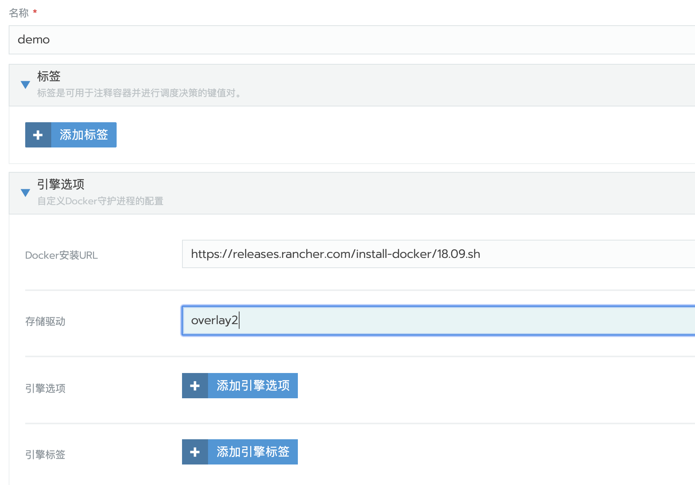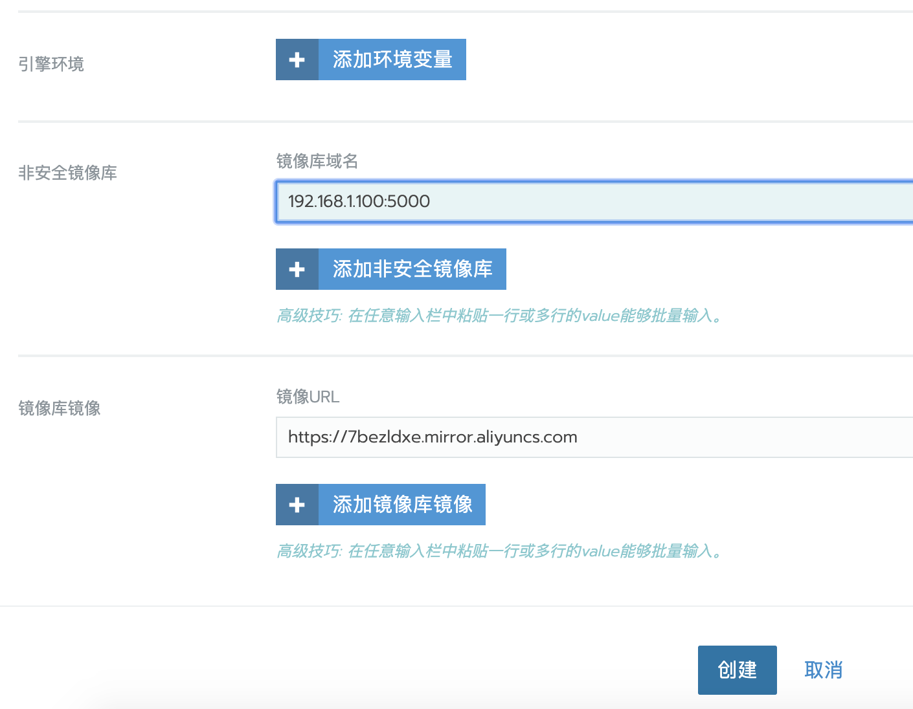

1. 添加模板参数（2.2以后的版本）

     2.2 版本引进了[云凭证](../cloud-credentials)的功能，主要是保存访问云供应商所需的凭证信息，避免每次创建模板都要输入凭证信息。

  - 选择云提供商，如果从未保存过云凭证，那么在账户访问中可以看到`云凭证`选项是灰色的。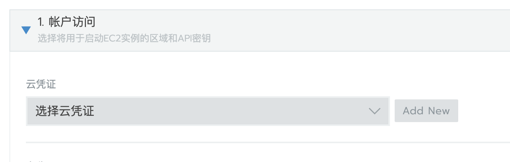如果有保存过云凭证，那么会可供选择

  - `云凭证`选项下方的参数是用来保存云凭证的，填写凭证名称、对应的授权的云平台区域、以及Access Key和Secret Key。(凭证名称不能为中文字符)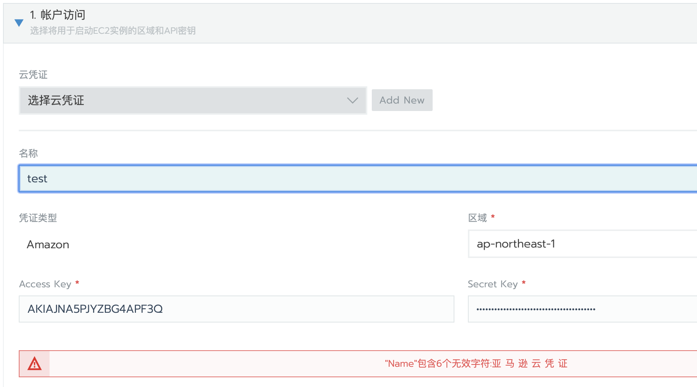

  - 点击创建并验证通过后，会自动跳转到云凭证选择页面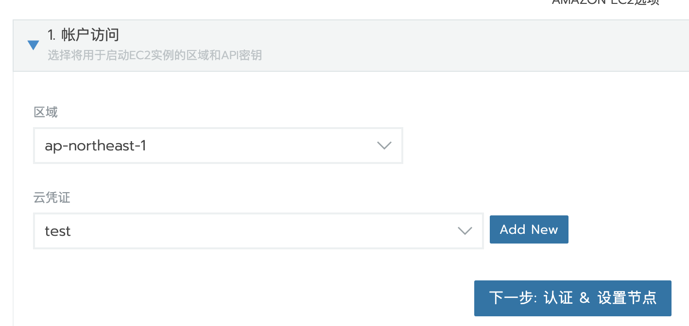

  - 点击下一步认证并设置其他参数

    

## 克隆主机模板

从`用户设置`创建新主机模板时，您可以克隆现有模板并快速更新其设置，而不是从头开始创建新模板，克隆模板可以减少重复输入参数的麻烦。

1. 从您的用户设置中，选择**用户头像>主机模板**。
1. 找到要克隆的模板。然后选择**省略号菜单>克隆**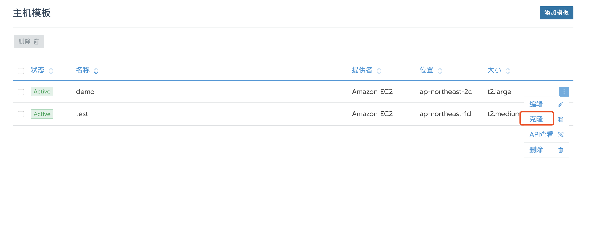
1. 输入Secret Key进行校验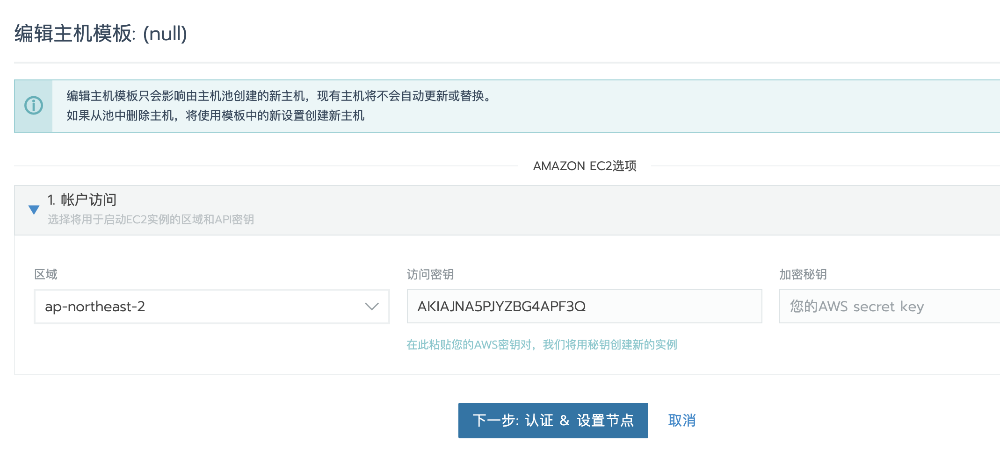
1. 后续的步骤与第一次创建主机模板相同

## 删除主机模板

当不再使用主机模板时，可以从用户设置中删除它。

1. 进入用户设置，选择**用户头像>主机模板**。
1. 从列表中选择一个或多个模板，然后单击**删除**，出现提示时确认删除。