> 警告：目前本工具仅适用于测试或开发环境。

## 一、简述

本工具基于`https://github.com/adnanh/webhook.git`定制, `Dockerfile`地址: `https://github.com/xiaoluhong/docker-webhook.git`。

镜像下载地址: `registry.cn-shanghai.aliyuncs.com/rancher_cn/webhook:latest`

## 二、准备配置文件

> 建议把webhooks作为系统服务运行在`system`项目下

1. 登录Rancher UI切换到`system`项目下，然后依次进入 `资源\配置映射`，点击页面右上角的`添加配置映射`。
1. 修改模板中`trigger-rule`对应的参数:
    - `<webhooks_id>`: 此`webhooks-id`具有唯一性，不能重复。建议设置为服务名，比如`cnrancher_website`;
    - `<token>`: 设置一个token值用于匹配校验;
    - `<workload>`: 指定一个应用，书写格式为`类型/Workload`,例如: `deployment/webhooks`、`daemonset/webhooks`;
    - `<namespaces>`: 指定服务所在的命名空间;
    - `<container>`: 指定容器名称，对于一个有多容器的Pod，升级时需要指定容器名称;

    ```json
    [
        {
            "id": "<webhooks-id>",
            "execute-command": "/webhooks.sh",
            "command-working-directory": "/home",
            "response-message": "I got the payload!",
            "include-command-output-in-response": true,
            "include-command-output-in-response-on-error": true,
            "trigger-rule-mismatch-http-response-code": 500,
            "response-headers":
            [
                {
                    "name": "Access-Control-Allow-Origin",
                    "value": "*"
                }
            ],
            "pass-arguments-to-command":
            [
                {
                    "source": "entire-payload"
                }
              ],
            "pass-environment-to-command":
            [
                {
                    "envname": "APP_NS",
                    "source": "url",
                    "name": "ns"
                },
                {
                    "envname": "APP_WORKLOAD",
                    "source": "url",
                    "name": "workload"
                },
                {
                    "envname": "APP_CONTAINER",
                    "source": "url",
                    "name": "container"
                },
                {
                    "envname": "REPO_TYPE",
                    "source": "url",
                    "name": "repo_type"
                }
            ],
            "trigger-rule":
            {
                "and":
                [
                    {
                        "match":
                        {
                            "type": "value",
                            "value": "<token>",
                            "parameter":
                            {
                                "source": "url",
                                "name": "token"
                            }
                        }
                    },
                    {
                        "match":
                        {
                            "type": "value",
                            "value": "<namespaces>",
                            "parameter":
                            {
                                "source": "url",
                                "name": "ns"
                            }
                        }
                    },
                    {
                        "match":
                        {
                            "type": "value",
                            "value": "<workload>",
                            "parameter": 
                            {
                                "source": "url",
                                "name": "workload"
                            }
                        }
                    },
                    {
                        "match":
                        {
                            "type": "value",
                            "value": "<container>",
                            "parameter":
                            {
                                "source": "url",
                                "name": "container"
                            }
                        }
                    }
                ]
            }
        }
    ]
    ```

1. 填写`添加配置映射`参数，其中:
    - `名称`: 可以随意填写;
    - `键`: 以`.json`结尾的文件名，比如`cnrancher.json`;
    - `值`: 设置为上一步中修改的配置文件;
    - 如果有多个服务，可以添加多个键值对，如图:
    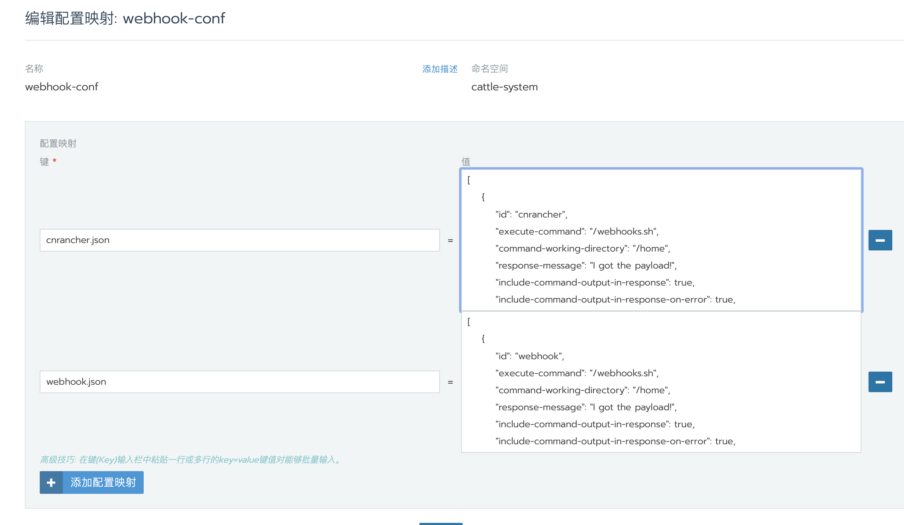

## 三、webhooks安装

   依次点击 `system项目\工作负载\工作负载`，点击右侧部署服务。

- 配置服务名称和镜像

    `registry.cn-shanghai.aliyuncs.com/rancher_cn/webhook`

    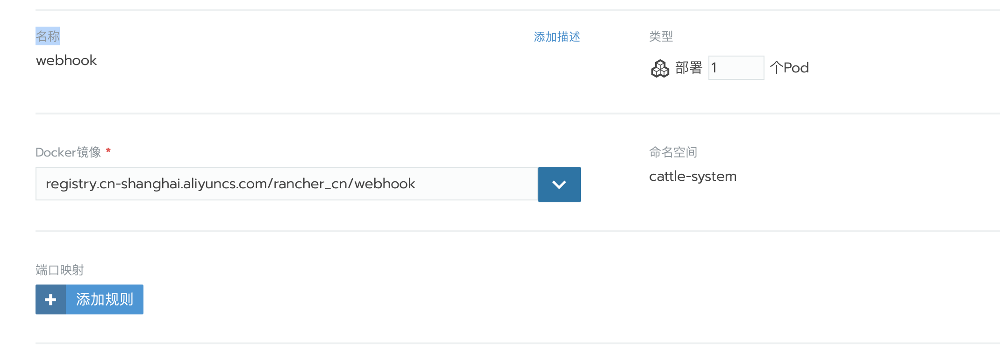

- 配置环境变量

    `WEBHOOK_CMD=-template`

    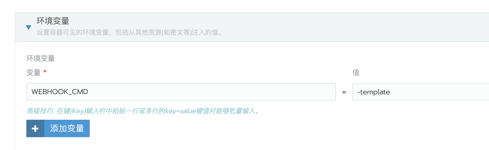

- 配置健康检查

    端口: `9000`

    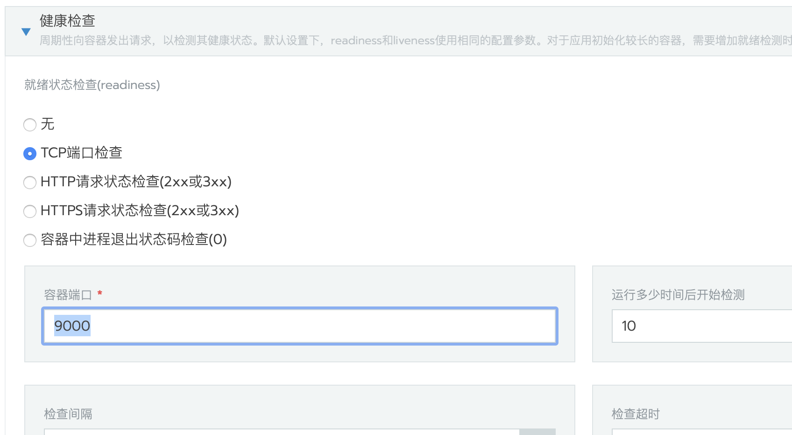

- 配置数据卷

  - 选择配置映射卷

        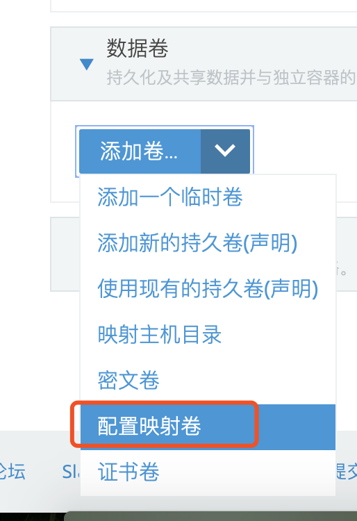

  - 配置映射名: 选择前面创建的配置映射;

  - 容器路径: `/etc/webhook/source`;

  - 其他参数保持默认;

        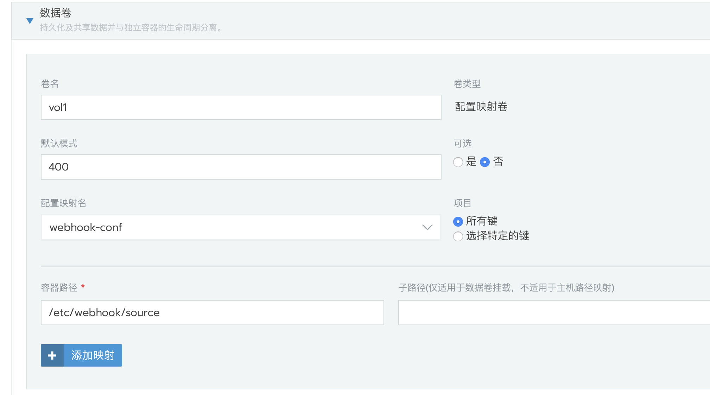

- 最后点击启动，启动后查看日志，可以看到当前监听的服务

    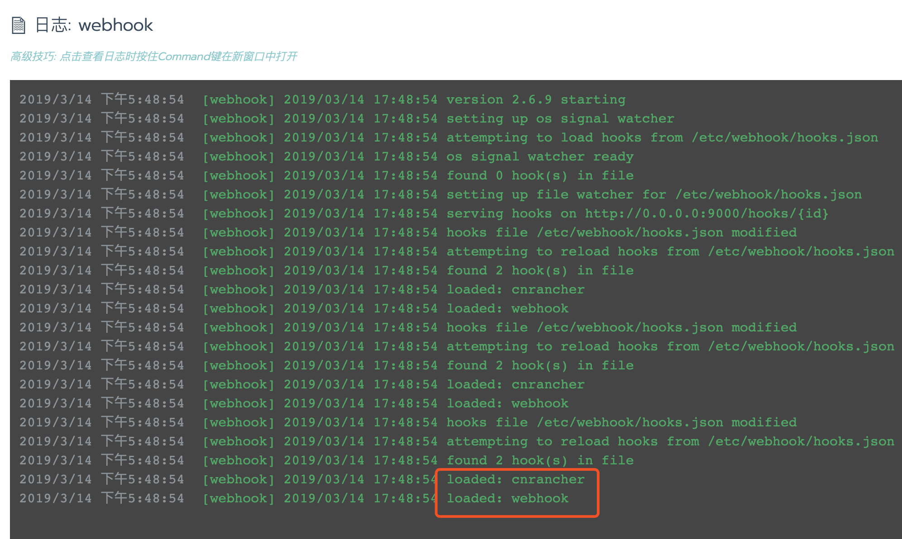

- 设置`serviceaccounts`

    这一步相对比较重要，webhooks服务需要`serviceaccounts`才可以正常的与K8S通信。因为目前Rancher UI不支持设置`serviceaccounts`，所以需要编辑`yaml`文件来配置`serviceaccounts`。

  - 如图，选择 `查看/编辑YAML`

        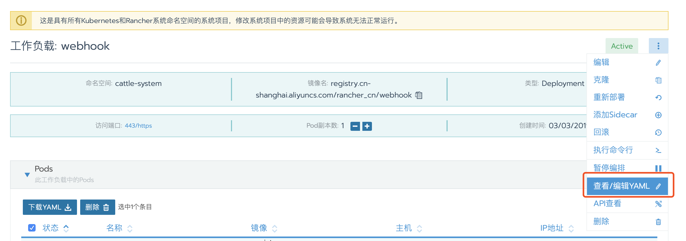

  - 在`securityContext: {}` 下边添加`serviceAccount: cattle`和`serviceAccountName: cattle`

      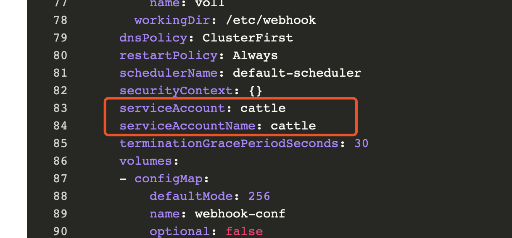

  - 最后点击`保存`

## 四、webhooks触发地址

```bash
http(s)://<webhooks_url>/hooks/\
<webhooks_id>?\
token=<token>&\
ns=<namespaces>&\
workload=<workload>&\
container=<container>&\
repo_type=<repo_type>
```

其中`<webhooks_id>、<namespaces>、<workload>、<container>`对应模板中的参数，`<repo_type>`支持:`aliyun`、`dockerhub`、`custom`。

## 五、配置仓库触发

- 支持镜像仓库类型:

    1. 阿里云镜像仓库: `https://cr.console.aliyun.com`
    1. Docker Hub: `http://hub.docker.com`
    1. 自定义webhooks

### 阿里云镜像仓库

  1. 浏览器访问`https://cr.console.aliyun.com`进入容器镜像服务管理界面；

  1. 选择一个需要添加自动触发功能的仓库，点击右侧的管理；

  1. 在切换的新窗口左上角选择触发器；

      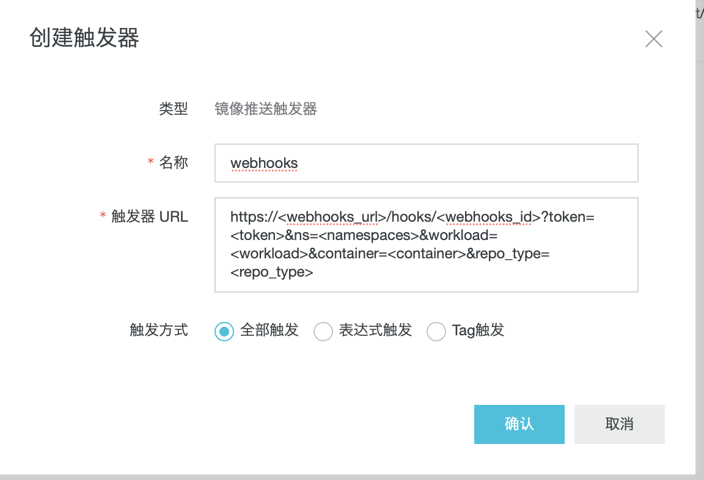

  1. webhooks触发消息示例：

      ```json
      {
          "push_data": {
              "digest":       "sha256:f66daa126e9fcac4e2d0b7131e78ffd5d8e0012a1e6cb150a953e5be8da5d      980",
              "pushed_at": "2019-03-13 23:38:07",
              "tag": "latest"
          },
          "repository": {
              "date_created": "2019-03-05 13:47:43",
              "name": "webhook",
              "namespace": "rancher_cn",
              "region": "cn-shanghai",
              "repo_authentication_type": "NO_CERTIFIED",
              "repo_full_name": "rancher_cn/webhook",
              "repo_origin_type": "NO_CERTIFIED",
              "repo_type": "PUBLIC"
          }
      }
      ```

### Docker Hub

  1. 浏览器访问`https://cloud.docker.com/repository/list`，输入账号和密码后将进入仓库列表;

  1. 点击需要添加webhooks仓库，然后点击webhooks;

      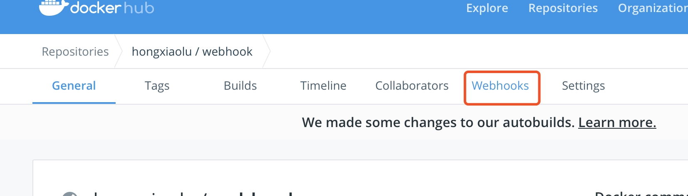

  1. 填写相关参数，点击右侧的加号； 

      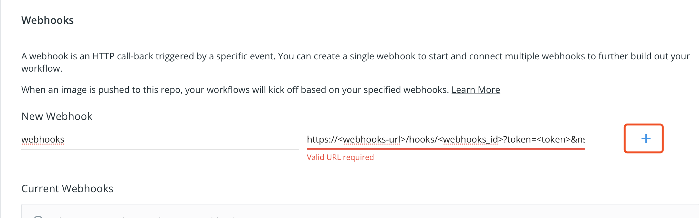

  1. webhooks触发消息示例：

      ```json
      {
          "push_data": {
              "pushed_at": 1552553567,
              "images": [],
              "tag": "latest",
              "pusher": "hongxiaolu"
          },
          "callback_url": "",
          "repository": {
              "status": "Active",
              "description": "iperf3",
              "is_trusted": true,
              "full_description": "# iperf3\niperf3\n",
              "repo_url": "",
              "owner": "hongxiaolu",
              "is_official": false,
              "is_private": false,
              "name": "iperf3",
              "namespace": "hongxiaolu",
              "star_count": 0,
              "comment_count": 0,
              "date_created": 1540013520,
              "dockerfile": "# ",
              "repo_name": "hongxiaolu/iperf3"
          }
      }
      ```

### 自定义webhooks

如果是使用Jenkins自定义构建镜像，可以设置`repo_type`=`custom`。

在Jenkins构建`task`中，在镜像`push`操作后增加一个`执行shell命令`的步骤。这个操作主要是在镜像成功推送到镜像仓库后发出`POST消息`去触发webhooks，这步中需要把上一步推送的`镜像仓库地址`,`镜像命名空间`,`镜像名`，以及镜像`tag`作为变量传递到这一步，这样在发送`POST消息`才可以把相关的镜像信息传递给webhooks,从而触发服务升级。

示例`POST消息`:

  ```shell
  curl -X POST \
    'http(s)://<webhooks_url>/hooks/<webhooks_id>?\
    token=<token>&\
    ns=<namespaces>&\
    workload=<workload>&\
    container=<container>&\
    repo_type=custom' \
    -H 'Content-Type: application/json' \
    -H 'cache-control: no-cache' \
    -d '{
      "push_data": {
          "tag": "${images_tag}"
      },
      "repository": {
          "repo_url": ${images_repo_url},
          "name": "${images_name}",
          "namespace": "${images_namespace}"
      }
  }'
  ```

## 触发webhooks

- 配置完以上参数，提交代码到git仓库后将会自动触发阿里云仓库或者dockerhub的自动构建，创建自动构建方法请自行查阅相关文档。

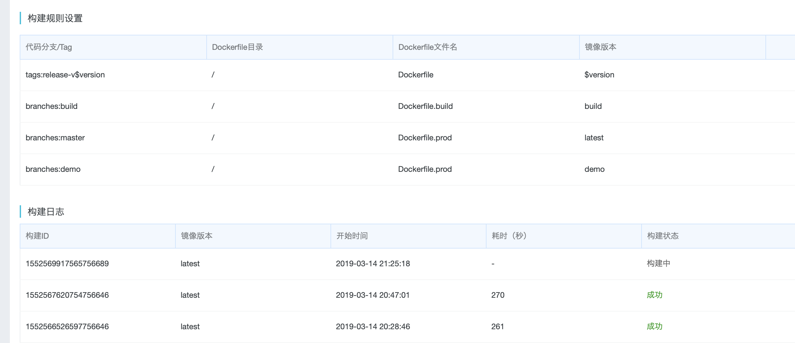

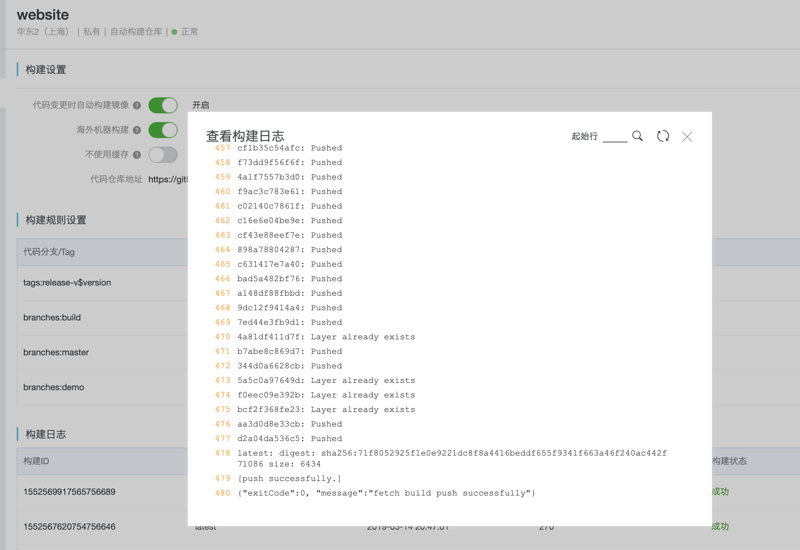

- 当镜像构建完成并推送到仓库后，会触发webhooks消息到预先配置的地址，从触发器也可以查看历史记录。

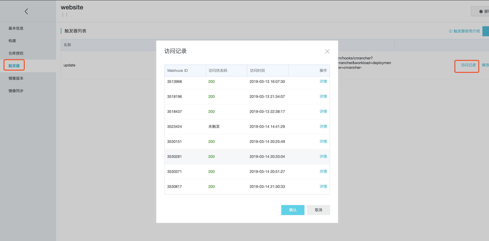

- webhooks服务收到消息后，会马上触发服务的升级。查看webhooks服务的日志，可以看到已经成功升级。

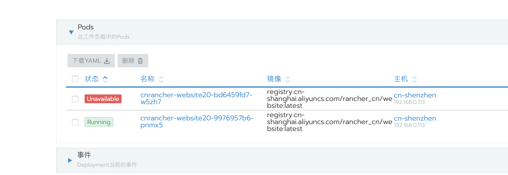

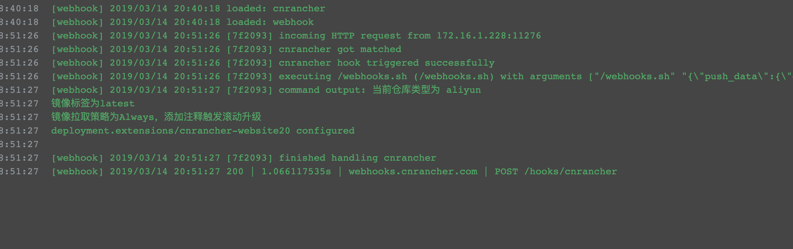