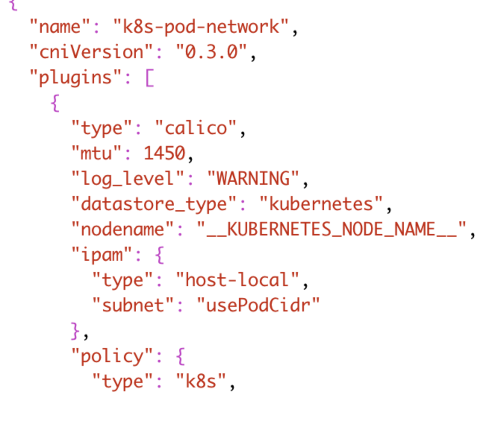

### Canal网络驱动下，Pod MTU值大于主机flannel.1MTU值

1. 编辑配置映射文件

    kubectl edit configmaps -n kube-system canal-config

2. 在`"type": "calico"`下面添加`"mtu": "1450"`

    

3. 删除Canal Pod让它重建

    kubectl get pod -n kube-system |grep canal |awk '{print $1}' | xargs kubectl delete -n kube-system pod