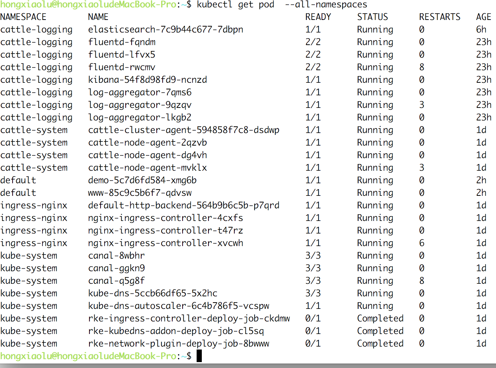

您可以按照以下步骤定位集群错误。

1. 检查防火墙是否放行了所需的端口，所需端口列表访问[端口需求](/rancher/v2.x/cn/install-prepare/references/);

2. 所有节点都应该存在并处于`Ready`状态；

    运行以下命令查询节点状态:

    ```bash
    kubectl --kubeconfig kube_config_rancher-cluster.yml get nodes
    ```
    

    如果输出结果中未显示节点或节点未处于`Ready`状态，则需要检查kubelet容器的日志记录。

    - 登录节点运行以下命令

        `docker logs kubelet`.

3. 所有的`pods/jobs` 应该是`Running/Completed`状态；

    通过以下命令检查`pods/jobs`状态:

    ```bash
    kubectl --kubeconfig kube_config_rancher-cluster.yml get pods --all-namespaces
    ```
    

    1. **如果`pod`不是`Running`状态, 需要通过以下命令进一步查询问题:**

        1. **Describe pod**

            ```bash
            kubectl --kubeconfig kube_config_rancher-cluster.yml describe pod POD_NAME -n NAMESPACE
            ```

        2. **Pod container logs**

            ```bash
            kubectl --kubeconfig kube_config_rancher-cluster.yml logs POD_NAME -n NAMESPACE
            ```
    2. **如果job不是`Completed`状态, 通过以下命令检查问题:**

        1. **Describe job**

            ```bash
            kubectl --kubeconfig kube_config_rancher-cluster.yml describe job JOB_NAME -n NAMESPACE
            ```

        2. **Logs from the containers of pods of the job**

            ```bash
            kubectl --kubeconfig kube_config_rancher-cluster.yml logs -l job-name=JOB_NAME -n NAMESPACE
            ```

4. 列出所有Kubernetes集群事件

    可以通过以下命令查询存储的Kubernetes cluster事件:

    ```bash
    kubectl --kubeconfig kube_config_rancher-cluster.yml get events --all-namespaces
    ```

5. 检查Rancher容器日志:

    ```bash
    kubectl --kubeconfig kube_config_rancher-cluster.yml logs -l app=cattle -n cattle-system
    ```

6. 检查NGINX ingress controller日志

    ```bash
    kubectl --kubeconfig kube_config_rancher-cluster.yml logs -l app=ingress-nginx -n ingress-nginx
    ```

7. 检查`overlay`网络是否正常运行

    可以将pod运行到多台主机上，通过`nginx ingress`把请求路由到多个节点上。路由请求将会通过`overlay`网络通信，如果`overlay`网络没有正常运行，`nginx ingress`无法路由请求到Pod。

    要测试`overlay`网络，可以通过DaemonSet定义一组全局服务，这将在每个主机上运行一个容器(alpine为例)，我们将使用这些容器去`ping`其他主机上的容器。

    1. 保存以下代码为 `ds-alpine.yml`

        ```yaml
        apiVersion: apps/v1
        kind: DaemonSet
        metadata:
          name: alpine
        spec:
          selector:
              matchLabels:
                name: alpine
          template:
            metadata:
              labels:
                name: alpine
            spec:
              tolerations:
              - effect: NoExecute
                key: "node-role.kubernetes.io/etcd"
                value: "true"
              - effect: NoSchedule
                key: "node-role.kubernetes.io/controlplane"
                value: "true"
              containers:
              - image: alpine
                imagePullPolicy: Always
                name: alpine
                command: ["sh", "-c", "tail -f /dev/null"]
                terminationMessagePath: /dev/termination-log
        ```

    2. 通过执行 `kubectl --kubeconfig kube_config_rancher-cluster.yml create -f ds-alpine.yml` 运行服务；

    3. 等到`kubectl --kubeconfig kube_config_rancher-cluster.yml rollout status ds/alpine -w`返回`daemon set "alpine" successfully rolled out`；

    4. 运行以下`kubectl`命令，让每个主机上的容器分别`ping`其他主机的容器:

        ```bash
        echo "=> Start"; kubectl --kubeconfig kube_config_rancher-cluster.yml get pods -l name=alpine -o jsonpath='{range .items[*]}{@.metadata.name}{" "}{@.spec.nodeName}{"\n"}{end}' | while read spod shost; do kubectl --kubeconfig kube_config_rancher-cluster.yml get pods -l name=alpine -o jsonpath='{range .items[*]}{@.status.podIP}{" "}{@.spec.nodeName}{"\n"}{end}' | while read tip thost; do kubectl --kubeconfig kube_config_rancher-cluster.yml --request-timeout='10s' exec $spod -- /bin/sh -c "ping -c2 $tip > /dev/null 2>&1"; RC=$?; if [ $RC -ne 0 ]; then echo $shost cannot reach $thost; fi; done; done; echo "=> End"
        ```

    5. 当命令运行完毕后，正常的`overlay`网络将会输出以下内容:

        ```bash
        => Start
        => End
        ```

        如果在输出结果中看到错误，则表明`overlay`网络无法正常通信。通常情况是因为端口未放行导致，查看[端口需求](/rancher/v2.x/cn/install-prepare/references/)验证端口放行。

        错误示例:

        ```bash
        => Start
        command terminated with exit code 1
        NODE2 cannot reach NODE1
        command terminated with exit code 1
        NODE3 cannot reach NODE1
        command terminated with exit code 1
        NODE1 cannot reach NODE2
        command terminated with exit code 1
        NODE1 cannot reach NODE3
        => End
        ```
