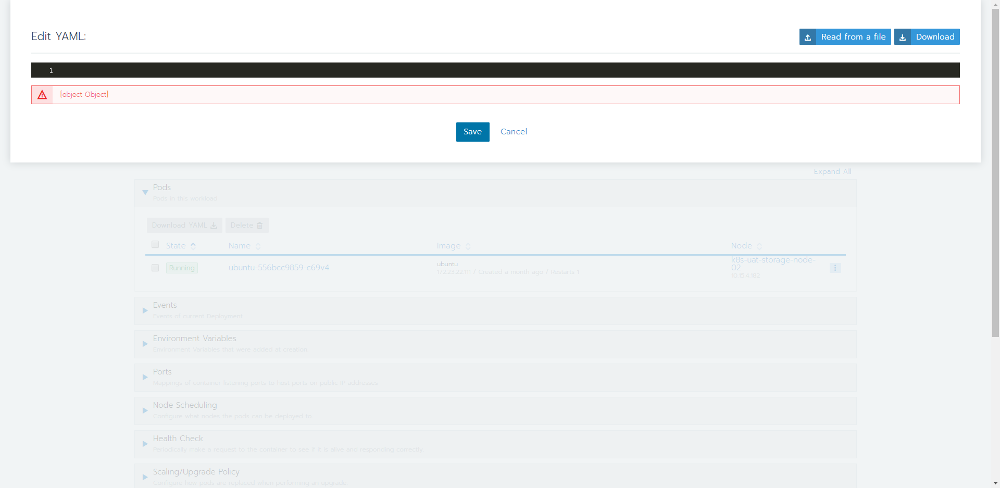
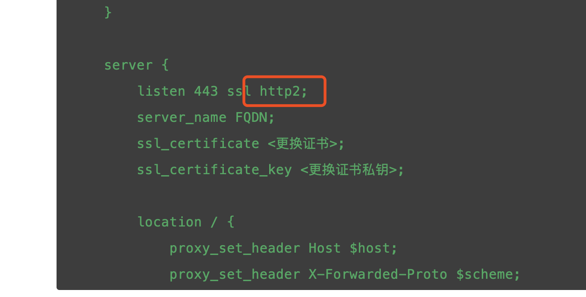
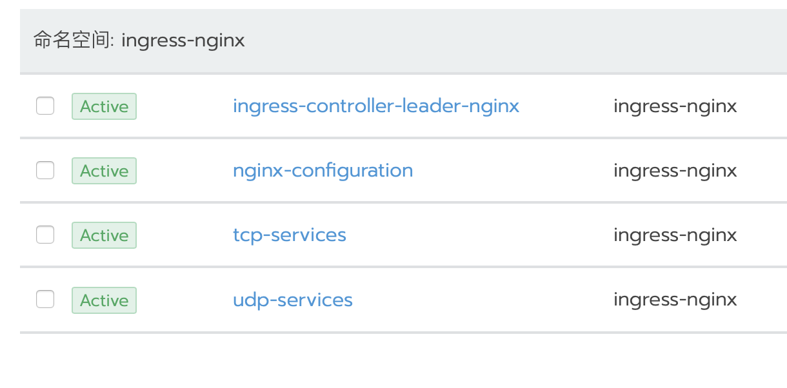
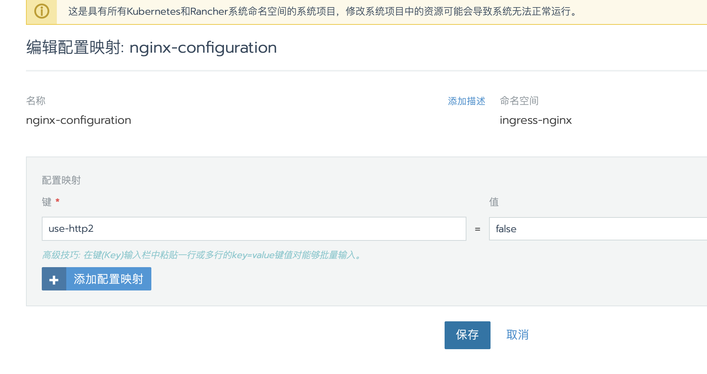

## 1. rancher2.1.x升级到2.2.x，无法`查看/编辑yaml`文件

_此文件将在2.2.3修复_

### 解决方法：

- 架构为使用外部七层负载均衡器代理rancher ha

  ​ 检查外部负载均衡器的配置，如果有`http2`的参数，把http2取消。比如nginx的配置：

- 架构为使用内部ingress 七层代理Rancher HA

  1. 进入`local`集群，切换到`系统项目`\\`资源`\\`配置映射`页面，找到并编辑`nginx-configuration`
  2. 添加`use-http2=false`禁止`http2`
