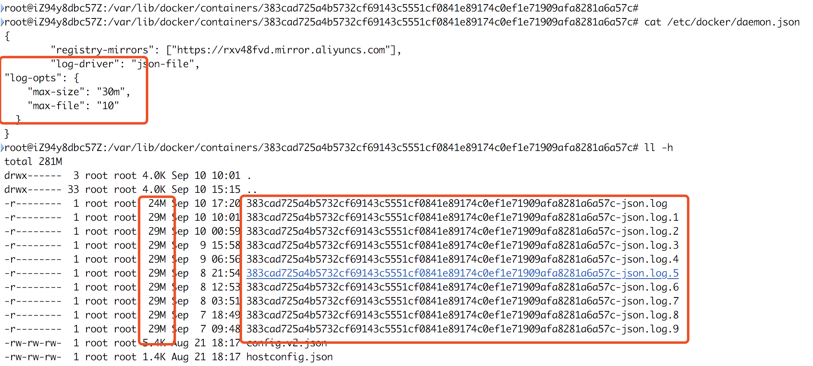

## 一、ETCD

### 1、磁盘IOPS

etcd对磁盘写入延迟非常敏感，通常需要50顺序写入IOPS(例如: 7200RPM磁盘)。对于负载较重的集群，建议使用500顺序写入IOPS(例如，典型的本地SSD或高性能虚拟化块设备)。请注意，大多数云服务器或者云存储提供并发IOPS而不是顺序IOPS，提供的并发IOPS可能比顺序IOPS大10倍。为了测量实际的顺序IOPS，建议使用磁盘基准测试工具，如[diskbench](https://github.com/ongardie/diskbenchmark)或[fio](https://github.com/axboe/fio)。

>**PS** 常见磁盘平均物理寻道时间约为: \
7200转/分的STAT硬盘平均物理寻道时间是9ms \
10000转/分的STAT硬盘平均物理寻道时间是6ms \
15000转/分的SAS硬盘平均物理寻道时间是4ms
>
>常见硬盘的旋转延迟时间约为: \
7200  rpm的磁盘平均旋转延迟大约为60X1000/7200/2=4.17ms \
10000 rpm的磁盘平均旋转延迟大约为60X1000/10000/2=3ms，\
15000 rpm的磁盘其平均旋转延迟约为60X1000/15000/2=2ms。
>
>最大IOPS的理论计算方法:\
IOPS=1000ms/(寻道时间+旋转延迟)。忽略数据传输时间。\
7200 rpm的磁盘IOPS=1000/(9+4.17)=76IOPS\
10000 rpm的磁盘IOPS=1000/(6+3)=111IOPS\
15000 rpm的磁盘IOPS=1000/(4+2)=166IOPS

### 2、磁盘IO优先级

由于etcd必须将数据持久保存到磁盘日志文件中，因此来自其他进程的磁盘活动可能会导致增加`写入时间`，结果可能会导致etcd请求超时和临时`leader`丢失。当给定高磁盘优先级时，etcd服务可以稳定地与这些进程一起运行。

在Linux上，etcd的磁盘优先级可以配置为ionice：

```bash
sudo ionice -c2 -n0 -p $(pgrep etcd)
```

### 3、修改空间配额大小

默认ETCD空间配额大小为2G，超过2G将不再写入数据。通过给ETCD配置`--quota-backend-bytes`参数增大空间配额,最大支持8G。

> RKE或者Rancher UI自定义部署集群的时候，在yaml文件中指定以下参数

```yaml
services:
  etcd:
    # 修改空间配额为$((4*1024*1024*1024))，默认2G,最大8G
    extra_args:
      quota-backend-bytes: '4294967296'
```


### 4、网络延迟

如果有大量并发客户端请求etcd leader服务，则可能由于网络拥塞而延迟处理`follower`对等请求。在`follower`节点上的发送缓冲区错误消息：

```bash
dropped MsgProp to 247ae21ff9436b2d since streamMsg's sending buffer is full
dropped MsgAppResp to 247ae21ff9436b2d since streamMsg's sending buffer is full
```

可以通过在客户端提高etcd对等网络流量优先级来解决这些错误。在Linux上，可以使用流量控制机制对对等流量进行优先级排序：

```bash
tc qdisc add dev eth0 root handle 1: prio bands 3
tc filter add dev eth0 parent 1: protocol ip prio 1 u32 match ip sport 2380 0xffff flowid 1:1
tc filter add dev eth0 parent 1: protocol ip prio 1 u32 match ip dport 2380 0xffff flowid 1:1
tc filter add dev eth0 parent 1: protocol ip prio 2 u32 match ip sport 2739 0xffff flowid 1:1
tc filter add dev eth0 parent 1: protocol ip prio 2 u32 match ip dport 2739 0xffff flowid 1:1
```

>根据实际情况修改接口名称

## 二、主机/OS

### 1、内核调优

```bash
net.ipv4.neigh.default.gc_thresh1=<value1>
net.ipv4.neigh.default.gc_thresh2=<value2>
net.ipv4.neigh.default.gc_thresh3=<value3>
```

> 根据主机资源大小来调整`<value>`值.

接着执行`sysctl -p`

## 三、Docker

1、Docker镜像下载最大并发数

通过配置镜像上传\下载并发数`max-concurrent-downloads,max-concurrent-uploads`,缩短镜像上传\下载的时间。

2、配置镜像加速地址

通过配置镜像加速地址`registry-mirrors`,可以很大程度提高镜像下载速度。

3、配置Docker存储驱动

OverlayFS是一个新一代的联合文件系统，类似于AUFS，但速度更快，实现更简单。Docker为OverlayFS提供了两个存储驱动程序:旧版的overlay，新版的[overlay2](https://docs.docker.com/storage/storagedriver/overlayfs-driver/)(更稳定)。

4、配置日志文件大小

容器中会产生大量日志文件，很容器占满磁盘空间。通过设置日志文件大小，可以有效控制日志文件对磁盘的占用量。例如：



5、开启`WARNING: No swap limit support，WARNING: No memory limit support`支持

对于Ubuntu\Debian系统，执行`docker info`命令时能看到警告`WARNING: No swap limit support或者WARNING: No memory limit support`。因为Ubuntu\Debian系统默认关闭了`swap account或者`功能，这样会导致设置容器内存或者swap资源限制不生效，[解决方法](/rancher/v2.x/cn/install-prepare/basic-environment-configuration/#3-ubuntu系统-docker-info提示warning-no-swap-limit-support)。

6、综合配置

```bash
touch /etc/docker/daemon.json
cat > /etc/docker/daemon.json <<EOF
{
    "log-driver": "json-file",
    "log-opts": {
    "max-size": "100m",
    "max-file": "3"
    },
    "max-concurrent-downloads": 10,
    "max-concurrent-uploads": 10,
    "registry-mirrors": ["https://7bezldxe.mirror.aliyuncs.com"],
    "storage-driver": "overlay2",
    "storage-opts": [
    "overlay2.override_kernel_check=true"
    ]
}
EOF
systemctl daemon-reload && systemctl restart docker
```

## 四、kubernetes

### kube-apiserver

> RKE或者Rancher UI自定义部署集群的时候，在yaml文件中指定以下参数

```yaml
services:
  kube-api:
    extra_args:
```

### kube-controller

> RKE或者Rancher UI自定义部署集群的时候，在yaml文件中指定以下参数

```yaml
services:
  kube-controller:
    extra_args:
      # 控制器定时与节点通信以检查通信是否正常，周期默认5s
      node-monitor-period: '5s'
      # 当节点通信失败后，再等一段时间kubernetes判定节点为notready状态。
      #$ 这个时间段必须是kubelet的nodeStatusUpdateFrequency(默认10s)的N倍，
      ## 其中N表示允许kubelet同步节点状态的重试次数，默认40s。
      node-monitor-grace-period: '20s'
      # 再持续通信失败一段时间后，kubernetes判定节点为unhealthy状态，默认1m0s。
      node-startup-grace-period: '30s'
      # 再持续失联一段时间，kubernetes开始迁移失联节点的Pod，默认5m0s。
      pod-eviction-timeout: '1m'
```

### kubelet

> RKE或者Rancher UI自定义部署集群的时候，在yaml文件中指定以下参数

```yaml
services:
  kubelet:
    extra_args:
    # 修改节点最大Pod数量,默认110个
    max-pods: '250'
    # 密文和配置映射同步时间，默认1分钟
    sync-frequency: '3s'
    # 自定义pause镜像,默认为rancher/pause:3.1
    pod-infra-container-image: 'xxx/xxx/pause:3.1'
    # 传递给网络插件的MTU值，以覆盖默认值，设置为0(零)则使用默认的1460
    network-plugin-mtu: '1500'
    # Kubelet进程可以打开的文件数（默认1000000）,根据节点配置情况调整
    max-open-files: '2000000'
    # 与apiserver会话时的并发数，默认是10
    kube-api-burst: '30'
    # 与apiserver会话时的 QPS,默认是5
    kube-api-qps: '15'
    # kubelet默认一次拉取一个镜像，设置为false可以同时拉取多个镜像，
    ## 前提是存储驱动要为overlay2，对应的Dokcer也需要增加下载并发数，参考：三、Docker
    serialize-image-pulls: 'false'
    # 拉取镜像的最大并发数，registry-burst不能超过registry-qps ，
    ## 仅当registry-qps大于0(零)时生效，(默认10)。如果registry-qps为0则不限制(默认5)。
    registry-burst: '10'
    registry-qps: '0'
```