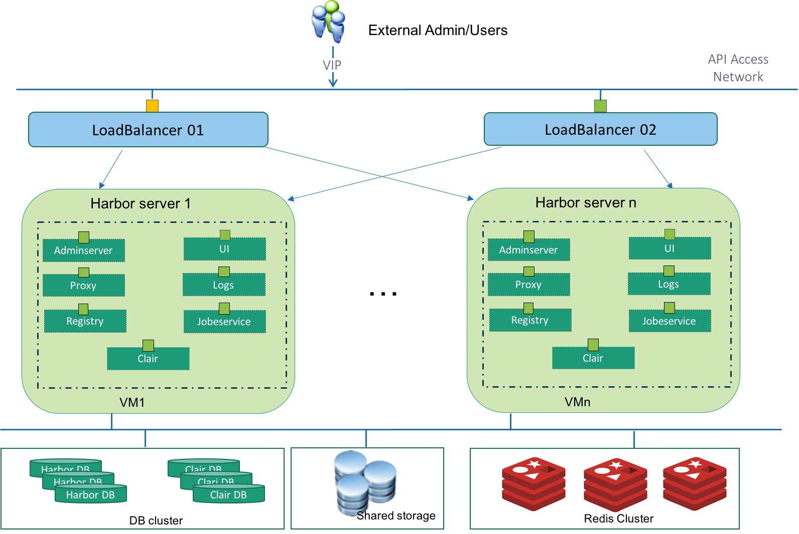
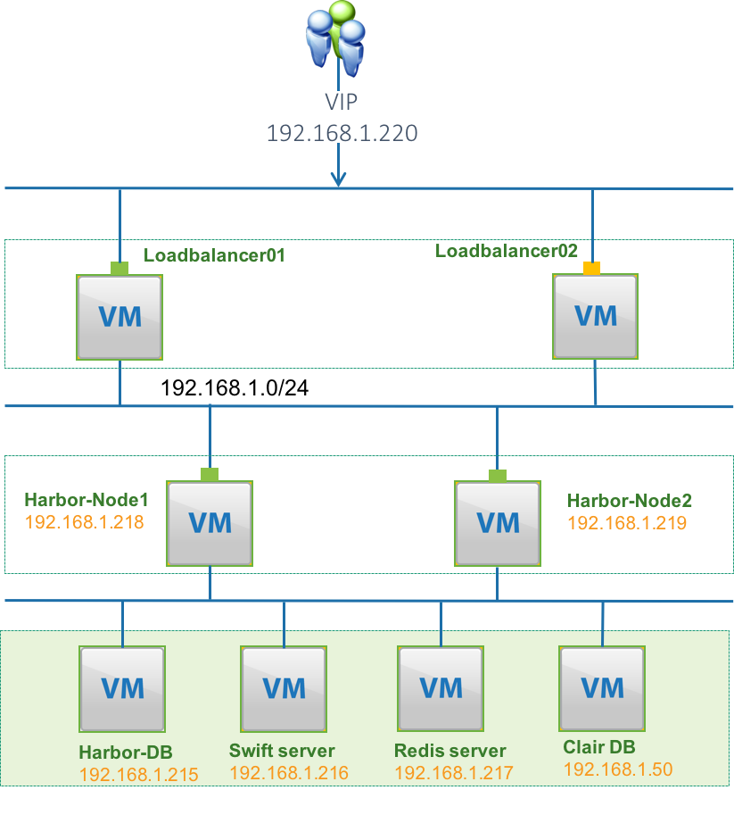

{}

本文档翻译至Harbor官方文档[Harbor High Availability Guide](https://github.com/goharbor/harbor/blob/master/docs/high_availability_installation_guide.md)。介绍如何安装和配置Harbour以实现高可用性,它补充了[单节点镜像仓库安装](/rancher/v2.x/cn/install-prepare/registry/single-node-installation/)。

**重要** 本文档基于Harbor1.5.0版本，它不适用于1.4.0之前的版本。本指南仅供参考。

{}
{}

本文档介绍了实现高可用系统的一些常用方法，重点是核心Harbor服务和与Harbor密切配合的其他开源服务。您需要解决在运行的Harbor环境中，所有应用程序软件的高可用性问题。重要的是确保您的服务冗余且可用。

## 1、无状态服务

要使无状态服务具有高可用性，您需要提供实例冗余并对其进行负载平衡。无状态的Harbor服务包括：

- AdminServer中
- UI
- Registry
- Logs
- Jobservice
- Clair
- Proxy

## 2、有状态的服务

有状态服务更难管理,提供额外的实例和负载平衡并不能解决问题。有状态的Harbor服务包括以下服务：

- Harbor database(MariaDB)
- Clair database(PostgresSQL)
- Notary database(MariaDB)
- Redis

{}
{}

同样，这种架构仅供建议。



如上图所示，架构中涉及的组件包括：

**VIP**：[虚拟IP](https://en.wikipedia.org/wiki/Virtual_IP_address)，Harbour用户将通过此虚拟IP地址访问Harbor。此`VIP`地址仅在一个负载均衡器节点上激活。如果活动负载均衡器节点关闭，它将自动切换到另一个节点。

**LoadBalancer 01和02**：它们一起组成一个组，避免负载均衡器节点的单点故障。[Keepalived](https://github.com/goharbor/harbor/blob/master/docs/www.keepalived.org)安装在两个负载均衡器节点上。两个Keepalived实例将组成一个VRRP组来提供VIP，并确保同一时间`VIP`仅在一个节点上被配置。Keepalived中的LVS组件负责根据路由算法平衡不同Harbor服务器之间的请求。

**Harbor服务器1..n**：这些是正在运行的Harbor实例。它们处于主动-主动模式。用户可以根据工作量设置多个节点。

**Harbor数据库集群**：Harbor使用MariaDB存储用户身份验证信息，镜像元数据信息等。用户应遵循其最佳实践，使其受到HA保护。

**Clair数据库集群**：Clair使用PostgreSQL存储扫描镜像使用的漏洞数据。用户应遵循最佳做法，使其受到HA保护

**共享存储**：共享存储用于存储Harbor使用的Docker卷。用户推送的镜像实际存储在此共享存储中。共享存储可确保多个Harbor实例具有一致的存储后端。共享存储可以是Swift，NFS，S3，azure，GCS Ceph或OSS。用户应遵循其最佳实践，使其受到HA保护。

**Redis**：拥有Redis的目的是存储UI会话数据并存储Registry元数据缓存。当一个Harbor实例失败或负载均衡器将用户请求路由到另一个Harbor实例时，保证任意Harbor实例都可以通过Redis以检索会话信息以确保最终用户可以继续会话。用户应遵循Redis的最佳实践，使其受到HA保护。

从上面的高可用性架构中，可以看到我们没有为每个无状态服务设置LB。相反，我们将这些无状态服务分组。每个服务之间的通信受基于主机的docker网络的隔离保护。

**注意** 由于组件通过rest API相互通信。您始终可以根据使用方案定义组粒度。

- 局限性

    目前Harbour在HA方案中不支持Notary。这意味着此HA设置不支持内容信任功能。

{}
{}

按照本节中的设置说明，我们可以构建Harbor高可用性部署，如下图所示。如果需要，您可以设置更多Harbor节点。

  

## 1、先决条件

- 1> MariaDB集群(Harbor-DB，192.168.1.215，目前Harbour使用MariaDB 10.2.10)
- 2> 共享存储(Swift服务器.192.168.1.216)
- 3> Redis集群(192.168.1.217)
- 4> PostgreSQL(Clair DB 192.168.1.50)
- 5> 2个VM用于负载平衡器集群。
- 6> n用于Harbor无状态服务的VM(n> = 2)，在此示例中，我们将设置2个Harbor节点。
- 7> n+1个静态IP(1个用于VIP，其他n个IP将由Harbor无状态服务器使用)

**重要** 项目1,2,3,4是Harbor的有状态组件。在配置Harbor HA之前，我们假设这些组件存在且所有组件都受HA保护。否则，任何这些组件都可能是单点故障。

共享存储是可替换的，您可以选择其他共享存储，只需确保您使用的存储由Registry(https://docs.docker.com/registry/storage-drivers)支持

PostgreSQL是可选的，它只在您使用漏洞扫描功能时才需要，目前使用PostgreSQL 9.6.5

**提示**: 如果您只是为了POC而设置HA。您可以使用docker在一个操作系统中使用以下命令快速运行MariaDB，Redis和PostgreSQL。

```bash
docker run --name redis-server -p 6379:6379 -d redis
docker run -d --restart=always -e MYSQL_ROOT_PASSWORD=root123 -v /data/database:/var/lib/mysql:z -p 3306:3306 --name mariadb vmware/mariadb-photon:10.2.10
docker run -d -e POSTGRES_PASSWORD="password" -p 5432:5432 postgres:9.6
```

## 2、加载Harbor数据库结构

将Harbor数据库结构导入外部MariaDB

- 登录到安装了MariaDB客户端的计算机

- 将[Harbor DB Schema](https://github.com/vmware/harbor/blob/release-1.5.0/make/photon/db/registry.sql)保存到`registry.sql`

- 导入数据表结构

```bash
mysql -u `your_db_username` -p -h `your_db_ip` < registry.sql
```

## 3、负载平衡器设置

由于所有Harbor节点都处于活动状态。将需要一个loadbancer来有效地在Harbor节点之间分配传入请求。您可以方便地选择硬件负载均衡器或软件负载均衡器。

在这里，我们将使用Ubuntu16.04 + Keepalived来构建软件负载均衡器。

### 在Loadbalancer01

1. 安装Keepalived和curl应用程序，Curl将用于keepalived check脚本。

    ```bash
    apt-get install keepalived curl
    ```

2. 配置Keepalived

    将[Keepalived配置文件](https://github.com/vmware/harbor/blob/release-1.5.0/make/ha/sample/active_active/keepalived_active_active.conf)保存到`/etc/keepalived/keepalived.conf`

    **重要**:

    - 您需要将**<change_to_VIP_address>**更改为您的VIP地址(有两个地方)；

    - 将**harbor_node1_IP**(两个地方)和**harbour_node2_IP**(两个地方)更改为真实Harbor节点IP；

    - 如果您有两个以上的节点，请在keepalived.conf中添加更多`real_server`定义；

3. 配置运行状况检查

    将服务器[运行状况检查](https://github.com/vmware/harbor/blob/release-1.5.0/make/ha/sample/active_active/check.sh)脚本保存到`/usr/local/bin/check.sh`

    运行以下命令以添加执行权限。

    `chmod +x /usr/local/bin/check.sh`

4. 启用ip forward

    ```bash
    add the follow two lines to /etc/sysctl.conf
    net.ipv4.ip_forward = 1
    net.ipv4.ip_nonlocal_bind = 1
    Run the follow command to apply the change.
    sysctl -p
    ```

5. 重新启动Keepalived服务。

    ```bash
    systemctl restart keepalived
    ```

### 在Loadbalancer02上：

按照与`Loadbalancer01`列表相同的步骤1到5，仅`priority`在步骤2中将`/etc/keepalived/keepalived.conf`中的更改为20.更高的数字将获得VIP地址。

## 4、Harbor节点1设置

1. 从[GitHub](https://github.com/vmware/harbor/releases)下载Harbor离线包到您的主目录

2. 解压缩harbour-offline-installer-vxxxtgz您将在当前目录中获得一个`harbor`文件夹

3. cd到`harbor`目录

4. 修改`harbor.cfg`配置主机名

    ```bash
    hostname = reg.mydomain.com
    ```

    将reg.mydomain.com更改为您的FQDN或VIP(例如192.168.1.220)

5. 修改`harbor.cfg`配置Harbor数据库连接

    在`Harbor.cfg` 更改Harbor数据库连接信息

    ```bash
    #The address of the Harbor database. Only need to change when using external db.
    db_host = 192.168.1.215 
    #The password for the root user of Harbor database. Change this before any production use.
    db_password = root123
    #The port of Harbor database host
    db_port = 3306
    #The user name of Harbor database
    db_user = root
    ```

6. 修改`harbor.cfg`配置Redis服务器/集群地址

    ```bash
    #The redis server address
    redis_url = 192.168.1.217:6379
    ```

7. 修改`harbor.cfg`配置Clair DB连接信息

    ```bash
    clair_db_host = 192.168.1.50
    clair_db_password = password
    clair_db_port = 5432
    clair_db_username = postgres
    clair_db = postgres
    ```

8. 修改`harbor.cfg`配置存储配置信息

    ```bash
    ### Docker Registry setting ###
    #registry_storage_provider can be: filesystem, s3, gcs, azure, etc.
    registry_storage_provider_name = filesystem
    #registry_storage_provider_config is a comma separated "key: value" pairs, e.g. "key1: value, key2: value2".
    #Refer to https://docs.docker.com/registry/configuration/#storage for all available configuration.
    registry_storage_provider_config =
    ```

    您可以在[https://docs.docker.com/registry/configuration/#storage中](https://docs.docker.com/registry/configuration/#storage)找到各种存储的配置示例。

    例如，如果您使用swift作为存储后端，则需要设置以下内容：

    ```bash
    registry_storage_provider_name = swift
    registry_storage_provider_config = username: yourusername,password: yourpass,authurl: http://192.168.1.217/identity/v3,tenant: admin,domain: default,region: RegionOne,container: docker_images
    ```

    **重要**:

    如果设置`filesystem`为`registry_storage_provider_name`必须确保Registry目录`/data/registry`安装到NFS，Ceph等共享存储。您需要首先创建/ data / registry目录并将其所有者更改为10000：10000，因为Registry将以userID 10000运行和groupID 10000。

9. 如果启用https(可选)，则需要准备证书和密钥并将其复制到`/data/cert/`目录(如果该文件夹不存在，则需要创建该文件夹)。

    ```bash
    mkdir -p /data/cert
    cp server.crt /data/cert/
    cp server.key /data/cert/
    mkdir /data/ca_download
    cp ca.crt /data/ca_download/
    ```

    如果要为证书配置自己的文件名，则需要修改harbor.cfg中的ssl_cert和ssl_cert_key属性。如果您使用由私有CA签名的证书，则需要将您的CA文件放入`/data/ca_download/ca.crt`

10. 在第一个节点上启动Harbour

    ```bash
    ./install.sh --ha
    ```

    **注意**

    如果要使用漏洞扫描功能。然后使用follow命令

    ```bash
    ./install.sh --ha --with-clair
    ```

11. 更改iptables

    **重要**

    在执行以下命令之前，您需要将192.168.1.220更改为您的VIP地址。如果您只使用http，那么您不需要运行第二个命令。

    ```bash
    iptables -t nat -A PREROUTING -p tcp -d 192.168.1.220 --dport 80 -j REDIRECT
    iptables -t nat -A PREROUTING -p tcp -d 192.168.1.220 --dport 443 -j REDIRECT
    ```

12. 压缩Harbor目录

    ```bash
     tar -cvf harbor_ha.tar ~/harbor
    ```

13. 将harbor_ha.tar复制到harbor_node2

## 5、Harbor节点2 ... n设置

1. 将tar文件放在主目录中

    将harbor_ha.tar文件移动到harbor_node2上的主目录

2. 解压缩文件

    ```bash
    tar -xvf harbor_ha.tar
    ```

    您将在主目录中获得“harbour”文件夹。

3. 可选)创建证书文件夹

    只有启用https for Harbor时才需要执行此步骤。

    这些文件夹将用于存储证书文件。

    ```bash
    mkdir -p /data/cert
    mkdir -p /data/ca_download
    ```

4. 安装Harbor

    ```bash
    cd harbor  
    ./install.sh --ha  
    ```

    **注意**

    如果启用漏洞扫描，请使用

    ```bash
     ./install.sh --ha --with-clair
    ```

5. 更改iptables

    **重要**

    在执行以下命令之前，您需要将192.168.1.220更改为您的VIP地址，如果您只使用http for Harbor，则无需运行第二个命令。

    ```bash
    iptables -t nat -A PREROUTING -p tcp -d 192.168.1.220 --dport 80 -j REDIRECT
    iptables -t nat -A PREROUTING -p tcp -d 192.168.1.220 --dport 443 -j REDIRECT
    ```

    如果要设置更多Harbor节点，请重复步骤1到4. Keepalived配置还需要在两个loadbalancer服务器中更新。

    现在您可以通过http(s)://VIP访问Harbor

{}
{}

1、Job日志应保存到集中的位置: <https://github.com/vmware/harbor/issues/3919>

解决方法：

- 对于所有Harbor服务器，将/data/job_logs目录安装到NFS服务器上的文件夹中;
- 确保NFS服务器上的文件夹具有UID的读/写权限：GroupID 10000:10000;
- `docker restart harbor-jobservice` 在所有Harbor服务器上重新启动jobservices容器;

2、在HA环境中无法正确停止正在运行的作业:<https://github.com/vmware/harbor/issues/4012>

在Harbor 1.4中，我们支持停止正在运行的Jobs。但在高可用性方案中，您可能无法停止作业。目前，作业状态存储在内存中而不是磁盘存储中。请求可能无法安排到执行作业的节点。我们将计划重构jobservices模型，并在下一版本中解决此问题。

{}
