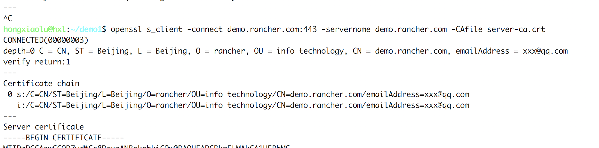

## 一、HTTP over SSL

要保证Web浏览器到服务器的安全连接，HTTPS几乎是唯一选择。HTTPS其实就是HTTP over SSL，也就是让HTTP连接建立在SSL安全连接之上。

SSL使用证书来创建安全连接。有两种验证模式:

1. 仅客户端验证服务器的证书，客户端自己不提供证书；

1. 客户端和服务器都互相验证对方的证书。

一般第二种方式用于网上银行等安全性要求较高的网站，普通的Web网站只采用第一种方式。

- 客户端如何验证服务器的证书呢？

服务器自己的证书必须经过某“权威”证书的签名，而这个“权威”证书又可能经过更权威的证书签名，这么一级一级追溯上去，最顶层那个最权威的证书就称为根证书。根证书直接内置在浏览器中，这样，浏览器就可以利用自己自带的根证书去验证某个服务器的证书是否有效。如果要提供一个有效的证书，服务器的证书必须从`VeriSign`这样的证书颁发机构签名。这样，浏览器就可以验证通过，否则，浏览器给出一个证书无效的警告。一般安全要求较高的内网环境，可以通过创建自签名SSL证书来加密通信。

## 二、数字证书(Certificate)

在HTTPS的传输过程中，有一个非常关键的角色--`数字证书`，那什么是数字证书？又有什么作用呢？

所谓数字证书，是一种用于电脑的身份识别机制。由数字证书颁发机构(CA)对使用私钥创建的签名请求文件做的签名(盖章)，表示CA结构对证书持有者的认可。

### 数字证书拥有以下几个优点:

- 使用数字证书能够提高用户的可信度；
- 数字证书中的公钥，能够与服务端的私钥配对使用，实现数据传输过程中的加密和解密；
- 在证认使用者身份期间，使用者的敏感个人数据并不会被传输至证书持有者的网络系统上；

### 证书类型

x509的证书编码格式有两种:

1. PEM(Privacy-enhanced Electronic Mail)是明文格式的,以 -----BEGIN CERTIFICATE-----开头，已-----END CERTIFICATE-----结尾。中间是经过base64编码的内容,apache需要的证书就是这类编码的证书.查看这类证书的信息的命令为: `openssl x509 -noout -text -in server.pem`。其实PEM就是把DER的内容进行了一次base64编码

2. DER是二进制格式的证书，查看这类证书的信息的命令为: `openssl x509 -noout -text -inform der -in server.der`

### 扩展名

- .crt证书文件,可以是DER(二进制)编码的，也可以是PEM(ASCII (Base64))编码的),在类unix系统中比较常见;
- .cer也是证书，常见于Windows系统。编码类型同样可以是DER或者PEM的，windows下有工具可以转换crt到cer；
- .csr证书签名请求文件，一般是生成请求以后发送给CA，然后CA会给你签名并发回证书
- .key一般公钥或者密钥都会用这种扩展名，可以是DER编码的或者是PEM编码的。查看DER编码的(公钥或者密钥)的文件的命令为: `openssl rsa -inform DER  -noout -text -in  xxx.key`。查看PEM编码的(公钥或者密钥)的文件的命令为: `openssl rsa -inform PEM   -noout -text -in  xxx.key`;
- .p12证书文件,包含一个X509证书和一个被密码保护的私钥;

## 三、自签名证书及自签名类型

当由于某种原因(如:不想通过CA购买证书，或者仅是用于测试等情况)，无法正常获取CA签发的证书。这时可以生成一个自签名证书。使用这个自签名证书的时候，会在客户端浏览器报一个错误，签名证书授权未知或不可信(signing certificate authority is unknown and not trusted.)。

### 自签名类型

- 自签名证书
- 私有CA签名证书

  >自签名证书的`Issuer`和`Subject`是相同的。

- 区别:

    自签名的证书无法被吊销，私有CA签名的证书可以被吊销。

    如果你的规划需要创建多个证书，那么使用私有CA签名的方法比较合适，因为只要给所有的客户端都安装相同的CA证书，那么以该CA证书签名过的证书，客户端都是信任的，也就只需要安装一次就够了。

    如果你使用用自签名证书，你需要给所有的客户端安装该证书才会被信任。如果你需要第二个证书，则需要给所有客户端安装第二个CA证书才会被信任。

## 四、生成自签名证书

### 1、一键生成ssl自签名证书脚本

```bash
#!/bin/bash -e

CMDOPTS="$*"
for OPTS in $CMDOPTS;
do
    key=$(echo ${OPTS} | awk -F"=" '{print $1}' )
    value=$(echo ${OPTS} | awk -F"=" '{print $2}' )
    case "$key" in
        --domain) CN=$value ;;
        --trusted-ip) SSL_IP=$value ;;
        --trusted-domain) SSL_DNS=$value ;;
        --ssl-size) SSL_SIZE=$value ;;
        --ssl-date) SSL_DATE=$value ;;
        --ca-date) CA_DATE=$value ;;
    esac
done

# 国家名(2个字母的代号)
C=CN

# 配置文件
SSL_CONFIG='openssl.cnf'

echo "----------------------------"
echo "| 生成 SSL Cert |"
echo "----------------------------"
echo

export CN=${CN:-localhost}

export CA_KEY=${CA_KEY-"cakey.pem"}
export CA_CERT=${CA_CERT-"cacerts.pem"}
export CA_SUBJECT=ca-$CN
export CA_EXPIRE=${CA_DATE:-3650}

export SSL_CONFIG=${SSL_CONFIG}
export SSL_KEY=$CN.key
export SSL_CSR=$CN.csr
export SSL_CERT=$CN.crt
export SSL_EXPIRE=${SSL_DATE}

export SSL_SUBJECT=${CN}
export SSL_DNS=${SSL_DNS}
export SSL_IP=${SSL_IP}

export SSL_SIZE=${SSL_SIZE:-2048}

# 证书有效期
export SSL_DATE=${SSL_DATE:-3650}

echo "--> 生成自签名ssl证书"

if [[ -e ./${CA_KEY} ]]; then
    echo "====> 备份"${CA_KEY}"为"${CA_KEY}"-bak" \
    && mv ${CA_KEY} "${CA_KEY}"-bak \
    && openssl genrsa -out ${CA_KEY} ${SSL_SIZE} > /dev/null
else
    echo "====> 生成新的CA私钥 ${CA_KEY}"
    openssl genrsa -out ${CA_KEY} ${SSL_SIZE} > /dev/null
fi

if [[ -e ./${CA_CERT} ]]; then
    echo "====> 备份"${CA_CERT}"为"${CA_CERT}"-bak" \
    && mv ${CA_CERT} "${CA_CERT}"-bak \
    && openssl req -x509 -sha256 -new -nodes -key ${CA_KEY} -days ${CA_EXPIRE} \
    -out ${CA_CERT} -subj "/CN=${CA_SUBJECT}" > /dev/null || exit 1
else
    echo "====> 生成新的CA证书 ${CA_CERT}"
    openssl req -x509 -sha256 -new -nodes -key ${CA_KEY} \
    -days ${CA_EXPIRE} -out ${CA_CERT} -subj "/CN=${CA_SUBJECT}" > /dev/null || exit 1
fi

echo "====> 生成新的配置文件 ${SSL_CONFIG}"
cat > ${SSL_CONFIG} <<EOM
[req]
req_extensions = v3_req
distinguished_name = req_distinguished_name
[req_distinguished_name]
[ v3_req ]
basicConstraints = CA:FALSE
keyUsage = nonRepudiation, digitalSignature, keyEncipherment
extendedKeyUsage = clientAuth, serverAuth
EOM

if [[ -n ${SSL_DNS} || -n ${SSL_IP} ]]; then
    cat >> ${SSL_CONFIG} <<EOM
subjectAltName = @alt_names
[alt_names]
EOM
    IFS=","
    dns=(${SSL_DNS})
    dns+=(${SSL_SUBJECT})
    for i in "${!dns[@]}"; do
      echo DNS.$((i+1)) = ${dns[$i]} >> ${SSL_CONFIG}
    done

    if [[ -n ${SSL_IP} ]]; then
        ip=(${SSL_IP})
        for i in "${!ip[@]}"; do
          echo IP.$((i+1)) = ${ip[$i]} >> ${SSL_CONFIG}
        done
    fi
fi

echo "====> 生成新的SSL KEY ${SSL_KEY}"
openssl genrsa -out ${SSL_KEY} ${SSL_SIZE} > /dev/null || exit 1

echo "====> 生成新的SSL CSR ${SSL_CSR}"
openssl req -sha256 -new -key ${SSL_KEY} -out ${SSL_CSR} \
    -subj "/CN=${SSL_SUBJECT}" -config ${SSL_CONFIG} > /dev/null || exit 1

echo "====> 生成新的SSL CERT ${SSL_CERT}"
openssl x509 -sha256 -req -in ${SSL_CSR} -CA ${CA_CERT} \
    -CAkey ${CA_KEY} -CAcreateserial -out ${SSL_CERT} \
    -days ${SSL_EXPIRE} -extensions v3_req \
    -extfile ${SSL_CONFIG} > /dev/null || exit 1

echo "====> 证书制作完成"
echo
echo "====> 以YAML格式输出结果"
echo "---"
echo "ca_key: |"
cat $CA_KEY | sed 's/^/  /'
echo
echo "ca_cert: |"
cat $CA_CERT | sed 's/^/  /'
echo
echo "ssl_key: |"
cat $SSL_KEY | sed 's/^/  /'
echo
echo "ssl_csr: |"
cat $SSL_CSR | sed 's/^/  /'
echo
echo "ssl_cert: |"
cat $SSL_CERT | sed 's/^/  /'
echo

echo "====> 附加CA证书到Cert文件中"
cat ${CA_CERT} >> ${SSL_CERT}
echo "ssl_cert: |"
cat $SSL_CERT | sed 's/^/  /'
echo

echo "4. 重命名服务证书"
echo "cp ${CN}.key tls.key"
cp ${CN}.key tls.key
echo "cp ${CN}.crt tls.crt"
cp ${CN}.crt tls.crt
```

### 2、脚本说明

- 复制以上代码另存为`create_self-signed-cert.sh`或者其他您喜欢的文件名。
- 脚本参数

```bash
--domain: 生成ssl证书需要的主域名，如不指定则默认为localhost，如果是ip访问服务，则可忽略；
--trusted-ip: 一般ssl证书只信任域名的访问请求，有时候需要使用ip去访问server，那么需要给ssl证书添加扩展IP，多个IP用逗号隔开；
--trusted-domain: 如果想多个域名访问，则添加扩展域名（SSL_DNS）,多个SSL_DNS用逗号隔开；
--ssl-size: ssl加密位数，默认2048；
--ssl-date: ssl有效期，默认10年；
--ca-date: ca有效期，默认10年；
使用示例:
./create_self-signed-cert.sh --domain=www.test.com \
--trusted-ip=1.1.1.1,2.2.2.2,3.3.3.3 --ssl-size=2048 --ssl-date=3650
```

## 五、验证证书

>注意: 因为使用的是自签名证书，浏览器会提示证书的颁发机构是未知的。

把生成的ca证书和去除密码的私钥文件部署到web服务器后，执行以下命令验证:

- 通过openssl本地校验

    `openssl  verify -CAfile cacerts.pem tls.crt` 应该返回状态为 `ok`

    

    `openssl x509 -in  tls.crt -noout -text`执行后查看对应的域名和扩展iP是否正确

    

- 不加CA证书验证

    ```bash
    openssl s_client -connect demo.rancher.com:443 -servername demo.rancher.com
    ```

    ![image-20180805213034249] (_index.assets/image-20180805213034249.png)

- 添加CA证书验证

    ```bash
    openssl s_client -connect demo.rancher.com:443 -servername demo.rancher.com -CAfile server-ca.crt
    ```

    
