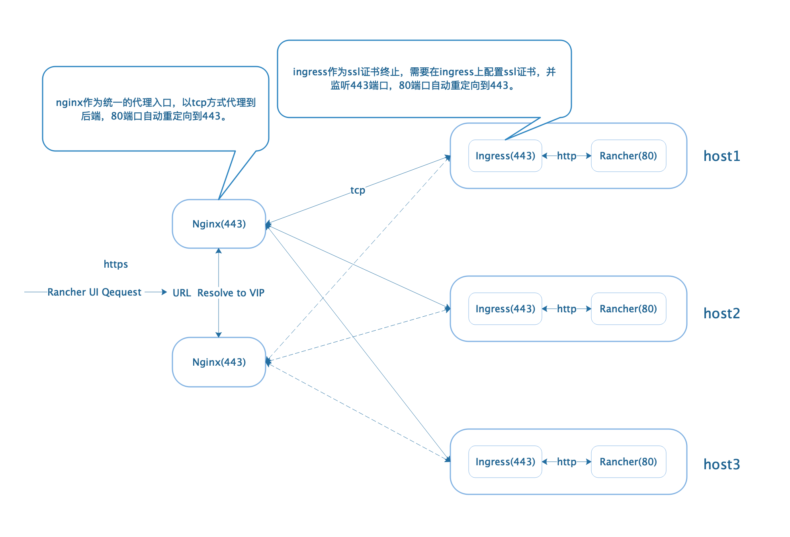
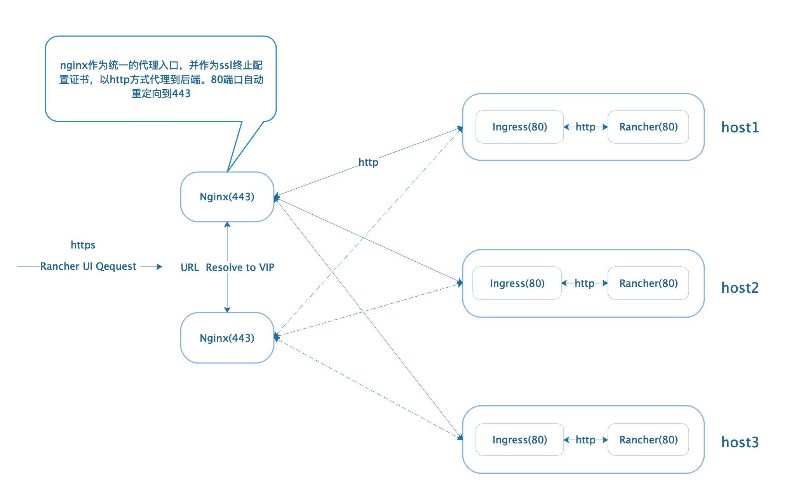
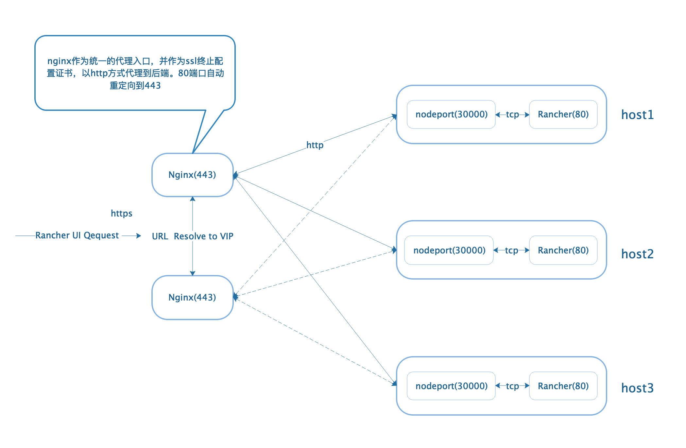

本章节包含在开发和生产环境中安装Rancher的配置说明。该部分还包含配置负载均衡和SSL证书以配合Rancher使用的补充文档。

## 四层代理与七层代理的区别

| OSI中的层     | 功能                                     | TCP/IP协议族                                                 |
| ------------ | ---------------------------------------- | ------------------------------------------------------------ |
| 应用层        | 文件传输，电子邮件，文件服务，虚拟终端   | 例如：TFTP、HTTP、HTTPS、SNMP、FTP、SMTP、DNS、RIP、Telnet、SIP、SSH、NFS、RTSP、XMPP、Whois、ENRP               |
| 表示层        | 数据格式化，代码转换，数据加密           | 例如：ASCII、ASN.1、JPEG、MPEG                                     |
| 会话层        | 解除或建立与别的接点的联系               | 例如：ASAP、TLS、SSH、ISO 8327 / CCITT X.225、RPC、NetBIOS、ASP、Winsock、BSD sockets                 |
| 传输层        | 位**数据段**提供端对端的接口             | 例如：TCP，UDP，SPX                                                |
| 网络层        | 为**数据包**选择路由，拥塞控制、网际互连 | 例如：IP，ICMP，OSPF，BGP，IGMP，ARP，RARP，IPX、RIP、OSPF         |
| 数据链路层     | 传输有地址的**帧**以及错误检测功能       | 例如：SLIP，CSLIP，PPP，MTU，ARP，RARP，SDLC、HDLC、PPP、STP、帧中继 |
| 物理层        | 以**二进制**数据形式在物理媒体上传输数据 | 例如：ISO2110，IEEE802，IEEE802.2，EIA/TIA RS-232、EIA/TIA RS-449、V.35、RJ-45 |

如图，平时我们说的4层和7层其实就是OSI网络模型中的第四层和第七层。4层代理中主要是TCP协议代理，TCP代理主要基于IP+端口来通信。7层代理中主要是http协议, http协议主要基于URL来通信。

## Rancher HA部署架构

安装Rancher HA有多种部署架构、多种中间件可以选择，可根据自己熟悉的应用和熟悉的架构进行选择。以下有三种常用方案可供参考：

>全局的负载均衡器有多种选择，可以用软件负载均衡器(nginx\haproxy等)、硬件负载均衡器(F5等)，只要可以支持四层TCP或者七层http代理就可以，这里以Nginx为例。

### 方案一、全局Nginx(tcp)-Ingress(http)-Rancher

本方案中，所有的流量都通过外部负载均衡转发到后端ingress服务上。因为外部负载均衡为四层TCP模式，无法设置域名转发，所以需要把域名转发的功能设置在后端的ingress服务上，让。ingress作为ssl终止后，ingress到后端的Rancher server将采用非加密的http模式。此方案中，`Rancher server`无法与外部直接通信，需通过ingress代理进入。因为ingress采用了ssl加密，所以此部署架构的安全性相对较高。但多次转发也将会导致网络性能减弱。

### 方案二、全局Nginx(http)-Ingress(http)-Rancher

### 方案三、全局Nginx(http)-Rancher(nodeport)

