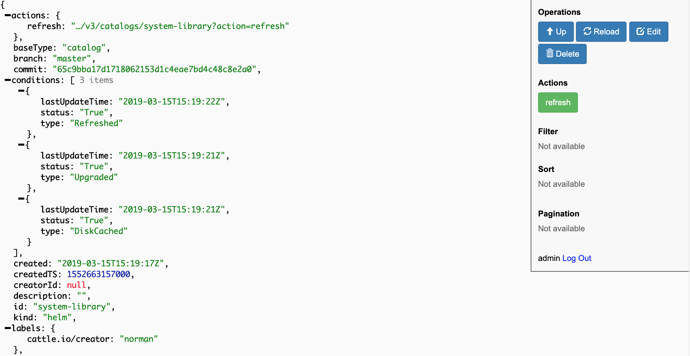
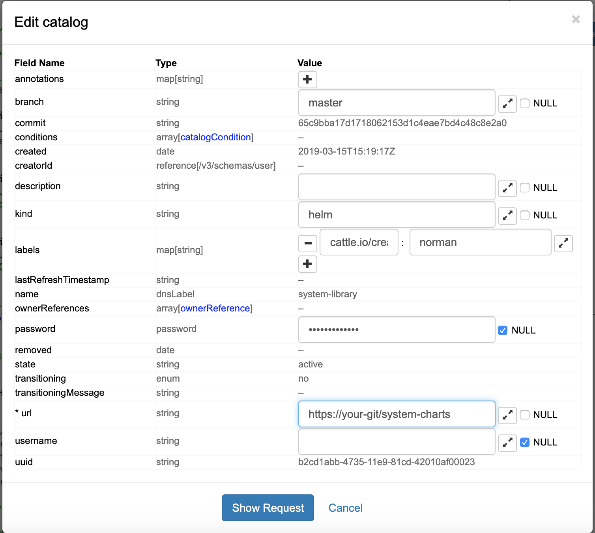

## 一、准备系统chart

该[系统chart](https://github.com/rancher/system-charts)库包含的所有功能，如moniotring，logging，报警和全局DNS等。为了能够在离线安装中使用这些功能，您需要将`system-charts`代码同步到内部git代码库中，以便Rancher可以访问。

## 二、配置系统chart

1. 登录Rancher
2. 浏览器访问`https://<your-rancher-server>/v3/catalogs/system-library`

3. 单击右上角的“ **编辑”**，将**url**的值更新为内部Git代码库`system-charts`的地址。

4. **点击Show Request**
5. **点击Send Request**