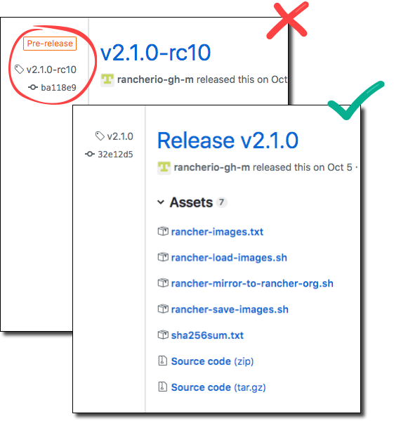

## 一、私有仓库安装

参考:  [私有镜像仓库](/rancher/v2.x/cn/install-prepare/registry/)

## 二、准备相应文件

使用可以访问Internet的计算机，访问我们的版本[发布页面](https://github.com/rancher/rancher/releases)，找到需要安装的`Rancher 2.xx`版本。不要下载的版本标示`rc`或者`Pre-release`，因为它们不适用于稳定的生产环境。



从发行版的**Assets**部分，下载以下三个文件，这些文件是在离线环境中安装Rancher所必需的：

| 文件                 | 描述                                                         |
| :----------------------- | :----------------------------------------------------------- |
| `rancher-images.txt`     | 此文件包含安装Rancher所需的所有镜像的列表。                  |
| `rancher-save-images.sh` | 此脚本`rancher-images.txt`从Docker Hub中下载所有镜像并将所有镜像保存为`rancher-images.tar.gz`。 |
| `rancher-load-images.sh` | 此脚本从`rancher-images.tar.gz`文件加载镜像，并将其推送到您的私有镜像仓库。 |

## 三、同步镜像

> **注意：**镜像同步需要接近20GB的空磁盘空间。

1. 在可用访问Internet的主机中，使用`rancher-save-images.sh`和 `rancher-images.txt`创建所有所需镜像的压缩包。

    ```bash
    ./rancher-save-images.sh --image-list ./rancher-images.txt
    ```

1. 复制`rancher-load-images.sh`、`rancher-images.txt`、`rancher-images.tar.gz`文件到可用访问私有镜像仓库的主机上。

   - 如果需要，请登入私有镜像仓库。

     ```bash
     docker login <REGISTRY.YOURDOMAIN.COM:PORT>
     ```

   - 使用`rancher-load-images.sh`加载`rancher-images.tar.gz`，并将镜像推送到私有仓库。

     ```bash
     ./rancher-load-images.sh --image-list ./rancher-images.txt \
     --registry <REGISTRY.YOURDOMAIN.COM:PORT>
     ```