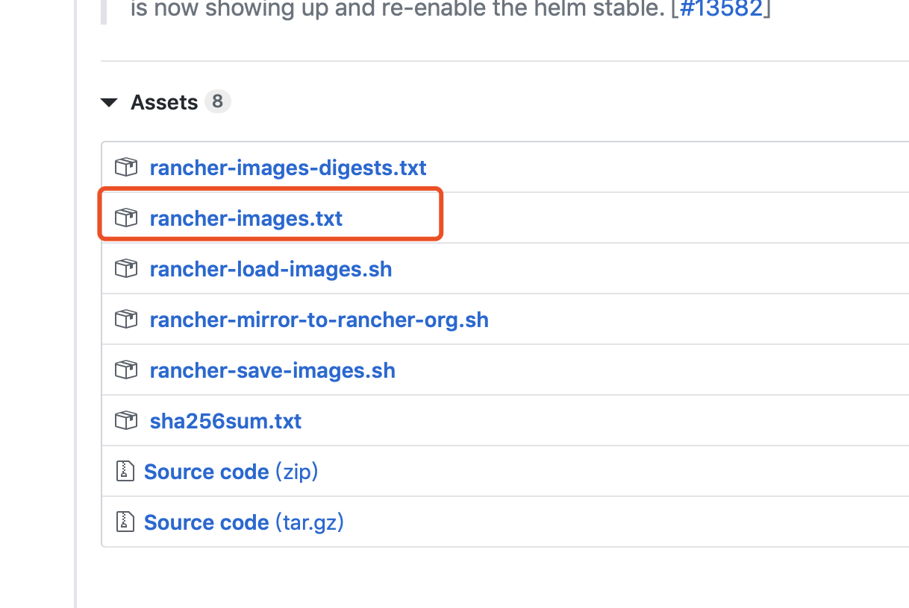
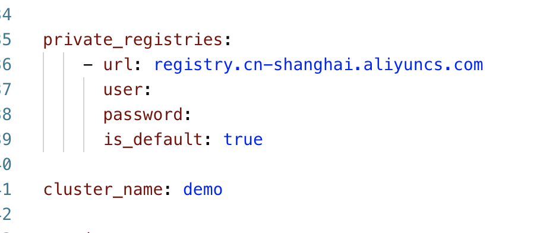
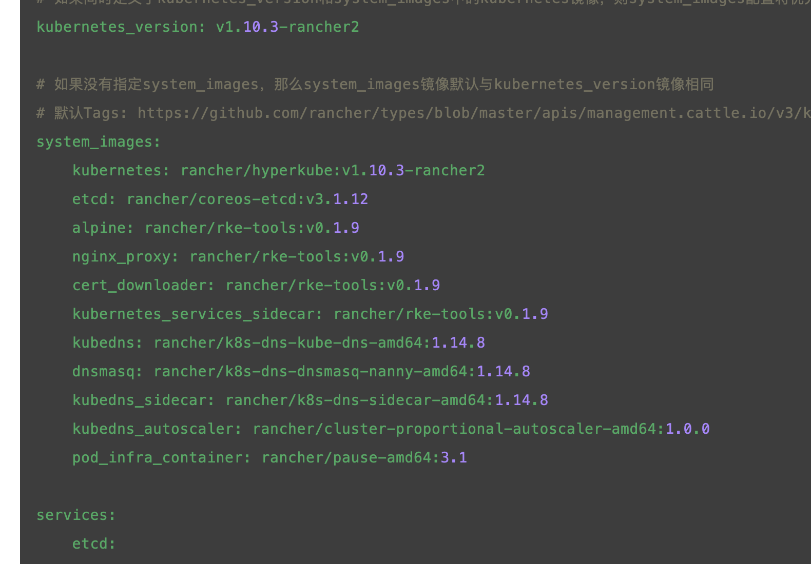
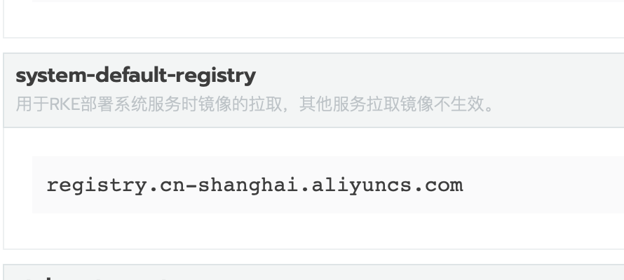
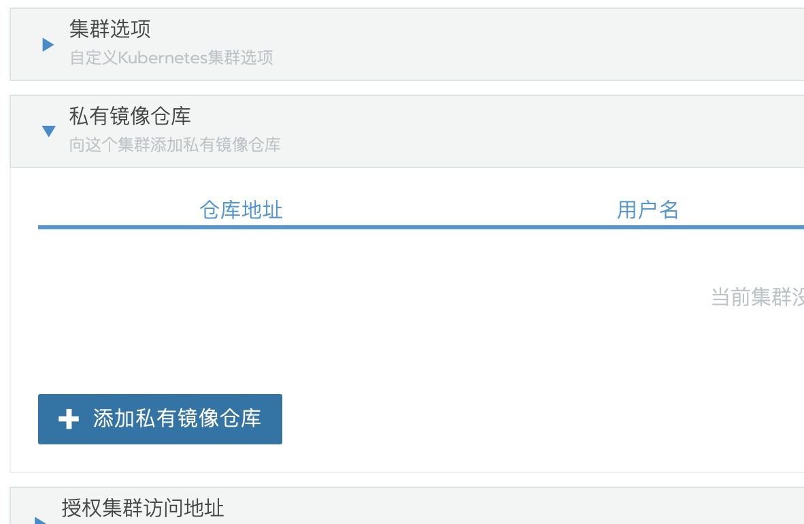

> 中国区镜像目前属于测试阶段

Rancher 统一的基础镜像均设置为UTC时区，为了解决时差的问题，中国区单独维护了一套基础镜像。

修改时区为`Asia/Shanghai`，并安装了常用的基础命令工具。

镜像地址: `registry.cn-shanghai.aliyuncs.com`

当前维护了三个版本的镜像：`rancher v2.0.13、v2.1.5、v2.1.6、v2.1.7、v2.2.0、v2.2.1`, 可以点击查询每个版本对应的[镜像清单](images-list/)。其他版本的镜像清单可访问`https://github.com/rancher/rancher/releases/<version>`镜像查询。

## 镜像使用

- RKE安装kubernetes集群

如图，在rke配置文件中添加私有仓库的配置项，如果是私有项目，需要设置用户名和密码，如果是开放项目可以只设置url。配置好之后，rke构建集群时就会在原来的镜像前添加仓库地址，从而指定到阿里云仓库拉取镜像。

也有安装rke的使用方法，手动指定具体的镜像地址 `https://www.cnrancher.com/docs/rke/latest/cn/example-yamls/cluster/`

- Rancher UI自定义安装kubernetes集群

进入Rancher UI\全局\系统设置\system-default-registry，把这个默认仓库设置修改为`registry.cn-shanghai.aliyuncs.com`，这样在构建kubernetes集群时将默认从这个仓库拉取镜像。

> **注意** 这是个全局的参数设置，设置这个参数后以后创建任何集群都会从这个仓库拉取镜像。2.2 以后版本支持在构建集群的时候单独指定镜像仓库。
>
> 

> 