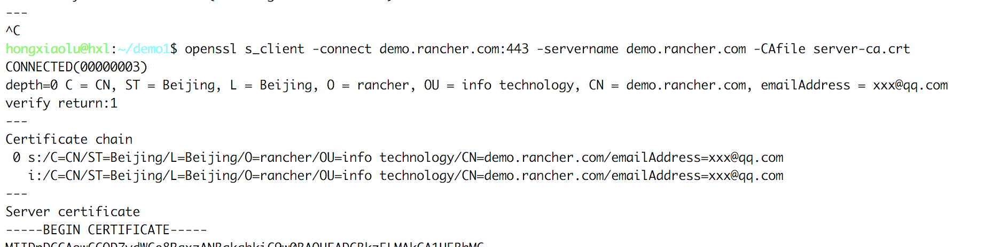

{}

要保证Web浏览器到服务器的安全连接，HTTPS几乎是唯一选择。HTTPS其实就是HTTP over SSL，也就是让HTTP连接建立在SSL安全连接之上。

SSL使用证书来创建安全连接。有两种验证模式:

1. 仅客户端验证服务器的证书，客户端自己不提供证书；

2. 客户端和服务器都互相验证对方的证书。

一般第二种方式用于网上银行等安全性要求较高的网站，普通的Web网站只采用第一种方式。

- 客户端如何验证服务器的证书呢？

    服务器自己的证书必须经过某“权威”证书的签名，而这个“权威”证书又可能经过更权威的证书签名，这么一级一级追溯上去，最顶层那个最权威的证书就称为根证书。根证书直接内置在浏览器中，这样，浏览器就可以利用自己自带的根证书去验证某个服务器的证书是否有效。如果要提供一个有效的证书，服务器的证书必须从`VeriSign`这样的证书颁发机构签名。这样，浏览器就可以验证通过，否则，浏览器给出一个证书无效的警告。一般安全要求较高的内网环境，可以通过创建自签名SSL证书来加密通信。

{}
{}

在HTTPS的传输过程中，有一个非常关键的角色--`数字证书`，那什么是数字证书？又有什么作用呢？

所谓数字证书，是一种用于电脑的身份识别机制。由数字证书颁发机构(CA)对使用私钥创建的签名请求文件做的签名(盖章)，表示CA结构对证书持有者的认可。

## 1、数字证书拥有以下几个优点:

- 使用数字证书能够提高用户的可信度；
- 数字证书中的公钥，能够与服务端的私钥配对使用，实现数据传输过程中的加密和解密；
- 在证认使用者身份期间，使用者的敏感个人数据并不会被传输至证书持有者的网络系统上；

## 2、证书类型

x509的证书编码格式有两种:

1. PEM(Privacy-enhanced Electronic Mail)是明文格式的,以 -----BEGIN CERTIFICATE-----开头，已-----END CERTIFICATE-----结尾。中间是经过base64编码的内容,apache需要的证书就是这类编码的证书.查看这类证书的信息的命令为: `openssl x509 -noout -text -in server.pem`。其实PEM就是把DER的内容进行了一次base64编码

2. DER是二进制格式的证书，查看这类证书的信息的命令为: `openssl x509 -noout -text -inform der -in server.der`

## 3、扩展名

- .crt证书文件,可以是DER(二进制)编码的，也可以是PEM(ASCII (Base64))编码的),在类unix系统中比较常见;
- .cer也是证书，常见于Windows系统。编码类型同样可以是DER或者PEM的，windows下有工具可以转换crt到cer；
- .csr证书签名请求文件，一般是生成请求以后发送给CA，然后CA会给你签名并发回证书
- .key一般公钥或者密钥都会用这种扩展名，可以是DER编码的或者是PEM编码的。查看DER编码的(公钥或者密钥)的文件的命令为: `openssl rsa -inform DER  -noout -text -in  xxx.key`。查看PEM编码的(公钥或者密钥)的文件的命令为: `openssl rsa -inform PEM   -noout -text -in  xxx.key`;
- .p12证书文件,包含一个X509证书和一个被密码保护的私钥;

{}
{}

当由于某种原因(如:不想通过CA购买证书，或者仅是用于测试等情况)，无法正常获取CA签发的证书。这时可以生成一个自签名证书。使用这个自签名证书的时候，会在客户端浏览器报一个错误，签名证书授权未知或不可信(signing certificate authority is unknown and not trusted.)。

## 1、自签名类型

- 自签名证书
- 私有CA签名证书

  >自签名证书的`Issuer`和`Subject`是相同的。

- 区别:

    自签名的证书无法被吊销，私有CA签名的证书可以被吊销。

    如果你的规划需要创建多个证书，那么使用私有CA签名的方法比较合适，因为只要给所有的客户端都安装相同的CA证书，那么以该CA证书签名过的证书，客户端都是信任的，也就只需要安装一次就够了。

    如果你使用用自签名证书，你需要给所有的客户端安装该证书才会被信任。如果你需要第二个证书，则需要给所有客户端安装第二个CA证书才会被信任。

{}
{}

下面简单介绍如何通过openssl创建一个自签名SSL证书。

操作步骤:

## 私有CA签名证书

- 1.创建root CA私钥

    ```bash
    openssl req \
    -newkey rsa:4096 -nodes -sha256 -keyout ca.key \
    -x509 -days 365 -out ca.crt
    ```

    ```bash
    Country Name(2 letter code)[AU]: CN
    State or Province Name(full name)[Some-State]: Beijing
    Locality Name(eg, city)[]: Beijing
    Organization Name(eg, company)[Internet Widgits Pty Ltd]: rancher
    Organizational Unit Name(eg, section)[]: info technology
    Common Name(e.g. server FQDN or YOUR name)[]: ca.rancher.com
    Email Address []: xxx@qq.com
    ```

- 2.为服务端(web)生成证书签名请求文件

    如果你使用类似`demo.rancher.com`的FQDN域名访问，则需要设置`demo.rancher.com`作为CN；如果你使用IP地址访问，CN则为IP地址：

    ```bash
    openssl req \
    -newkey rsa:4096 -nodes -sha256 -keyout demo.rancher.com.key \
    -out  demo.rancher.com.csr
    ```

    ```bash
    Country Name(2 letter code)[AU]: CN
    State or Province Name(full name)[Some-State]: Beijing
    Locality Name(eg, city)[]: Beijing
    Organization Name(eg, company)[Internet Widgits Pty Ltd]: rancher
    Organizational Unit Name(eg, section)[]: info technology
    Common Name(e.g. server FQDN or YOUR name)[]: demo.rancher.com
    Email Address []: xxx@qq.com
    ```
    >注意: `Commone Name`一定要是你要授予证书的FQDN域名或主机名，并且不能与生成root CA设置的`Commone Name`相同，challenge password可以不填。

- 3.用`第一步`创建的CA证书给`第二步`生成的签名请求进行签名

    ```bash
    openssl x509 -req -days 365 -in demo.rancher.com.csr -CA ca.crt -CAkey ca.key -CAcreateserial -out demo.rancher.com.crt
    ```
- 4.如果你使用IP，例如192.168.1.101来连接，则可以改为运行以下命令：

    ```bash
    echo 'subjectAltName = IP:192.168.1.101' > extfile.cnf
    openssl x509 -req -days 365 -in demo.rancher.com.csr -CA ca.crt -CAkey ca.key -CAcreateserial -extfile extfile.cnf -out  demo.rancher.com.crt
    ```
    > **注意** `subjectAltName`后的IP不需添加端口。

{}
{}

>注意: 因为使用的是自签名证书，浏览器会提示证书的颁发机构是未知的。

把生成的ca证书和去除密码的私钥文件部署到web服务器后，执行以下命令验证:

- 不加CA证书验证

    ```bash
    openssl s_client -connect demo.rancher.com:443 -servername demo.rancher.com
    ```
    ![image-20180805213034249] (_index.assets/image-20180805213034249.png)

- 添加CA证书验证

    ```bash
    openssl s_client -connect demo.rancher.com:443 -servername demo.rancher.com -CAfile server-ca.crt
    ```
    

{}