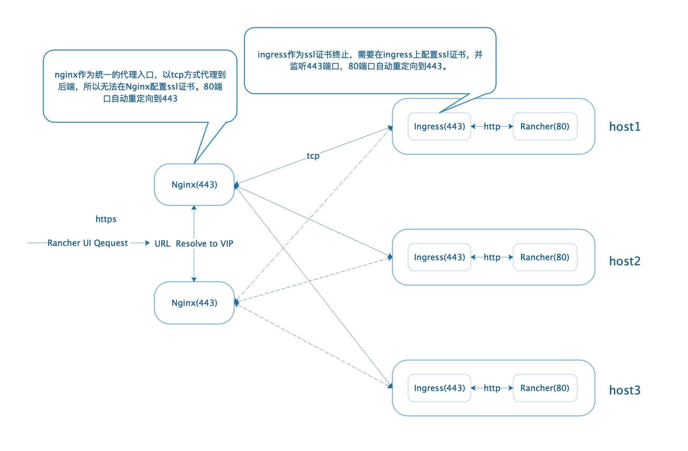
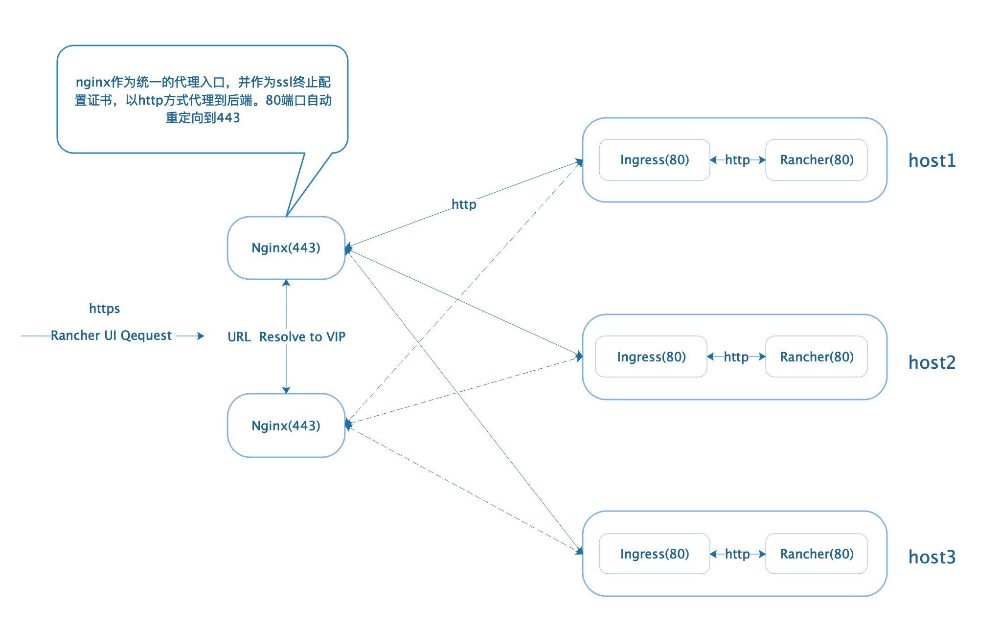

## Rancher HA架构选择

安装Rancher有多种架构多种中间值可以选择，可根据自己熟悉的应用和熟悉的架构进行选择。以下有三种常用方案可供参考：

>全局的负载均衡器有多种选择，可以用软件负载均衡器(nginx\haproxy等)、硬件负载均衡器(F5等)，只要可以支持四层TCP或者七层http代理就可以，这里以Nginx为例。

### (推荐)全局Nginx(tcp)-Ingress(http)-Rancher

### 全局Nginx(http)-Ingress(http)-Rancher

### 全局Nginx(http)-Rancher(nodeport)

