>**注意:** 本入门指南的目的是让你快速的运行一个Rancher2.0环境，它不适用于生产。有关更全面的说明，请查阅[Rancher安装](/docs/rancher/v2.x/cn/installation/server-installation/).

本教程将指导你完成:

- 安装 ；
- 本教程将指导你创建第一个集群；
- 部署一个应用程序，如Nginx；

## 一、配置Linux主机

通过配置Linux主机开始创建自定义集群。你的主机可以是:

- 云虚拟主机
- 本地虚拟机
- 本地物理机

  >**注意:** 在使用云虚拟主机时，你需要允许TCP/80和TCP/443入站通信端口。请查阅你的云主机文档以获取有关端口配置的信息。有关端口要求的完整列表，请查阅[端口需求](/docs/rancher/v2.x/cn/installation/references/).

根据以下要求配置主机:

- Ubuntu 16.04 +(64位)
- Centos/RedHat Linux 7.5+(64位)
- RancherOS 1.3.0+(64位)

> Ubuntu操作系统有Desktop和Server版本，选择安装server版本.

### 1、**硬件需求**:

- CPU: 2C
- 内存: 4GB
> **注意:** 此配置仅为满足小规模测试环境的最低配置。如用于生产，请参考[基础配置要求](/rancher/v2.x/cn/installation/basic-environment-configuration/)。

### 2、**软件需求**:

- 软件: Docker

- 支持的Docker版本:

  - `1.12.6`
  - `1.13.1`
  - `17.03.2`

  >**注意:** 有关Docker安装说明,请访问其[文档](https://docs.docker.com/install/)。软件需求要应用于所有节点。
  >
  > 主机的更详细配置说明，请查看[基础环境配置](/docs/rancher/v2.x/cn/installation/basic-environment-configuration/)

## 二、安装Rancher

要想在主机上安装Rancher,需要先登录到主机上，接着进行以下步骤:

  1. 通过shell工具(例如PuTTy或远程终端连接)登录到主机

  2. 在shell中执行以下命令:

      ```bash
      sudo docker run -d --restart=unless-stopped -p 80:80 -p 443:443 rancher/rancher
      ```

## 三、登录Rancher

登录并开始使用Rancher。登录后，你将进行一些一次性配置。

  1. 打开浏览器，输入`https://<server_ip>`,`server_ip`替换为运行Rancher容器主机的ip;

  2. 因为是自动使用的自签名证书，在第一次登录会提示安全授信问题，信任即可；

      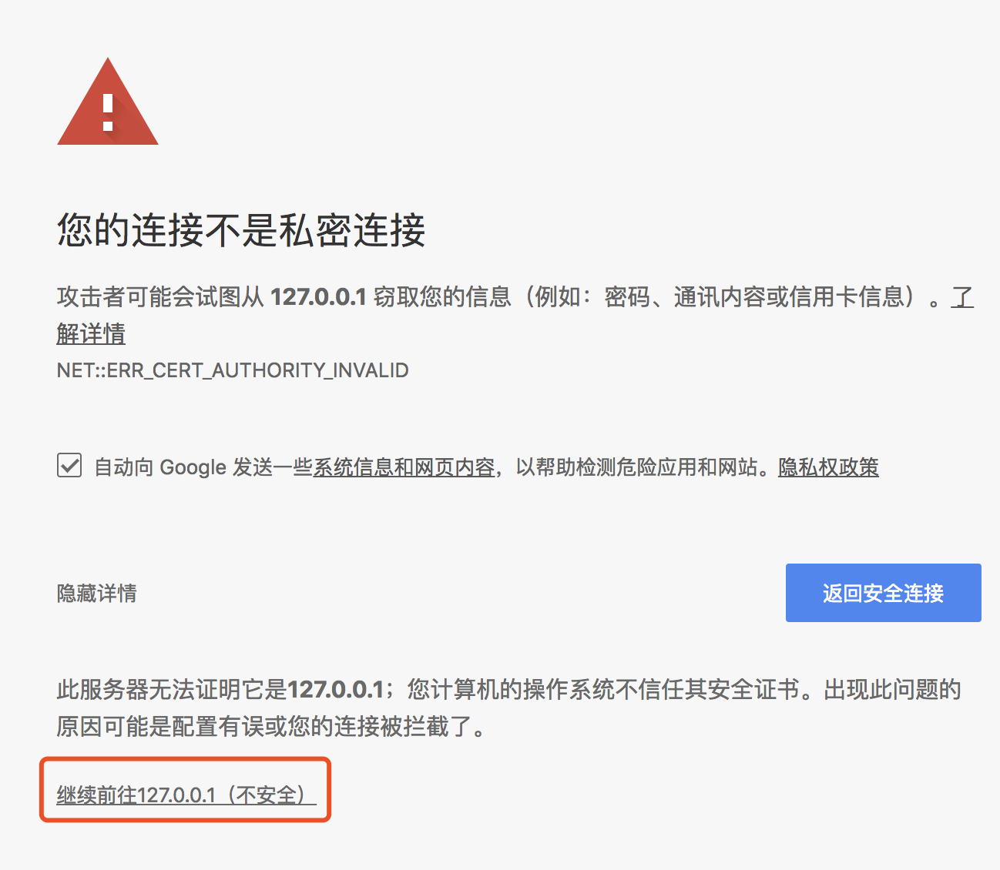

  3. 设置管理员密码

      第一次登录会要求设置管理员密码，默认管理员账号为: admin

      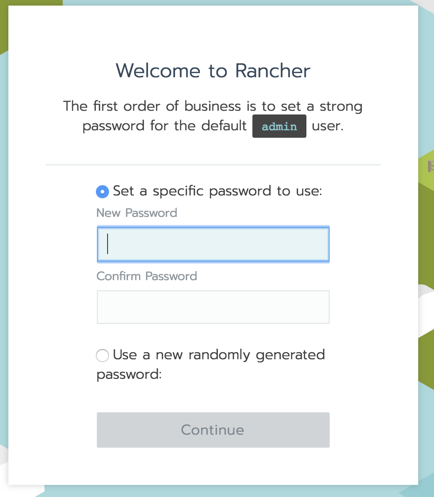

  4. 设置Rancher Server URL

      这个Rancher Server URL是agent节点注册的地址，需要保证这个地址能够被其他主机访问

## 四、创建K8S集群

现在创建第一个Kubernetes集群，可以使用**自定义**选项。你可以添加云虚拟主机、内部虚拟机或物理主机作为集群节点，节点可以运行任何一种或多种主流Linux发行版:

  1. 页面右下角可以切换语言；

      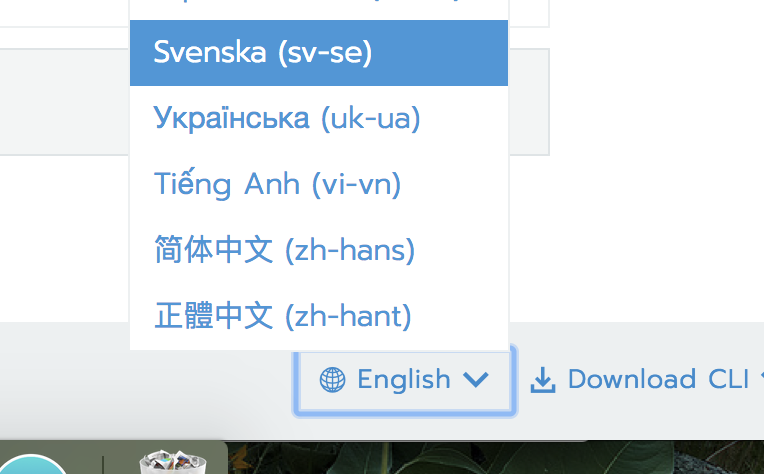

  2. 在全局视图下，点击菜单中的集群 , 并点击添加集群；

      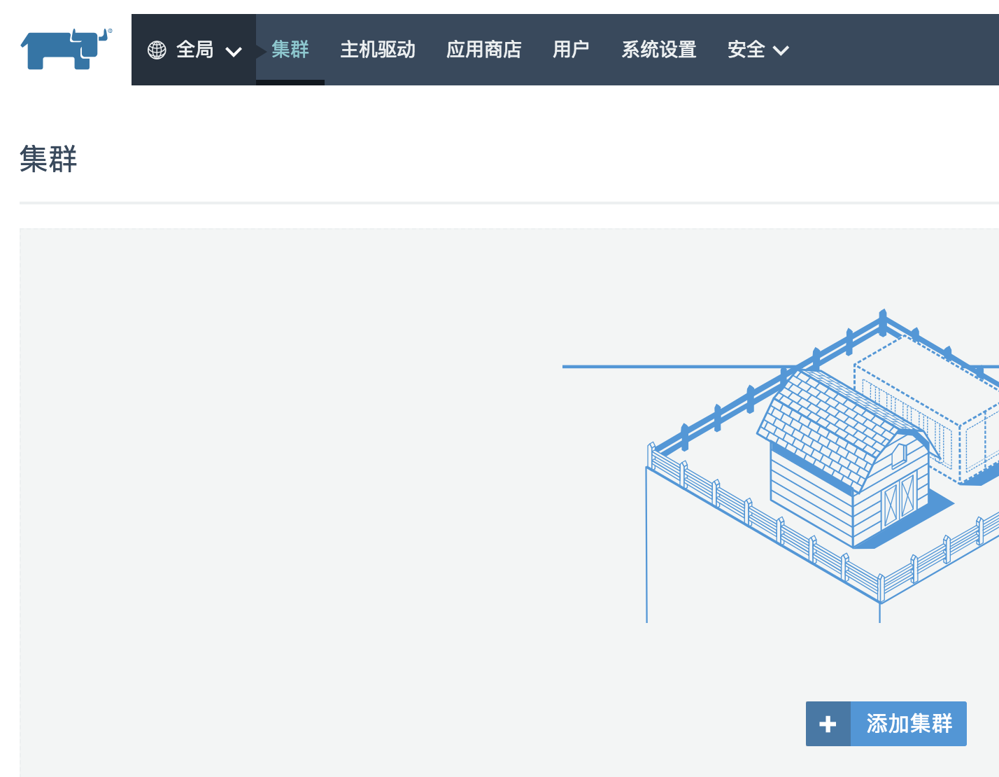

  3. 选择 **Custom**，并设置集群名称,其他参数可不用修改，点击下一步；

      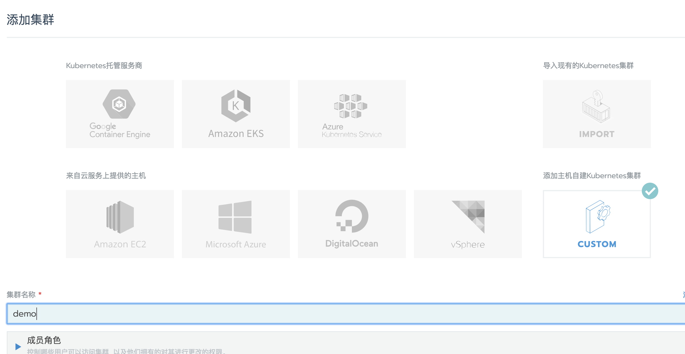

  4. 选择节点运行的角色
  
      默认会勾选**Worker**角色，根据需要可以一次勾选多种角色。比如，假设我只有一个节点，那就需要把所有角色都选择上，选择后上面的命令行会自动添加相应的命令参数；

      

  5. 如果是云虚拟主机，需要添加主机的内网地址和对应的公网地址，如果是没有公网的云主机，可以跳过这步；

  6. 其他参数保持默认，点击命令行右侧的复制按钮，复制命令参数

      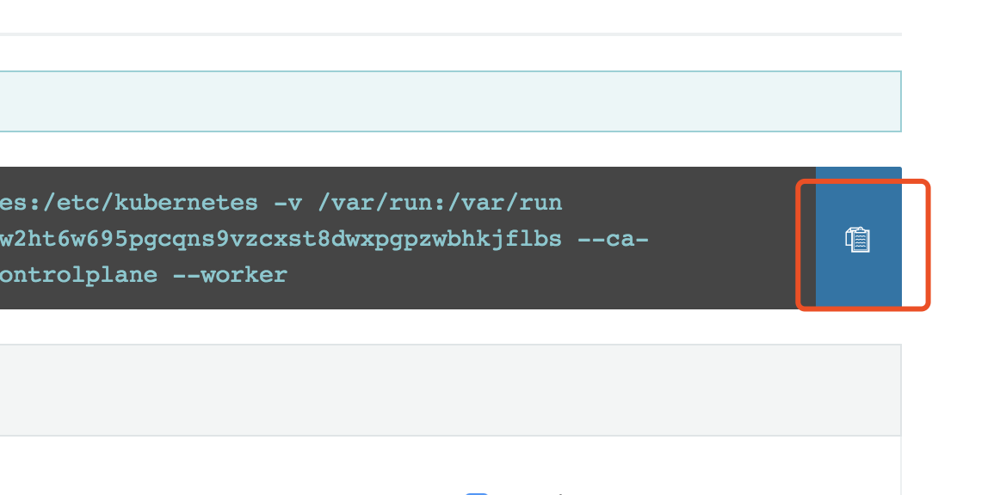

      > 如果是多台主机，根据角色的不同，需要复制多次

  7. 登录预添加集群的主机，执行以上复制的命令；

      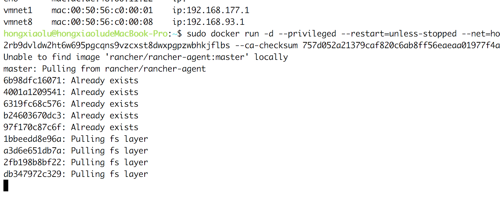

  8. 在主机上执行完命令后，最后点击完成；

  9. 回到全局视图，可以查看集群的部署状态；

      

  10. 点击集群名称，进入集群视图

      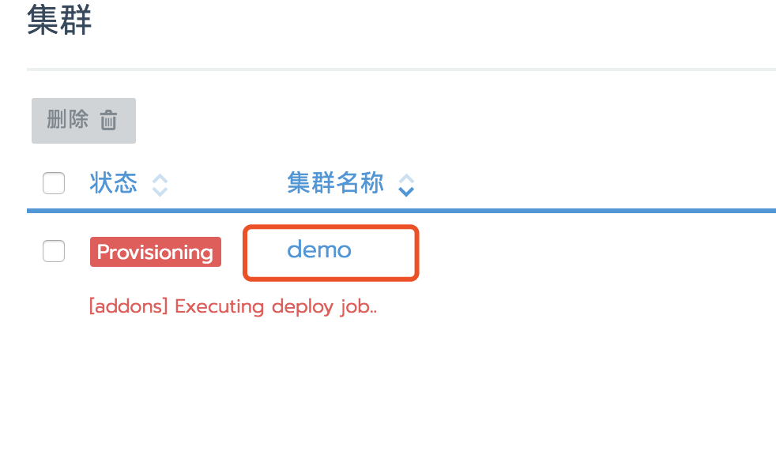

      

  11. 点击菜单栏**主机**按钮

      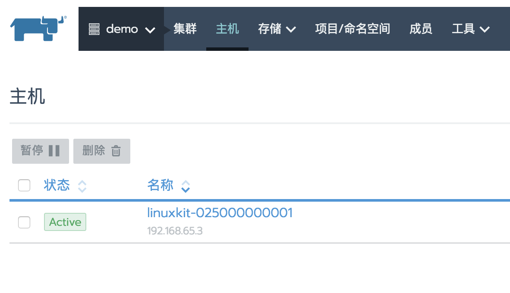

  12. 集群创建完成

      

  13. 集群创建完成后，默认会生成Default项目，点击Default切换到项目视图；

      

## 五、部署工作负载

工作负载是一个对象，包括pod以及部署应用程序所需的其他文件和信息。我们以nginx作为例如: 

  1. 在Default视图下，点击工作负载—部署服务

      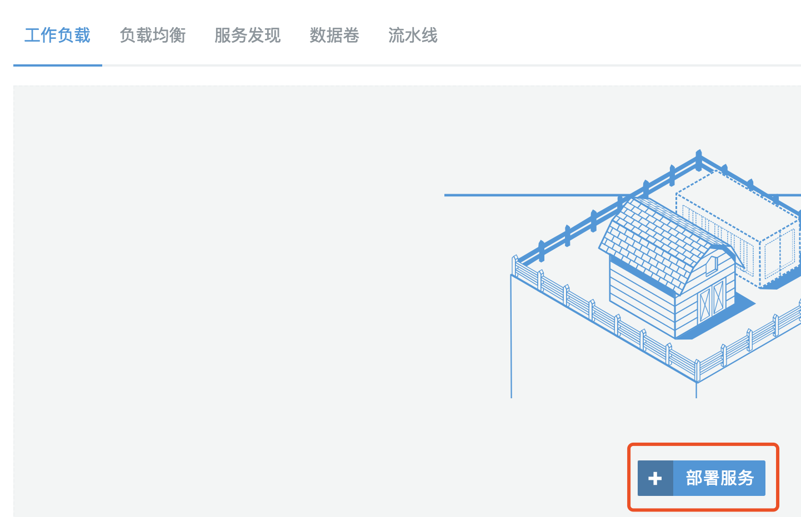

  2. 在部署工作负载页面，设置工作负载名称、副本数量、镜像名称、命名空间、端口映射，其他参数保持默认，最后点击启动；

      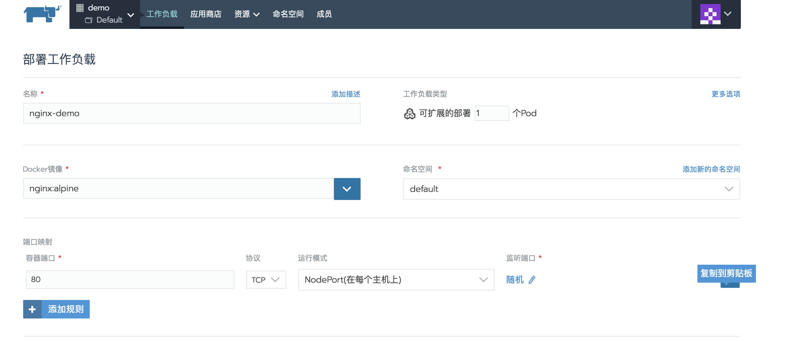

  3. 部署完成

      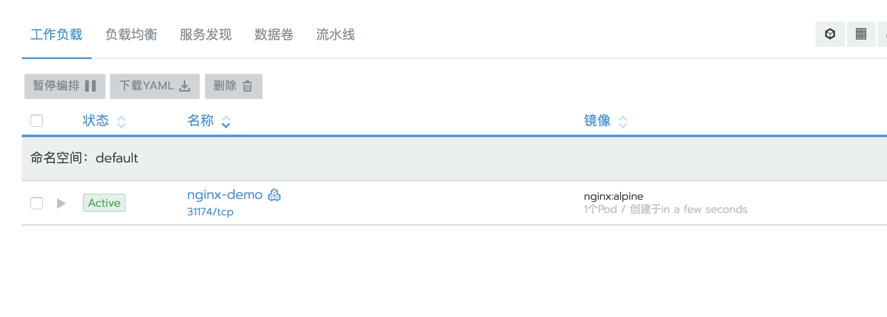

  4. 通过31174端口去访问nginx服务。
