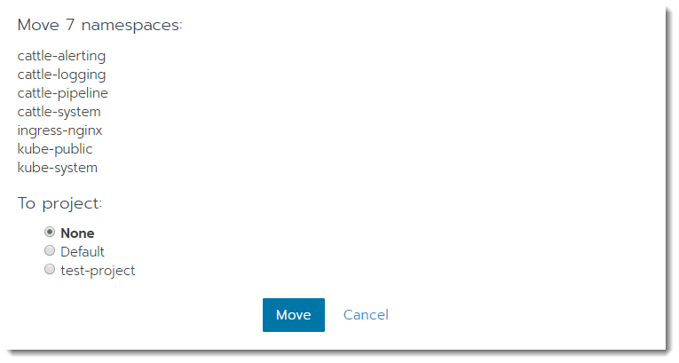

> #### **重要提示：RKE HA安装仅支持Rancher v2.0.8以及早期版本**
>
>如果您当前正在使用RKE HA安装方法，请按照以下说明迁移到Helm HA安装。

以下说明将指导您使用Helm软件包管理器从RKE HA安装迁移到Helm HA安装。

您需要安装[kubectl](/rancher/v2.x/cn/install-prepare/kubectl/)和使用RKE生成的kubeconfig YAML文件 `kube_config_rancher-cluster.yml`

> **注意:** 本文档假定您是标准安装Rancher，如果您修改了任何对象名称或命名空间，请相应地进行调整。

## 命名空间迁移(可选)(重要)

从rancher `v2.0.7`开始引入了`System`项目，该项目是自动创建的，用于存储Kubernetes运行需要的重要命名空间。在升级到`v2.0.7+`前，确保没有手动创建`System`项目，并且检查如下的系统命名空间，以确保它们未分配到任何项目中，以防止出现集群网络问题。

- kube-system
- kube-public
- cattle-system
- cattle-alerting
- cattle-logging
- cattle-pipeline
- ingress-nginx
- cattle-prometheus
- longhorn-system
- rancher-monitoring

如下图，移动系统命名空间到`None`

  

## 配置kubectl配置文件

确保kubectl使用正确的kubeconfig YAML文件，将`KUBECONFIG`环境变量设置为指向`kube_config_rancher-cluster.yml`：

```bash
export KUBECONFIG=$(pwd)/kube_config_rancher-cluster.yml
```

设置`KUBECONFIG`环境变量后，请验证它是否包含正确的server参数，它应该直接指向一个集群节点的`6443`端口上。

```bash
kubectl config view -o=jsonpath='{.clusters[*].cluster.server}'

https://NODE:6443

```

如果命令的输出显示带有Rancher主机名与后缀`/k8s/clusters`，则配置了错误的kubeconfig YAML文件，它应该是您使用RKE创建集群时创建的配置文件。

## 保存证书

如果Rancher集群使用ingress作为ssl终止，那么需要恢复您的证书和密钥以便Helm安装中使用。

使用kubectl获取密文、`base64解码`和并输出到文件中。

```bash
kubectl --kubeconfig=kube_configxxx.yml -n cattle-system get secret cattle-keys-ingress -o jsonpath --template='{ .data.tls\.crt }' | base64 -d > tls.crt
kubectl --kubeconfig=kube_configxxx.yml -n cattle-system get secret cattle-keys-ingress -o jsonpath --template='{ .data.tls\.key }' | base64 -d > tls.key
```

如果使用了私有CA根证书

```bash
kubectl --kubeconfig=kube_configxxx.yml -n cattle-system get secret cattle-keys-server -o jsonpath --template='{ .data.cacerts\.pem }' | base64 -d > cacerts.pem
```

## 删除以前的Kubernetes资源对象

删除RKE安装创建的Kubernetes资源对象。

> **注意:** 删除这些Kubernetes组件不会影响Rancher配置或数据库，但是最好事先创建数据备份。有关详细信息，请查看[集群备份](/rancher/v2.x/cn/backups-and-restoration/backups/ha-backups/)。

```bash
kubectl --kubeconfig=kube_configxxx.yml -n cattle-system delete ingress cattle-ingress-http
kubectl --kubeconfig=kube_configxxx.yml -n cattle-system delete service cattle-service
kubectl --kubeconfig=kube_configxxx.yml -n cattle-system delete deployment cattle
kubectl --kubeconfig=kube_configxxx.yml -n cattle-system delete clusterrolebinding cattle-crb
kubectl --kubeconfig=kube_configxxx.yml -n cattle-system delete serviceaccount cattle-admin
```

## 通过RKE `rancher-cluster.yml`删除附加组件

`addons`部分包含使用RKE部署Rancher所需的所有资源。通过切换到Helm，不再需要此部分集群配置文件。

>**Important:** 确保仅从集群配置文件中删除addons部分。

```yaml
nodes:
  - address: <IP> # hostname or IP to access nodes
    user: <USER> # root user (usually 'root')
    role: [controlplane,etcd,worker] # K8s roles for node
    ssh_key_path: <PEM_FILE> # path to PEM file
  - address: <IP>
    user: <USER>
    role: [controlplane,etcd,worker]
    ssh_key_path: <PEM_FILE>
  - address: <IP>
    user: <USER>
    role: [controlplane,etcd,worker]
    ssh_key_path: <PEM_FILE>

services:
  etcd:
    snapshot: true
    creation: 6h
    retention: 24h

# Remove addons section from here til end of file
addons: |-
  ---
  ...
# End of file
```

## 下一步

接下来按照[Helm HA](/rancher/v2.x/cn/installation/ha-install/helm-rancher/)安装Rancher
